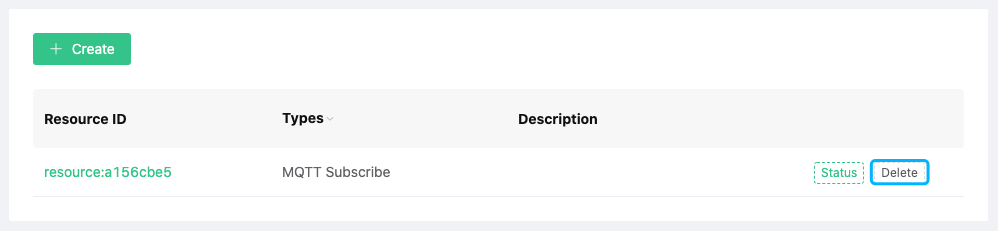

# Resources

EMQ X Cloud resources are used to respond to actions by the rule engine. Before that, you need to ensure that the deployment status is `running`

> Notes:
>
> 1. To use EMQ X Cloud resources, you need to create a [VPC Peering Connection](./vpc_peering.md) at first.
> 2. All resources must be **intranet resources**

### Create resource

1. Log in to [EMQ X Cloud console](https://cloud.emqx.io/console/)

2. Click on the deployment for the connection, and you will enter the deployment details page

3. Click the dashboard address in the deployment details page, and you will enter the dashboard

4. Click `Rule Engine` → `Resources` in the left menu of dashboard, and click the `Create` button on the resource list page

   

5. Select the corresponding resource type and fill in the corresponding resource configuration information

   

6. Click Test. If there is no error, click Confirm, otherwise please check the resource configuration information carefully

### View resource status

1. Log in to [EMQ X Cloud console](https://cloud.emqx.io/console/)

2. Click on the deployment for the connection, and you will enter the deployment details page

3. Click the dashboard address in the deployment details page, and you will enter the dashboard

4. Click `Rule Engine` → `Resources` on the left menu of dashboard, and click the resource status icon on the resource list page

   

### Delete resource

1. Log in to [EMQ X Cloud console](https://cloud.emqx.io/console/)

2. Click on the deployment for the connection, and you will enter the deployment details page

3. Click the dashboard address in the deployment details page, and you will enter the dashboard

4. Click `Rule Engine` → `Resources` in the left menu of dashboard, and click the `Delete` button on the resource list page

   
