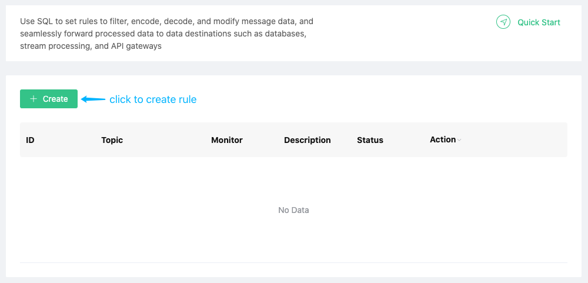

# Rule engine
EMQ X Cloud rule engine is used to configure the processing and response rules of EMQ X message flow and device events. Rule engine not only provides a clear and flexible "configurable" business integration solution, but also simplifies the business development process, improves user usability, and reduces the coupling between business system and EMQ X.

> Note: If you are new to EMQ X rule engine, you can go to [EMQ X rule engine](<https://docs.emqx.io/broker/latest/cn/rule/rule-engine.html>) to learn more about how to use the rule engine.

### Create your first rule engine

Before creating a rule engine, you need to make sure that the deployment status is `running`

1. Log in to [EMQ X Cloud console](https://cloud.emqx.io/console/)

2. Click on the deployment for the connection, and you will enter the deployment details page

3. Click the dashboard address in the deployment details page, and you will enter the dashboard

4. Click `Rule Engine` → `Resources` in the left menu of dashboard, and click the `Create` button on the resource list page

   

5. Create a new test SQL, click the switch behind `SQL test`, fill in the corresponding test parameters, and finally click the `SQL test` button

   

6. Add an action

   > Note: Before adding an action, you need to ensure that you have added [VPC peering connection](), and [created resource](./)

   

   In the pop-up action configuration dialog box, you can select the corresponding action type and fill in the configuration information of the corresponding action

   

### View rule monitoring status

1. Log in to [EMQ X Cloud console](https://cloud.emqx.io/console/)

2. Click on the deployment for the connection, and you will enter the deployment details page

3. Click the dashboard address in the deployment details page, and you will enter the dashboard

4. Click `Rule Engine` → `Rules` in the left menu of dashboard, and click the rule monitoring icon on the rule list page

   

### Edit rules

1. Log in to [EMQ X Cloud console](https://cloud.emqx.io/console/)

2. Click on the deployment for the connection, and you will enter the deployment details page

3. Click the dashboard address in the deployment details page, and you will enter the dashboard

4. Click `Rule Engine` → `Rules` in the left menu of dashboard, and click the `Edit` button on the rule list page

   

   When editing rules, you can also edit the actions added in the rules

   

5. Change rule status

   

### Delete rules

1. Log in to [EMQ X Cloud console](https://cloud.emqx.io/console/)

2. Click on the deployment for the connection, and you will enter the deployment details page

3. Click the dashboard address in the deployment details page, and you will enter the dashboard

4. Click `Rule Engine` → `Rules` in the left menu of dashboard, and click the `Delete` button on the rule list page

   
