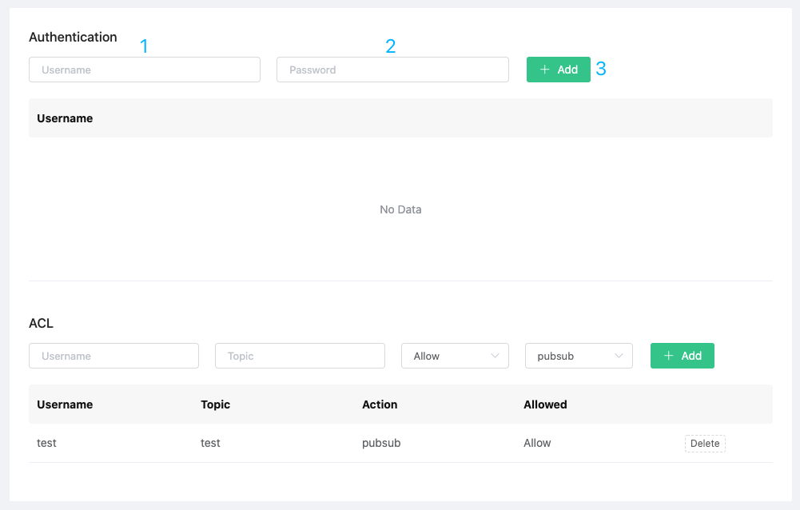
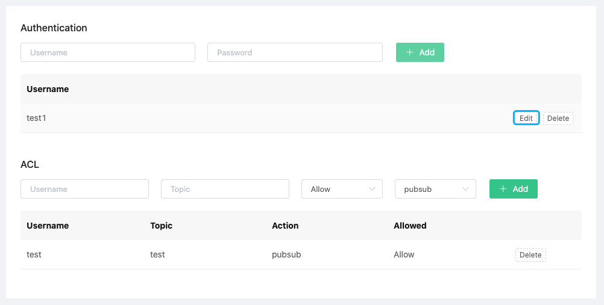
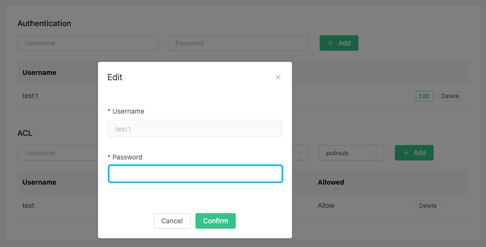
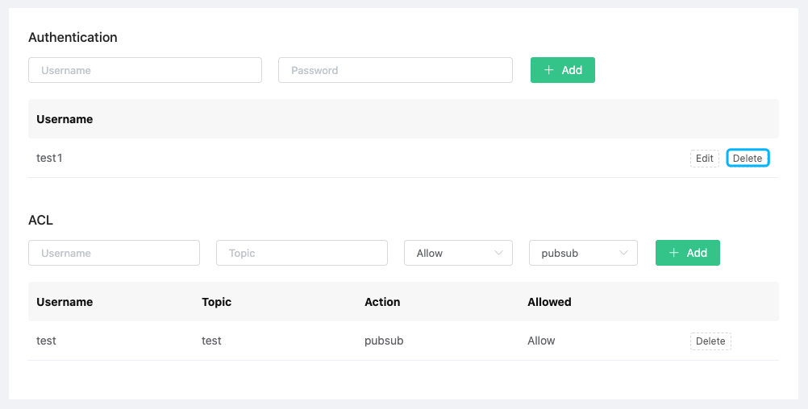
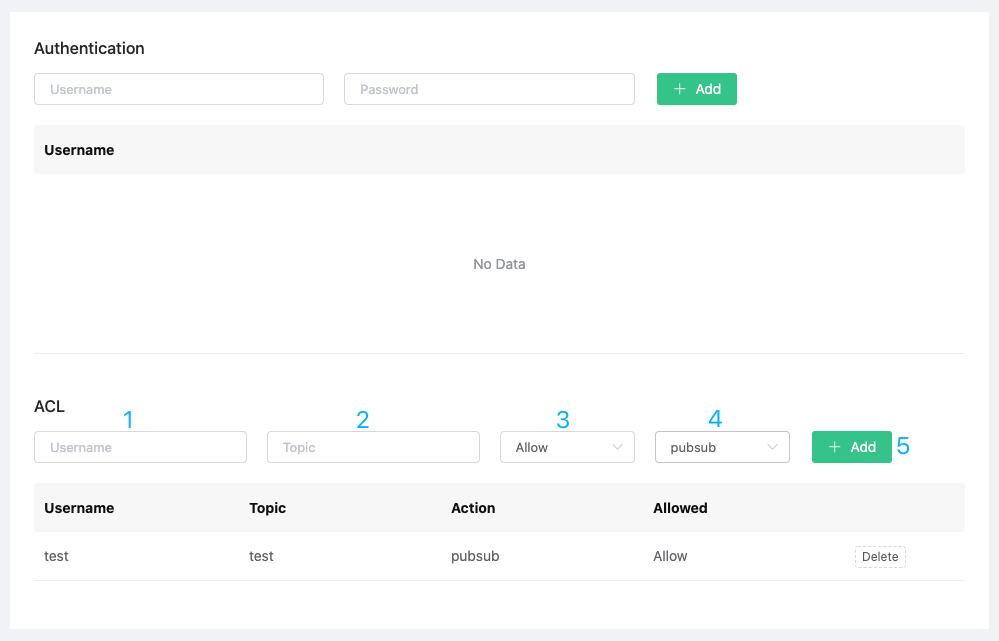
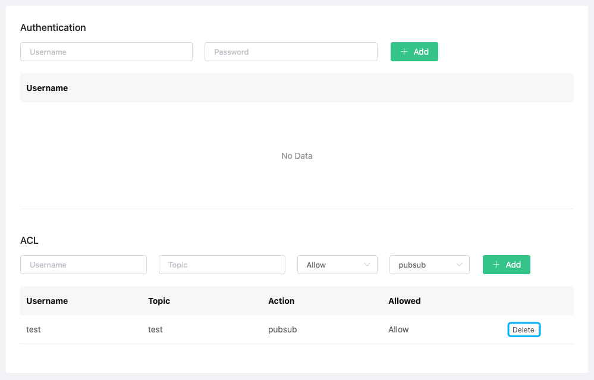

# Authentication

EMQ X Cloud fully supports the various security specifications of MQTT, and the built-in security functions can be used out of the box without programming, which can quickly eliminate security risks in the project. When using Users and ACL, you need to ensure that the deployment status is `running`

## Authentication

EMQ X Cloud client supports `username` and `password` authentication.

### Add client authentication information

1. Log in to [EMQ X Cloud console](https://cloud.emqx.io/console/)

2. Click on the deployment for the connection, and you will enter the deployment details page

3. Click the dashboard address in the deployment details page, and you will enter the dashboard

4. Click `Authentication` in the left menu of dashboard, fill in `Username`, `Password` in the authentication, and then click the Add button

   

### Edit client authentication information

1. Log in to [EMQ X Cloud console](https://cloud.emqx.io/console/)

2. Click on the deployment for the connection, and you will enter the deployment details page

3. Click the dashboard address in the deployment details page, and you will enter the dashboard

4. Click `Authentication` in the left menu of dashboard, and then click the `Edit` button

   

   The password of the authentication information can be changed

   

### Delete client authentication information

1. Log in to [EMQ X Cloud console](https://cloud.emqx.io/console/)

2. Click on the deployment for the connection, and you will enter the deployment details page

3. Click the dashboard address in the deployment details page, and you will enter the dashboard

4. Click on the `Authentication` on the left side of the dashboard menu, and click the `Delete` button in the authentication information

   

## Publish and Subscription ACL

EMQ X Cloud publish and subscription ACL supports `username`, `topic` mode.

### Add ACL information

1. Log in to [EMQ X Cloud console](https://cloud.emqx.io/console/)

2. Click on the deployment for the connection, and you will enter the deployment details page

3. Click the dashboard address in the deployment details page, and you will enter the dashboard

4. Click `Authentication` in the left side of dashboard menu, fill in `Username`, `topic` in ACL, and select whether to allow topict actions, then click the Add button

   

### Delete ACL information

1. Log in to [EMQ X Cloud console](https://cloud.emqx.io/console/)

2. Click on the deployment for the connection, and you will enter the deployment details page

3. Click the dashboard address in the deployment details page, and you will enter the dashboard

4. Click `Authentication` on the left side of dashboard menu, and click `Delete` button in ACL information

   
