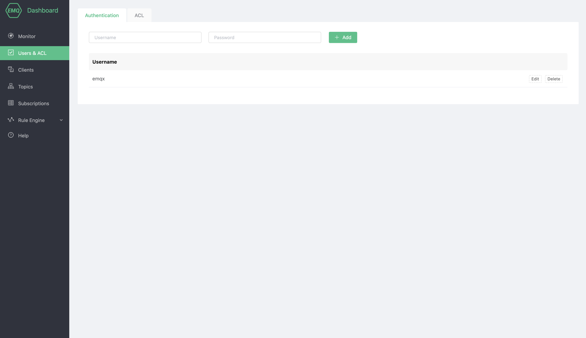
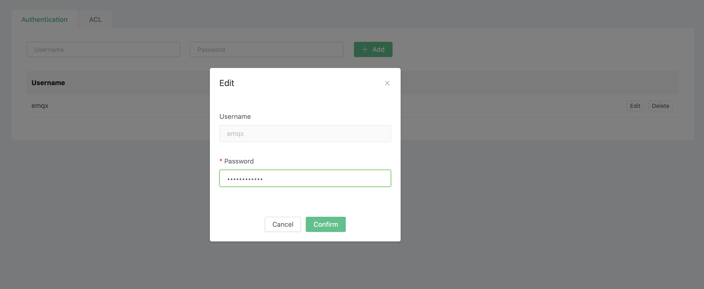

# Authentication

Identity authentication is an important part of most applications. The MQTT protocol supports user name and password authentication. Enabling identity authentication can effectively prevent illegal client connections. Authentication in EMQ X means that when a client connects to EMQ X, the server-side configuration controls the client's permission to connect to the server.

EMQ X certification support includes two levels:

1. The MQTT protocol itself specifies the user name and password in the CONNECT packet
2. At the transport layer, TLS can guarantee client-to-server authentication using client certificates and ensure that the server verifies the server certificate to the client.

This section mainly refers to the authentication of the MQTT protocol itself. For TLS verification on the transport layer, you can refer to the guide-[Configure TLS/SSL](../tls_ssl.md)

## Authentication

### View client authentication information

In the `Authentication` page of `Dashboard`, you can view all the authentication information of the deployment.

### Add client authentication information

In the input box at the top of the page, enter the client user name and password in turn, and then click the Add button to complete the addition.

### Edit client authentication information

You can click the `Edit` button on the right side of each piece of authentication information to modify the client authentication password.

### Delete authentication information

For unnecessary authentication information, you can click the `Delete` button on the right to delete it.

## ACL

ACL refers to the `permission control` for PUBLISH/SUBSCRIBE operations.

### View ACL information

In the `Authentication and ACL page of `Dashboard`, you can view all the authentication information of the deployment.

### Add ACL

Enter the client in the input box: user name, topic, rule (allowed/not allowed), topic action (pub/sub/pubsub) to complete the deployment of ACL rule creation

### Delete ACL 

For unnecessary ACL information, you can click the `Delete` button on the right to delete it.

