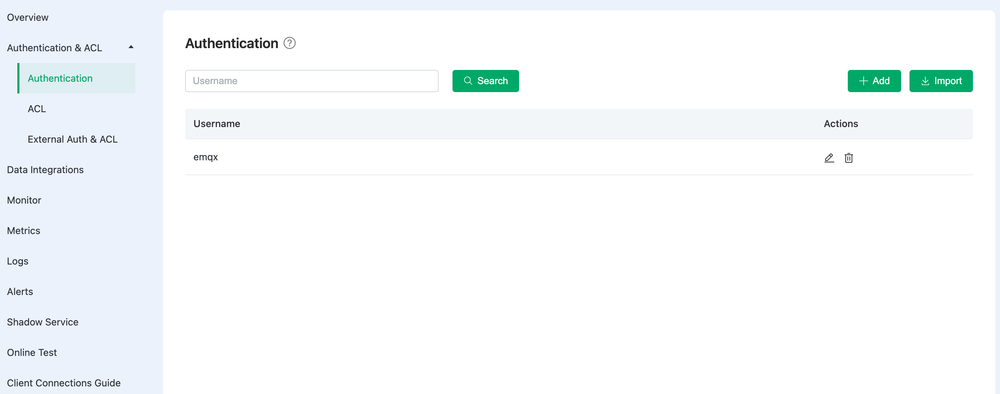

# Authentication <!--TODO-->

EMQX supports identity verification through passwords. After enabling password authentication, when clients attempt to connect, they are required to provide identity credential information. EMQX will initiate a query in the database and match the returned password with the information provided by the client. If the match is successful, EMQX will accept the client's connection request.

EMQX Cloud's authentication support includes two aspects:

1. The MQTT protocol itself specifies the username and password in the CONNECT message.
2. On the transport layer, TLS ensures client-to-server identity verification using client certificates and ensures the server presents its certificate to the client for verification.

This page primarily refers to the authentication of the MQTT protocol itself, explaining how to manage authentication information through the console. By configuring through the console, you can quickly implement authentication for clients.  For TLS verification on the transport layer, refer to [Configuring TLS/SSL](https://chat.openai.com/c/tls_ssl.md).

## View Authentication Information

Click on **Access Control** -> **Authentication** in the left menu of the deployment to see the authentication information.

## Add Authentication Information

Enter the username and password in the input boxes at the top of the page, and click the **Add** button to complete the addition of authentication information.

## Batch Add Authentication Information

You can import authentication information in batch via a CSV file.

1. Click the **Import** button.

2. Download the template. The template example file is shown in the following image:

   

3. Fill in the authentication information and upload the file.

4. Click **Import**.

   

## Edit Authentication Information

Click the edit icon on the right side of the authentication information to modify the password of the username.

## Delete Authentication Information

Click the delete icon on the right side of the authentication information to delete it.

