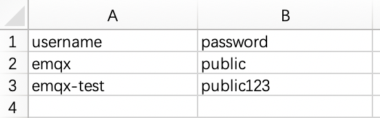

# Default Authentication

EMQX supports identity verification through username and password. When a client attempts to connect, it must provide the required credential information. EMQX initiates a query in the built-in database and matches the returned password with the information provided by the client. Upon a successful match, EMQX will accept the client's connection request.

## View Authentication Information

Click on **Access Control** -> **Authentication** in the left-side menu of the deployment to view authentication information.

## Add Authentication Information

On the Client Authentication page, select **+ Add**. Enter the username and password in the input fields and click the **Confirm** button to complete the addition of authentication information.

## Import Authentication Information

You can import authentication information in bulk via a CSV file.

1. Click the **Import** button.

2. Download the template. An example of the template file is shown below:

   

3. Fill in the authentication information and upload the file.

4. Click **Import**.

## Edit Authentication Information

Click the edit icon on the right side of the authentication information to modify the password for a username.
## Delete Authentication Information

Click the delete icon on the right side of the authentication information to delete it.
