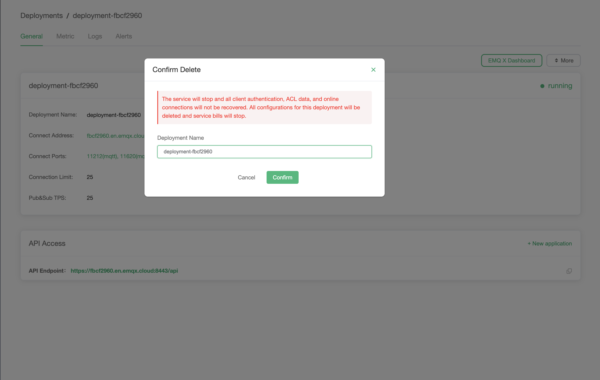

# Delete Deployment

Before deleting the deployment, you need to make sure the deployment running status is `running`.

1. Enter the console, click the deployment you want to delete, and you will enter the deployment details page.

2. Click the delete button and fill in the deployment name in the pop-up box.

    ::: tip
    When you delete a deployment, you will not be able to connect to the deployment, and all data and configuration of the deployment, as well as the enabled value-added services, will be deleted. We will stop billing for the deployment and value-added services.
    :::

3. Click `Confirm` to complete the deployment deletion.

