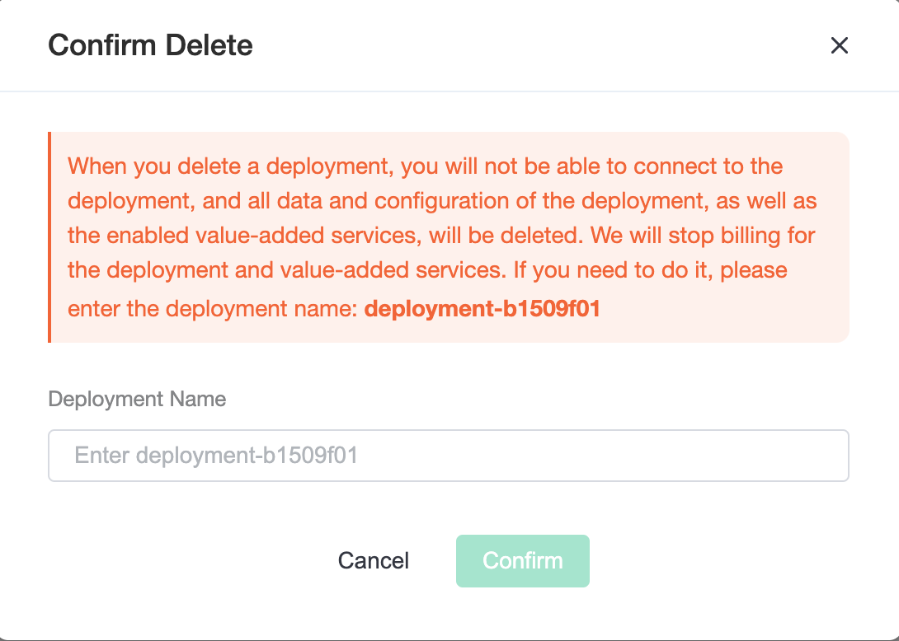

# Delete deployment

Before deleting the deployment, you need to make sure the deployment running status is `running`.

1. Enter the console, click the deployment you want to delete, and you will enter the deployment details page

2. Click the delete button and fill in the deployment name in the pop-up box

   > Note: When deleting the deployment, it will clear the Users and ACL, rule engine and other data and disconnect the online connection. At the same time, we will stop deployment billing.

3. Click OK to complete the deployment deletion

