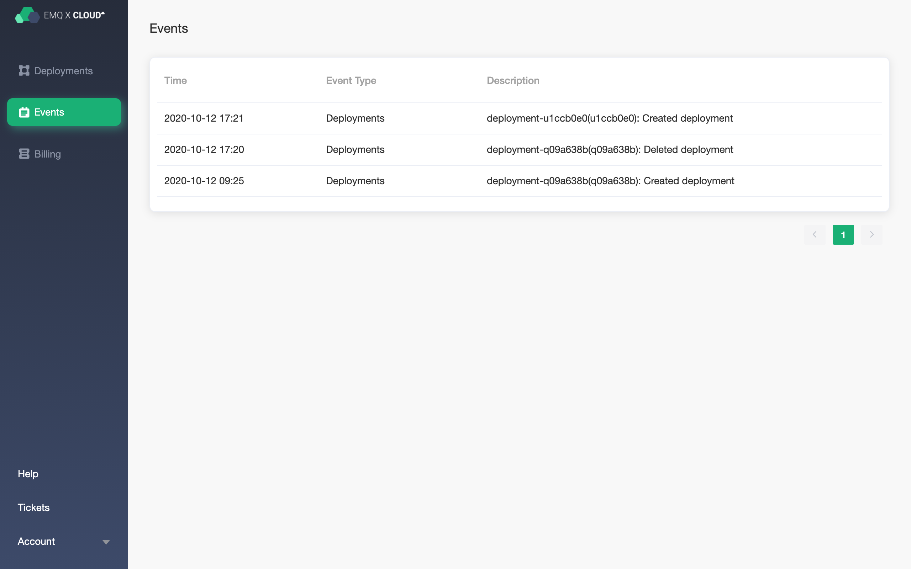

# Event
View current accounts: create and delete deployment events.

### View event

EMQ X Cloud provides the following types of event records:

- Create deployment
- Delete deployment
- Start deployment
- Stop deployment
- Add TLS/SSL certificate
- Delete TLS/SSL certificate
- Create NAT gateway
- Delete NAT gateway
- Create a peer connection
- Delete a peer connection
