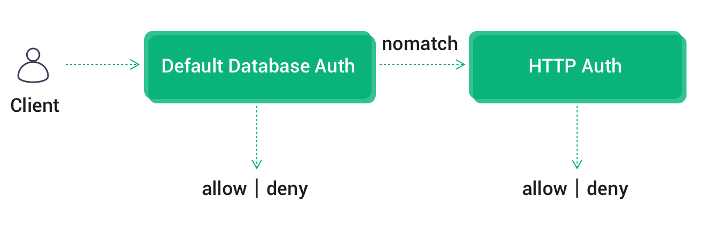
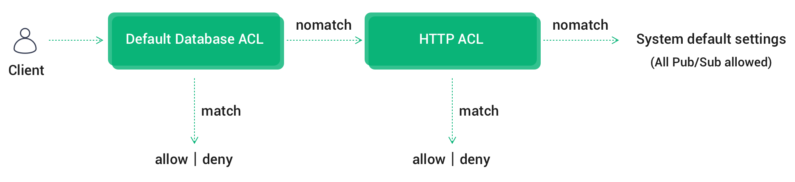

# HTTP Authentication/Access Control

In addition to the default authentication, EMQX Cloud also allows users to connect to their own services and determine the login of the endpoint by returning status, enabling complex authentication logic and complex ACL verification. Custom authentication currently supports both permission-based authentication and access control authentication.

## Authentication Rules

EMQX Cloud requests permission from a user-defined authentication service using information about the current client as a parameter in the device connection event and processes the authentication request with the HTTP status code returned.

- Successful: returns status code 200  
- Failure: returns a non-200 status code
- Ignored: returns a 200 status code and the message body: ignore

## Authentication Chain
  
If default authentication is also enabled, EMQX Cloud will follow [default authentication](https://docs.emqx.com/en/cloud/latest/deployments/auth.html) -> HTTP authentication for chain authentication:

- Once authentication is successful, terminate the authentication chain and the client is accessible
- Once authentication fails, terminate the authentication chain and disable client access

 

## ACL Authentication Chain

If multiple ACL modules are enabled at the same time, EMQX Cloud will chain authentication in the order of [Default Authentication Database ACL](https://docs.emqx.com/en/cloud/latest/deployments/acl.html)-> HTTP ACL-> System Defaults (All Pub/Sub allowed).

- Once the authentication is passed, terminate the chain and allow the client to pass the authentication
- Once authentication has failed, terminate the chain and deny the client to pass authentication
- Until the last ACL module fails to authenticate, authenticate according to the System default settings --- **(All Pub/Sub allowed)**

## Permission Authentication

 Click on `Authentication` - `Custom Authentication` and click on Configure Authentication on the start page to create a new authentication.

 

When authenticating, EMQX Cloud will use the current client information to populate and initiate a user-configured authentication query request to find the client's authentication data on the HTTP server-side.

Configure the required parameters for permission authentication on the form page, including the authentication request address, authentication request parameters, HTTP request method, and the type of request content. Use the default values for the remaining parameters if they are not specifically required.

 

  ::: tip

- If the current deployment is Basic deployment, please fill in the public address for the server address
- If the current deployment is Professional deployment, you need to create a [VPC peer connection](https://docs.emqx.com/en/cloud/latest/deployments/vpc_peering.html), please fill in the internal network address for the server address.
- If you are prompted with Init resource failure! check whether the server address is correct, and whether the security group is enabled
  :::

### Request Parameter Placeholders

You can use the following placeholders in your authentication request and the EMQX will be automatically replace with client information.

- %u: User name
- %c: Client ID
- %a: Client IP address
- %r: Client access protocol
- %P: Plaintext password
- %p: Client port

### Request Method

When the HTTP request method is GET, the request parameters are passed as a URL query string; when the request method is POST, the request parameters are submitted as a normal form (content-type is x-www-form-urlencoded or json).

> The POST method is recommended. When using the GET method, plaintext passwords may be logged in the server logs with the URL during transmission.

## ACL

 When publishing or subscribing to authentication, EMQX Cloud will use the current client information and initiate a user-configured ACL authorization query request to find out the authorization info for the client on the HTTP server.

 Configure the parameters for ACL, including ACL request address, ACL request parameters, HTTP request method and type of request content. Use the default values for the remaining parameters if they are not specifically required.

  

### Request Parameter Placeholders

You can use the following placeholders in your authentication request and the EMQX will be automatically replaced with client information.

- %A: operation type, '1' subscribe; '2' publish
- %u: Client ID
- %c: Client ID
- %a: Client IP address
- %r: Client access protocol
- %t: Subject

### Request Method

When the HTTP request method is GET, the request parameters are passed as a URL query string; when the request method is POST, the request parameters are submitted as a normal form (content-type is x-www-form-urlencoded or json).
