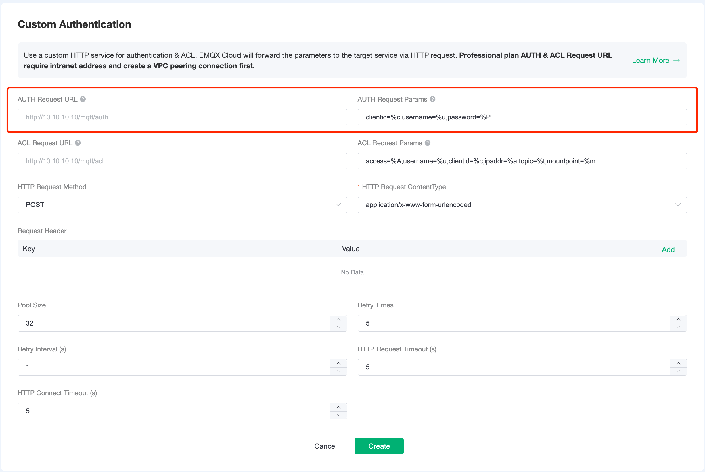

# Custom Authentication

In addition to the default authentication, EMQ X Cloud also allows users to connect to their own services and determine the login of the endpoint by returning status, enabling complex authentication logic and complex ACL verification. Custom authentication currently supports both permission-based authentication and access control authentication.

## Authentication Rules

EMQ X Cloud requests permission from a user-defined authentication service using information about the current client as a parameter in the device connection event, and processes the authentication request with the HTTP statusCode returned.

 - Failure: returns status code 4xx 
 - Successful: returns status code 200 
 - Ignored: returns a 200 status code and the message body: ignore
 

## Permission Authentication
 Click on `Authentication` - `Custom Authentication` and click on Configure Authentication on the start page to create a new authentication.

 

 When authenticating, EMQ X Cloud will use the current client information to populate and initiate a user-configured authentication query request to find the client's authentication data on the HTTP server side.

 Configure the required parameters for permission authentication on the form page, including the authentication request address, authentication request parameters, HTTP request method and the type of request content. Use the default values for the remaining parameters if they are not specifically required.

 

> - In Standard plan, please fill in the public network IP address for the request
> - In Professional Edition, please fill in the intranet IP address for the request

### Request Parameter Placeholders
You can use the following placeholders in your authentication request and the EMQ X will be automatically replace with client information.

 - %u: User name
 - %c: Client ID
 - %a: Client IP address
 - %r: Client access protocol
 - %P: Plaintext password
 - %p: Client port
 - %C: TLS certificate common name (domain or subdomain of the certificate), valid only for TLS connections
 - %d: TLS certificate subject, valid only for TLS connections
 

### Request Method
When the HTTP request method is GET, the request parameters are passed as a URL query string; when the request method is POST, the request parameters are submitted as a normal form (content-type is x-www-form-urlencoded or json).

> The POST method is recommended. When using the GET method, plaintext passwords may be logged in the server logs with the URL during transmission.

## ACL
 
 When publishing or subscribing to authentication, EMQ X Cloud will use the current client information and initiate a user-configured ACL authorization query request to find out the authorization info for the client on the HTTP server.

 Configure the parameters for ACL, including ACL request address, ACL request parameters, HTTP request method and type of request content. Use the default values for the remaining parameters if they are not specifically required.

  

### Request Parameter Placeholders
You can use the following placeholders in your authentication request and the EMQ X will be automatically replace with client information.

 - %A: operation type, '1' subscribe; '2' publish
 - %u: Client ID
 - %c: Client ID
 - %a: Client IP address
 - %r: Client access protocol
 - %m: Mountpoint
 - %t: Subject
 
### Request Method
When the HTTP request method is GET, the request parameters are passed as a URL query string; when the request method is POST, the request parameters are submitted as a normal form (content-type is x-www-form-urlencoded or json).