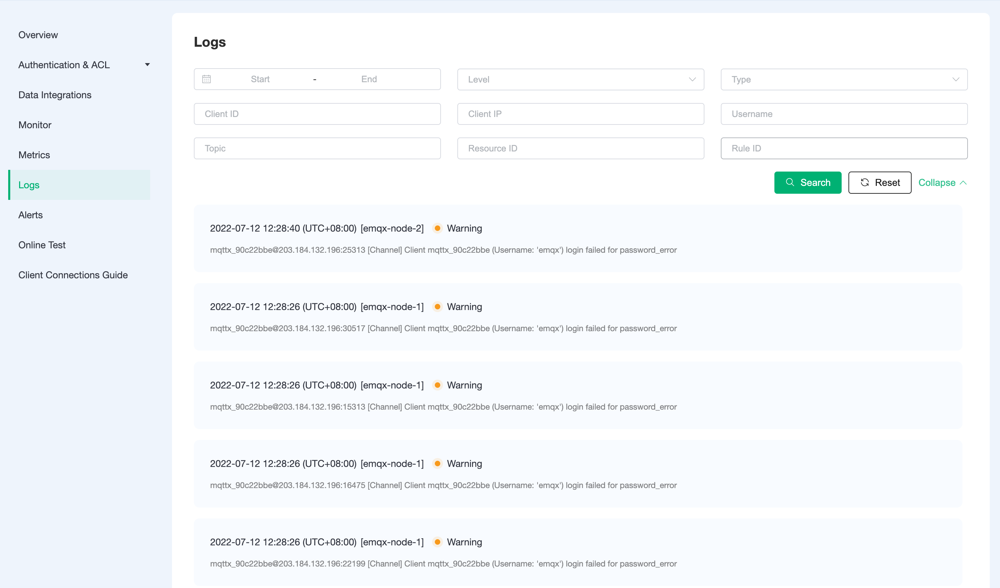

# Logs

:::warning

This feature is available on Dedicated Plan and BYOC Plan. 

:::

EMQX Platform provides real-time online viewing of EMQX logs.

## View Deployment Logs

Logs analysis reconfigures the ability to parse and search for logs, providing two EMQX nodes [emqx-node-1], [emqx-node-2] with multiple levels of log information, including ClientID, ClientIP, Username, Topic, Resource, and Rule ID, as well as filtering by error type.

**Data Integration**: Data integration related errors. Errors caused by the corresponding service not running or other reasons. For example, MySQL is not running when storing to MySQL, unauthorized, or table errors, etc.

**Client**: Client-related errors, including incorrect authentication information, incorrect access control information, and other reasons for not being able to connect.

**Message**: Message-related errors, such as encoding problems, message loss and abandonment, etc.

**Module**: emqx module related errors, such as custom authentication errors due to inability to connect to the corresponding service.

**EMQX Internal Errors**: Erlang and errors that cannot be classified to the above cases.



## Common Logs Analysis

### Client authentication failed (warning)

* Log
```
[Channel] Client xxx (Username: 'xxx') login failed for not_authorized
```

* Solution
```
Check that client authentication is correctly configured.
```

### Client ACL authentication failed (warning)

* Log
```
[Channel] Cannot publish message to xxx due to Not authorized.
```

* Solution
```
Check that the deployment ACL is configured correctly
```

### Non-standard MQTT protocol connections (warning)

* Log
```
[MQTT] Parse failed for function_clause[{emqx_frame,parse_packet,[{mqtt_packet_header,4,false,3,true}
```

* Solution
```
Check that the MQTT protocol used by the client connection is the standard MQTT protocol
```

### Message drop alerts (warnings)

* Log
```
Dropped msg due to queue is full: Message(Id=xxx, QoS=1, Topic=xxx)
```

* Solution
```
The client sets clean session to False or the client sets automatic reconnection.
```

### TPS over limit alarm (warning)

* Log
```
[Channel] Cannot publish messages to /acp_player/heartbeat due to Quota exceeded.
```

* Solution
```
Timely adjustment of the client sending rate so that the sending rate is less than the TPS of the deployment limit
```

### Data Integration MySQL Resource Exception (error)

* Log
```
Initiate 'mysql:resource:7aba6137' failed {{shutdown,{failed_to_start_child,worker_sup,{shutdown,{failed_to_start_child,{worker,1},timeout}}}},{child,undefined,{pool_sup,'mysql:resource:7aba6137'}
```

* Solution
```
Checking MySQL Resources in Data Integration
```


### Data Integration Webhook Resource Exception (error)

* Log
```
cluster_call error found, ResL: [{{emqx_web_hook_actions,on_resource_create},{error,{error,check_http_connectivity_failed}
```

* Solution
```
Checking Webhook resources in data integration
```

### Data Integration Webhook Status Exception (error)

* Log
```
[WebHook Action] HTTP request failed with status code: 401
```

* Solution
```
Check that the authentication configured for the Webhook resource in the data integration is correctly available
```

### Data Integration Kafka Resource Exceptions (error)

* Log
```
cluster_call error found, ResL: [{{emqx_bridge_kafka_actions,on_resource_create},{error,connect_kafka_server_fail,[{
```

* Solution
```
Checking the status of data integration Kafka resource for availability
```

### Data integration SQL template configuration error (error)

* Log
```
[RuleEngine MySql] insert failed reason: {1406,<<"22001">>, <<"Data too long for column 'topic' at row 1">>}
```

* Solution
```
Check that the SQL for the rules in the data integration is written correctly
```

### Data integration response action failed (error)

* Log
```
[RuleEngine MySql] Take action <<"data_to_mysql_1634029957602201470">> failed, continue next action, reason: {error,{data_to_xxx,
```

* Solution
```
Check that the action for the rule in the data integration is written correctly
```
