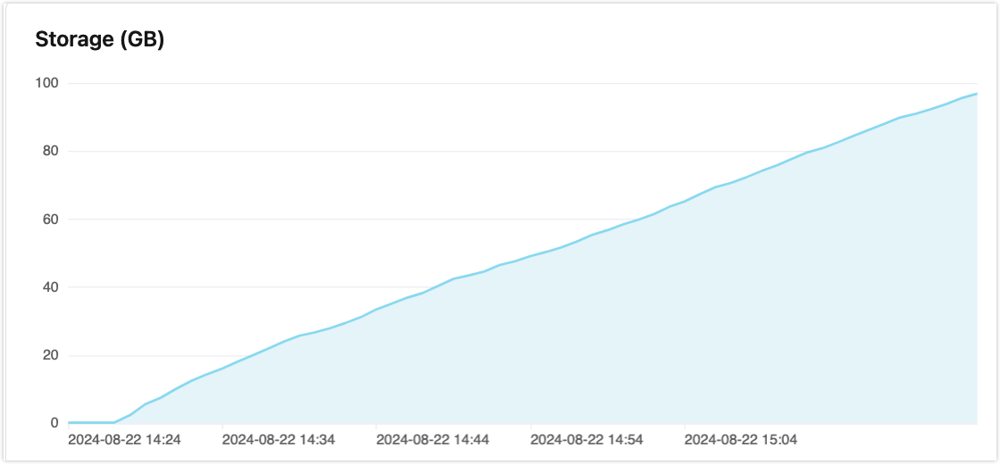

# Metrics

Metrics provide key data states and changes in deployments over a period of time. You can view them on the deployment details page by clicking **Monitor**->**Metrics** in the left navigation menu.

## Real-Time Metrics

Here you can observe the real-time metrics of your deployment.

| Metric                 | Description                                                  |
| ---------------------- | ------------------------------------------------------------ |
| Sessions               | The total number of clients currently connected to the deployment, including offline clients with retained sessions. |
| Total TPS              | The total number of messages processed per second by the current deployment, including the total rate of messages received and sent per second. |
| Total message sent     | The number of messages per second currently flowing out of the deployment. |
| Total message received | The number of messages per second currently flowing into the deployment. |
| Retained messages      | The total number of retained messages in the deployment.  For an introduction to retained messages, see [The Beginner's Guide to MQTT Retained Messages](https://www.emqx.com/blog/mqtt5-features-retain-message). |
| Topics                 | The total number of topics currently subscribed to by all clients. |
| Subscriptions          | The total number of subscribed topics in each client.        |
| Shared subscriptions   | The total number of shared subscriptions in the deployment.  For an introduction to shared subscriptions, see [MQTT Shared Subscriptions: Practical Guidelines and Use Cases ](https://www.emqx.com/blog/introduction-to-mqtt5-protocol-shared-subscription). |
| Storage (GB)           | The storage space used by Durable Sessions and Event History within the deployment. |

::: tip

Subscription count is calculated per client. If two different clients are subscribed to the same topic, the subscription count is considered as two. 

:::

## Timeline

CIick the **Timeline** tab, you can see the metrics data of the deployment within a period of time.

### Serverless Timeline Metrics

The Timeline page for serverless deployment provides five types of metrics: sessions, subscriptions, messages, packets, and dropped messages. You can view the corresponding graphical charts for each type of metric and detailed information at a specific point in time.

#### Sessions
The Sessions chart displays the number of clients connected to the deployment within the selected time period. The number of sessions also includes offline clients that have enabled [persistent sessions](https://www.emqx.com/en/blog/mqtt-session). Persistent sessions refer to sessions that remain active and store offline messages even when the client disconnects until the session times out and is cleared.

#### Subscriptions

The Subscriptions chart displays the total number of subscriptions within the selected time period.

#### Messages
The Messages chart displays the number of messages received and sent by the deployment within the selected time period.

- Inbound messages are the messages received from the device or application.
- Outbound messages are messages sent to the device or application.
- Messages with no subscribers are messages dropped because there is no subscriber to the topic.

#### Packets

The Packets chart shows the traffic of the messages received and sent by the deployment during the selected time period, including the following three types of data:

- Total packets: Total traffic of packets received and sent.
- Sent packets: The traffic of packets sent to the device or application.
- Received packets: The traffic of packets received from the device or application.

#### Dropped Messages

The Dropped Message chart shows the messages that are discarded during the sending phase within the selected time period. The reasons for messages being dropped can be that messages are too large in size, the message queue is full, or the message expires. 

### Dedicated / Premium / BYOC Timeline Metrics

The timeline metrics for Dedicated, Premium, and BYOC deployments include the following types:

- Sessions
- Subscriptions
- Messages
- Packets
- Dropped messages
- Storage (GB) (for Premium Plan only)

You can view graphical charts corresponding to each type of metric and detailed information at a specific time. For some metrics, the corresponding metrics in the API are indicated. If you need to learn and view more metrics, you can retrieve more metrics through the [API](https://docs.emqx.com/en/cloud/latest/api/dedicated.html#tag/Metrics).

::: tip
If there is no corresponding API metric in the table, it means that the metric cannot be retrieved from the API.
:::

#### Sessions
The Sessions chart displays the number of concurrent sessions within a selected time period. The number of sessions includes offline clients that have enabled [persistent sessions](https://www.emqx.com/en/blog/mqtt-session). The chart provides 3 metrics:

|Metrics in API       |   Description                                   |
| ----------------- | :--------------------------------------- |
| - | Concurrent sessions. |
| client.connected | The number of connected sessions at the moment.             |
| client.disconnected | The number of disconnected sessions at the moment.   |

#### Subscriptions
The Subscriptions chart provides three metrics to display the subscription status within the selected time period.

|Metrics in API       |   Description                                   |
| ----------------- | :--------------------------------------- |
| - | Total number of subscriptions. |
| client.subscribe | The number of subscriptions at the moment.        |
| client.unsubscribe | The number of unsubscriptions at the moment.  |

#### Messages

The Messages chart provides three metrics, showing the number of messages received and sent by the deployment during the selected time period, and the messages with no subscribers.

|Metrics in API       |   Description                                   |
| ----------------- | :--------------------------------------- |
| messages.received | The number of messages received from the device or application at the moment.         |
| messages.sent | The number of messages sent to the device or application at the moment. |
| messages.dropped.no_subscribers | The number of messages will be dropped because of no subscribers. |

#### Packets
The Packets chart provides two metrics, showing the traffic of messages received and sent by the deployment during the selected time period.

| Metrics in API   | Description                  |
| ------------------ | :--------------------------- |
| bytes.received    | Kilobytes of message packets received from the device or application at the moment. |
| bytes.sent | Kilobytes of message packets sent to the device or application at the moment. |

#### Dropped Messages

The Dropped Messages chart shows the number of messages that are dropped during delivery due to either expiration or the message queue reaching its capacity within the selected time period.

| Metrics in API   | Description                  |
| ------------------ | :--------------------------- |
| delivery.dropped.expired  | Messages dropped due to message expiration. |
| delivery.dropped.queue_full | Messages dropped due to a full message queue. |

#### Storage (GB)

The Storage (GB) chart shows the storage space used by Durable Sessions and Event History within the selected time period.

