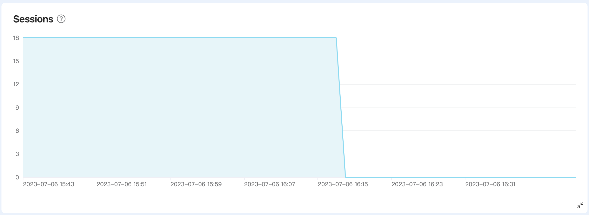
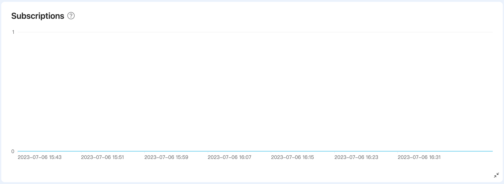
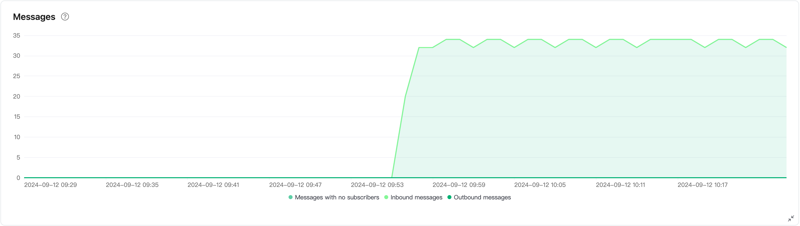
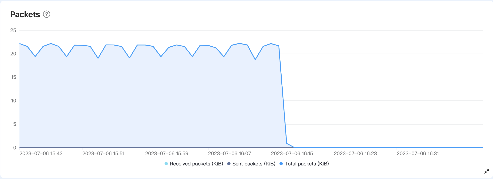
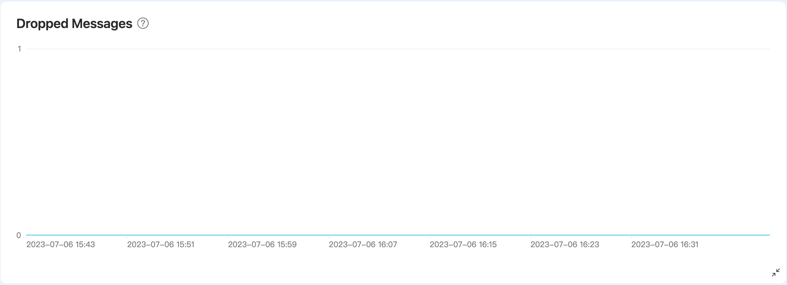
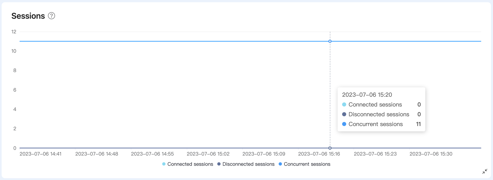
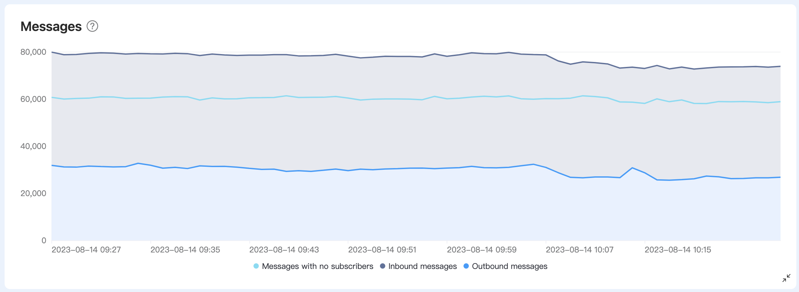
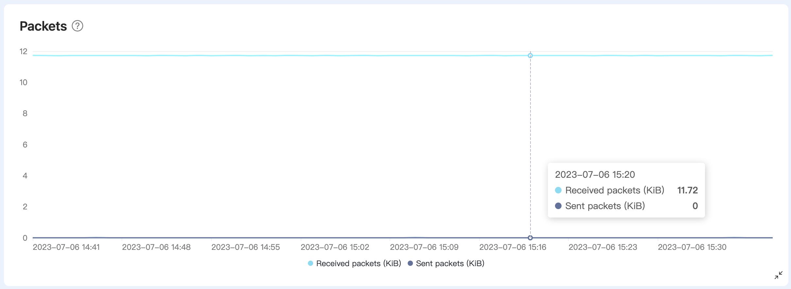
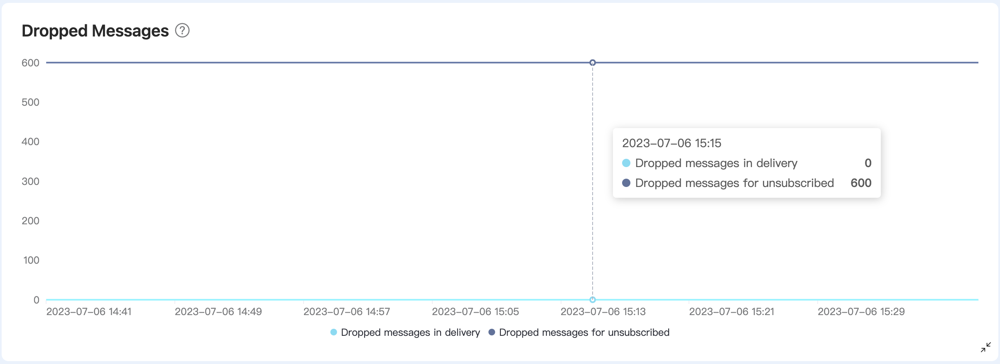

# Metrics

Metrics provide key data states and changes in deployments over a period of time. You can view them on the deployment details page by clicking on **Metrics** in the left navigation menu.

## Serverless Metrics

The Metrics page for serverless deployment provides 5 types of metrics: sessions, subscriptions, messages, packets, and dropped messages. You can view the corresponding graphical charts for each type of metric and detailed information at a specific point in time.

### Sessions
The Sessions chart displays the number of clients connected to the deployment within the selected time period. The number of sessions also includes offline clients that have enabled [persistent sessions](https://www.emqx.com/en/blog/mqtt-session). Persistent sessions refer to sessions that remain active and store offline messages even when the client disconnects until the session times out and is cleared.

### Subscriptions

The Subscriptions chart displays the total number of subscriptions within the selected time period.

### Messages
The Messages chart displays the number of messages received and sent by the deployment within the selected time period.

- Inbound messages are the messages received from the device or application.
- Outbound messages are messages sent to the device or application.

### Packets

The Packets chart shows the traffic of the messages received and sent by the deployment during the selected time period, including the following three types of data:

- Total packets: Total traffic of packets received and sent.
- Sent packets: The traffic of packets sent to the device or application.
- Recieved packets: The traffic of packets recieved from the device or application.

### Dropped Messages

The Dreopped Message chart shows the messages that are discarded during the sending phase within the selected time period. The reasons for messages being dropped can be that messages are too large in size, the message queue is full, or message expiration. 

## Dedicated / BYOC Metrics

The Metrics page for Dedicated and BYOC deployment provides 5 types of metrics: sessions, subscriptions, messages, packets, and dropped messages. You can view graphical charts corresponding to each type of metric and detailed information at a specific time. For some metrics, the corresponding metrics in the API are indicated. If you need to learn and view more metrics, you can retrieve more metrics through the [API - Metrics](../api/metrics.md).

::: tip
If there is no corresponding API metric in the table, it means that the metric cannot be retrieved from the API.
:::

### Sessions
The Sessions chart displays the number of concurrent sessions within a selected time period. The number of sessions includes offline clients that have enabled [persistent sessions](https://www.emqx.com/en/blog/mqtt-session). The chart provides 3 metrics:

|Metrics in API       |   Description                                   |
| ----------------- | :--------------------------------------- |
| - | Concurrent sessions. |
| client.connected | The number of connected sessions at the moment.             |
| client.disconnected | The number of disconnected sessions at the moment.   |

### Subscriptions
The Subscriptions chart provides 3 metrics to display the subscription status within the selected time period.

|Metrics in API       |   Description                                   |
| ----------------- | :--------------------------------------- |
| - | Total number of subscriptions. |
| client.subscribe | The number of subscriptions at the moment.        |
| client.unsubscribe | The number of unsubscriptions at the moment.  |

### Messages

The Messages chart provides 3 metrics, showing the number of messages received and sent by the deployment during the selected time period, and the messages with no subscribers.

|Metrics in API       |   Description                                   |
| ----------------- | :--------------------------------------- |
| messages.received | The number of messages received from the device or application at the moment.         |
| messages.sent | The number of messages sent to the device or application at the moment. |
| messages.dropped.no_subscribers | The number of messages will be dropped because of no subscribers. |

### Packets
The Packets chart provides 2 metrics, showing the traffic of messages received and sent by the deployment during the selected time period.

| Metrics in API   | Description                  |
| ------------------ | :--------------------------- |
| bytes.received    | Kilobytes of message packets received from device or application at the moment.     |
| bytes.sent | Kilobytes of message packets sent to the device or application at the moment. |

### Dropped Messages

The Dropped Messages chart shows the number of messages dropped due to expriation and message queue is full within the selected time period.

- The dropped messages for message expiration.
- The dropped messages for message queue being full.

| Metrics in API   | Description                  |
| ------------------ | :--------------------------- |
| delivery.dropped.expired  | The dropped messages for message expiration. |
| delivery.dropped.queue_full | The dropped messages for message queue being full. |

