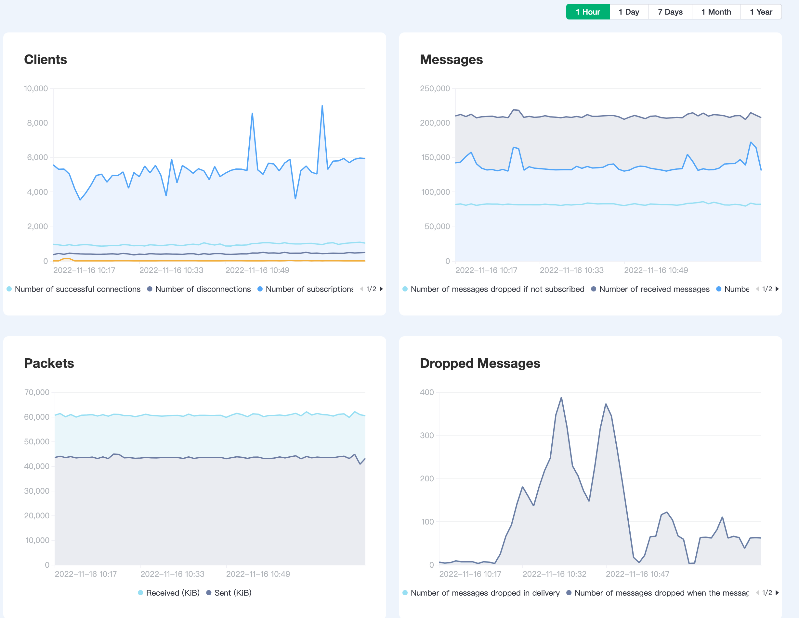
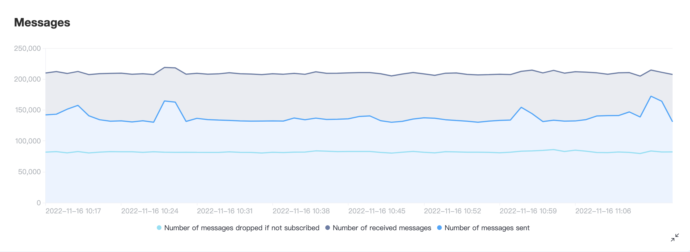
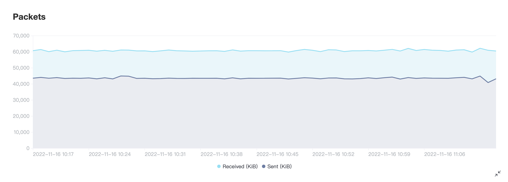

# Metric

EMQ X Cloud provides four incremental metrics: messages, client, packets, and delivery. You can view the display chart corresponding to each indicator, and the detailed information at a certain point of time.

## Message

It shows the incremental status of message sending and receiving in a certain period of time. The following 3 metrics are provided:

| Indicator         | Meaning                                                      |
| ----------------- | :----------------------------------------------------------- |
| messages_dropped  | The total number of messages discarded before forwarding to the subscription process in EMQ X |
| messages_received | Number of messages received from the client                  |
| messages_sent     | Number of messages sent to the client                        |

## Client

Shows the incremental situation of interaction with the client in a certain period of time. The following 4 metrics are provided:

| Indicator           | Meaning                                 |
| ------------------- | :-------------------------------------- |
| client_connected    | Number of successful client connections |
| client_disconnected | Number of client disconnections         |
| client_subscribe    | Number of client subscriptions          |
| client_unsubscribe  | Number of client unsubscriptions        |

## Packets

It shows the increment of the number of bytes sent and received during the time period. The following 2 metrics are provided:

| Indicator          | Meaning                      |
| ------------------ | :--------------------------- |
| send_kibibytes     | Kilobytes of sent packet     |
| received_kibibytes | Kilobytes of received packet |

## Delivery

It shows the increment of the number of discarded messages within a time period, and provides the following one indicator:

| Indicagor        | Meaning                                         |
| ---------------- | :---------------------------------------------- |
| delivery_dropped | Number of message dropped when sending |
| delivery_dropped_queue_full | Number of message dropped when the message queue is full |

