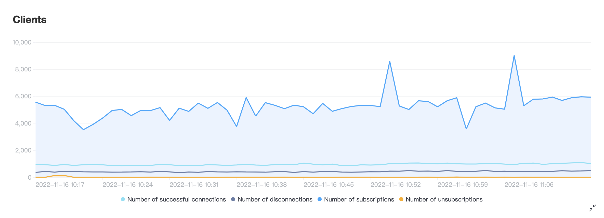
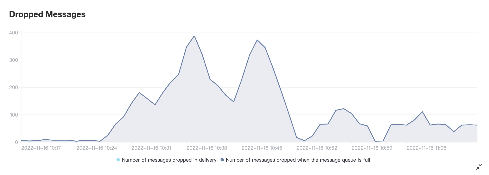

# Metric

:::: tabs type:card
::: tab Metrics of the Serverless Plan

EMQX Cloud provides four incremental metrics: **Sessions**, **Messages**, **Traffic**, and **Dropped Messages**. You can view the display chart corresponding to each indicator, and the detailed information at a certain point in time.

<!--需要增加serverless 截图-->

## Sessions

Displays the number of current sessions within a specified time period with indicator Sessions:

| Indicator | Description        |
| --------- | :----------------- |
| Sessions  | Number of sessions |

## Messages

Displays the incremental changes in messages sent and received within a given time period with indicator  messages_received and messages_sent: 

| Indicator         | Description                                 |
| ----------------- | :------------------------------------------ |
| messages_received | Number of messages received from the client |
| messages_sent     | Number of messages sent to the client       |

## Traffic

Displays the traffic generated by sending and receiving messages within a time period, with indicator send_kibibytes, received_kibibytes and total_kibibytes:

| Indicator          | 意义                                          |
| ------------------ | :-------------------------------------------- |
| send_kibibytes     | Kilobytes of the sent messages                |
| received_kibibytes | Kilobytes of the received messages            |
| total_kibibytes    | Total kilobytes of sent and received messages |

## Dropped Messages

Displays the incremental changes of the number of discarded messages within the time period, with indicator delivery_dropped, delivery_dropped_queue_full, and delivery_dropped_expire

| Indicator                   | Description                                               |
| --------------------------- | :-------------------------------------------------------- |
| delivery_dropped            | Number of messages dropped on send                        |
| delivery_dropped_queue_full | Number of messages dropped when the message queue is full |
| delivery_dropped_expire     | Number of messages dropped due to message expiration      |

:::
::: tab 

Metrics of the Dedicated Plan

## Message

It shows the incremental status of message sending and receiving in a certain period of time. The following 3 metrics are provided:

| Indicator         | Description                                                  |
| ----------------- | :----------------------------------------------------------- |
| messages_dropped  | The total number of messages discarded before forwarding to the subscription process in EMQX |
| messages_received | Number of messages received from the client                  |
| messages_sent     | Number of messages sent to the client                        |

## Client

Shows the incremental situation of interaction with the client in a certain period of time. The following 4 metrics are provided:

| Indicator           | Description                             |
| ------------------- | :-------------------------------------- |
| client_connected    | Number of successful client connections |
| client_disconnected | Number of client disconnections         |
| client_subscribe    | Number of client subscriptions          |
| client_unsubscribe  | Number of client unsubscriptions        |

## Packets

It shows the increment of the number of bytes sent and received during the time period. The following 2 metrics are provided:

| Indicator          | Description                  |
| ------------------ | :--------------------------- |
| send_kibibytes     | Kilobytes of sent packet     |
| received_kibibytes | Kilobytes of received packet |

## Delivery

It shows the increment of the number of discarded messages within a time period, and provides the following one indicator:

| Indicator                   | Description                                              |
| --------------------------- | :------------------------------------------------------- |
| delivery_dropped            | Number of message dropped when sending                   |
| delivery_dropped_queue_full | Number of message dropped when the message queue is full |

:::
::::

