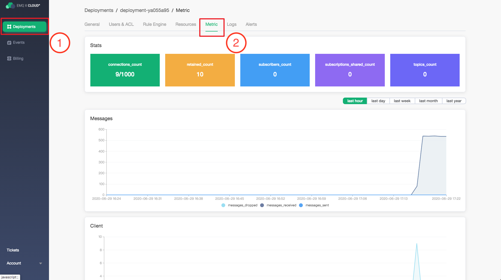
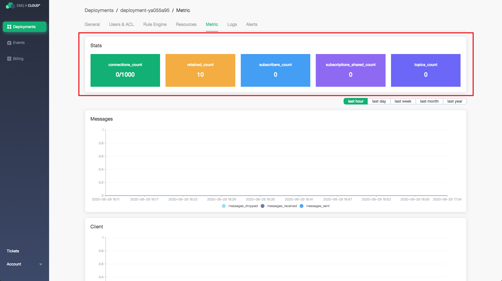
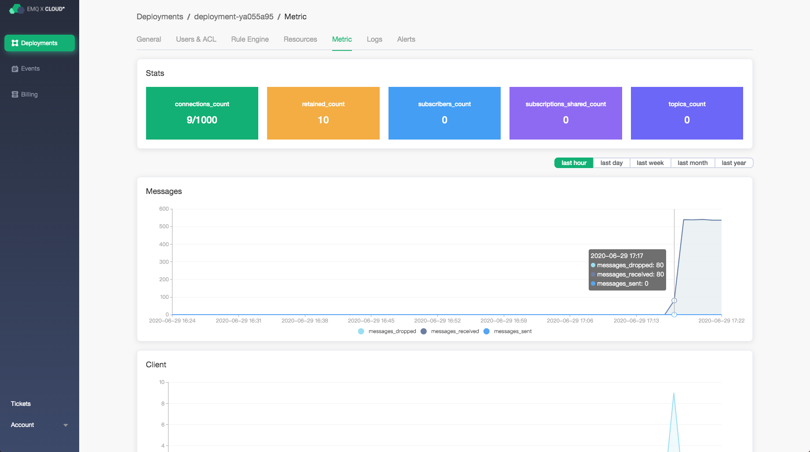
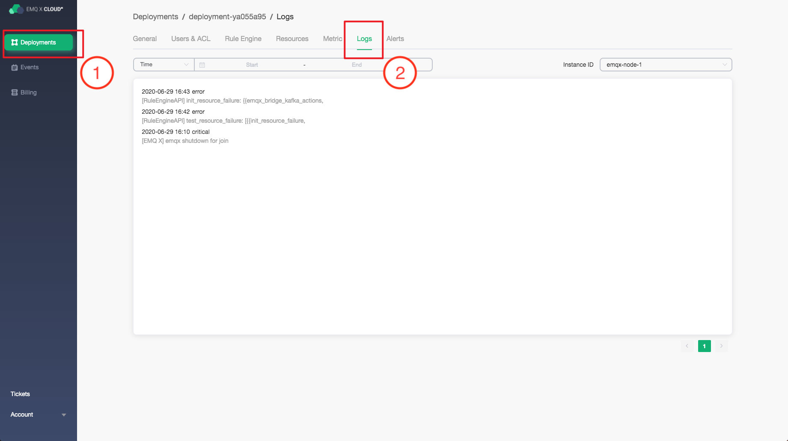
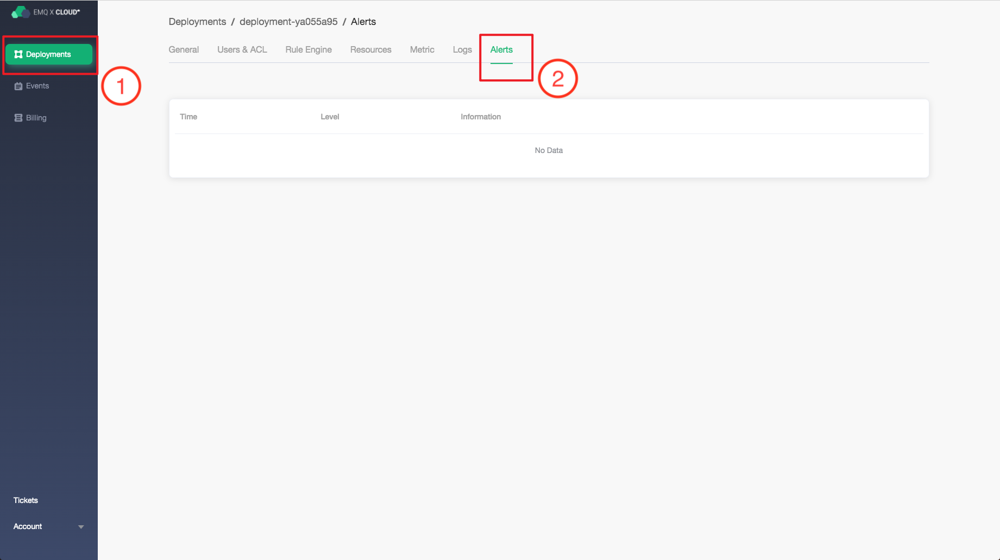

# Monitor and alert

EMQ x cloud provides complete monitoring and alarm scheme

To view the deployed monitoring and alarms, navigate to the [EMQ X Cloud console](https://cloud.emqx.io/console/) Click the corresponding deployment to view the monitoring metrics, logs, and alarms.

### Monitoring

Click the metric to navigate to the deployment metrics page, where you can view the deployment metrics information.

#### EMQX real time metrics

In the stats module, provide the number of metrics in the latest period. From left to right:

1. Number of connections

2. Number of retained

3. Number of subscriptions

4. Number of shared subscriptions

5. Number of topics

#### EMQX incremental metrics

The page also provides four incremental metrics: message, client, message, and delivery.

Move the mouse over the chart to view the details of a certain time point.

##### Message

It shows the incremental situation of message sending and receiving in the period. Providing three metrics:

| metric | meaning |
| ----------------- |:--------------------------------------- |
| messages_dropped | EMQ X total number of messages dropped before internal forwarding to subscription process|
| messages_received | number of messages received from the client|
| messages_send | number of messages sent to the client|

##### Client

It shows the incremental interaction with the client during the period. It provides the following four metrics:

| metric | meaning |
| ------------------- | :----------------- |
| client_connected | number of successful client connections|
| client_disconnected | number of clients disconnects|
| client_subscribe | number of client subscriptions|
| client_unsubscribe | number of clients unsubscribes|

##### Packet

It shows the incremental number of bytes sent and received in a period. It provides the following two metrics:

| metric | meaning |
| ------------------ | :--------------- |
| send_kibibytes | kilobytes of the message sent|
| received_kibibytes | kilobytes of received message|

##### Delivery

It shows the increment of the number of messages dropped in the period and provides the following one metric:

| metric | meaning |
| ---------------- | :------------------- |
| delivery_ Dropped | the total number of messages dropped when sent|

### Log

Click log to navigate to the deployment log page, where you can view the deployment log.

### Alarm

Click the alarm to navigate to the deployment's alarm page, where you can view the deployment alarm.

EMQ X Cloud provides the following five-alarm prompts

|Alarm type | alarm service | alarm level | trigger condition|
| ------------------- | ---------------- | -------- | ------------------------------------- |
| connections-high | load_ Balancer | warning | deployment connection number is greater than 90% of purchase specification|
| traffic-high | load_ Balancer | warning | sudden increase in traffic|
| CPU high | instance | warning | instance CPU load utilization rate is greater than 75%|
| Memory high | instance | warning | instance memory usage rate is greater than 75%|
| Filesystem high | instance | warning | instance disk usage is greater than 75%|

