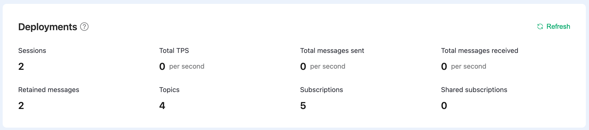
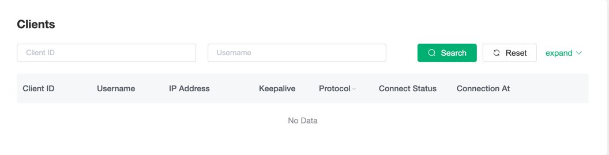
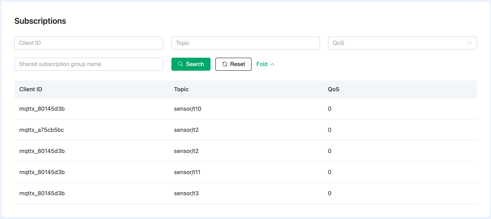

# Monitors

On the **Monitor** page of a deployment, you can view the monitoring data of the deployment, including metrics about connection and messaging, and detailed information on clients and subscriptions. It provides an easy way for you to observe the operation situations and manage the client connections in your deployment.

## Deployment metrics

In the **Deployments** section, you can view real-time metrics in the current deployment.

| Metrics                 | Descriptions                                                 |
| ----------------------- | ------------------------------------------------------------ |
| Sessions                | The total number of clients concurrently connected to the deployment, including the offline clients with live sessions. |
| Total TPS               | The total number of transactions processed by the current deloyment within a second, containing the total rate of messages received and sent per second. |
| Total messages sent     | The total number of messages sent within a second.           |
| Total messages received | The total number of messages received within a second.       |
| Retained messages       | The total number of retained messages in the deployment.  For knowledge about retained message, see [The Beginner's Guide to MQTT Retained Messages](https://www.emqx.com/en/blog/mqtt5-features-retain-message). |
| Topics                  | The total number of topics currently subscribed by all clients. |
| Subscriptions           | The total number of subscriptions established by each client. |
| Shared subscriptions    | The total number of shared subscriptions. For knowledge about shared subscriptions, see [Shared subscription - MQTT 5.0 new features](https://www.emqx.com/en/blog/introduction-to-mqtt5-protocol-shared-subscription). |

::: tip
The number of subscriptions is calculated per client. If two different clients subscribe to the same topic, it is counted as 2 subscriptions.
:::

## Clients

The **Clients** section lists the detailed information about the identity and connection status of each client. By clicking **More**, you can search a specific client by more fields. By clicking the **Kick Out** button at the end of a client entry, you can kick a client offline to terminate the connection of the client.

## Subscriptions

The **Subscriptions** section list the information about the topics subscribed by each client, including the client ID, topic and Quality of Service (QoS). You can search by all these fields. Wildcard is supported when you search by the **Topic** field. For example, if you want to search `a/b`, you can type `a/b`, `a/+` or `a/#`. 

By clicking **More**, there is a text box where you can type the group name of a shared subscription for search. After clicking **Search**, you can view all the clients that belong to the same group and the topic of the shared subscription. 

