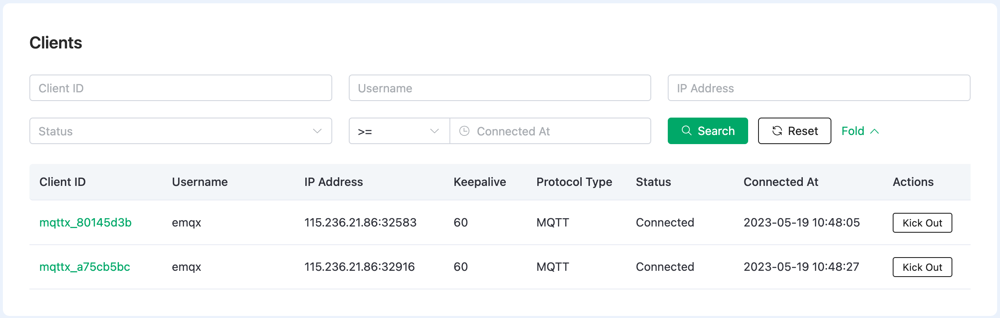

# Monitors

EMQ X Cloud provides monitoring metrics to view data such as TPS, number of connections, subscriptions, and topics in real time.

## Basic Information
The following monitoring metrics are included:
* Cluster status and running time
* Number of message sent per second
* Number of message received per second
* Number of connections
* Number of subscriptions
* Number of topics

## Clients
The client list includes the following information:
* Client ID
* Username
* IP Address
* Keepalive
* Protocol
* Connect status
* Connect time

