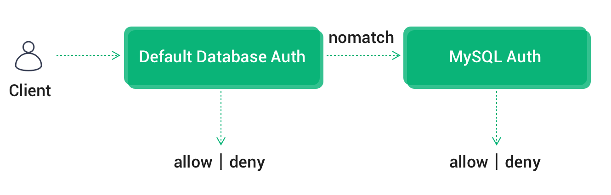
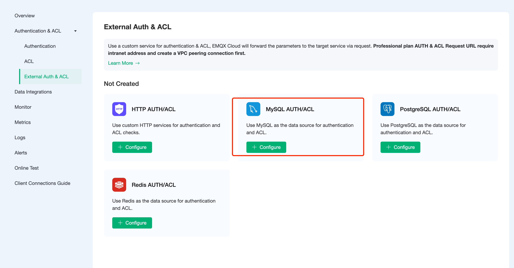
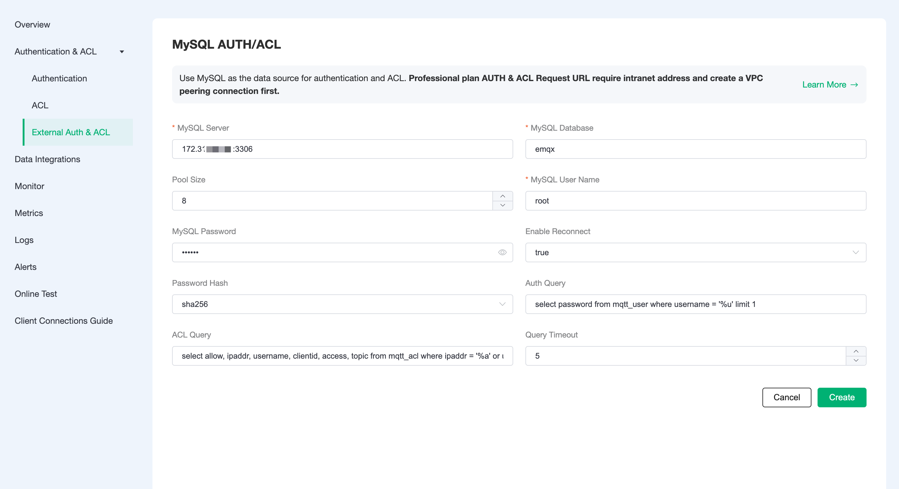

# MySQL Authentication/Access Control

In addition to supporting the default authentication and authentication method, EMQX Cloud can also use an external MySQL database as a data source to store large amounts of data and to facilitate integration with external device management systems.

## Authentication Chain

If built-in authentication is also enabled, EMQX Cloud will chain [default authentication](https://docs.emqx.com/en/cloud/latest/deployments/auth.html) and MySQL authentication in the following order Authentication.

- Once authentication is successful, the chain is terminated and the client is allowed access
- Once authentication fails, terminate the chain and disable client access



## MySQL Configuration

1. MySQL Installation

    ```bash
    docker run -d --restart=always \
      --name mysql \
      -p 3306:3306 \
      -e MYSQL_ROOT_PASSWORD=public \
      mysql/mysql-server:5.7
    ```

2. Database creation

    ```bash
    docker exec -it mysql mysql -uroot -ppublic
    CREATE DATABASE emqx;
    USE emqx;
    ```

3. Authentication table creation

    The following SQL statement will create the `mqtt_user` table, which will be used to store user authentication data.

    ```sql
    CREATE TABLE `mqtt_user` (
      `id` int(11) unsigned NOT NULL AUTO_INCREMENT,
      `username` varchar(100) DEFAULT NULL,
      `password` varchar(100) DEFAULT NULL,
      `salt` varchar(35) DEFAULT NULL,
      `created` datetime DEFAULT NULL,
      PRIMARY KEY (`id`),
      UNIQUE KEY `mqtt_username` (`username`)
    ) ENGINE=InnoDB DEFAULT CHARSET=utf8mb4;
    ```

    Field Description:

    - username: username of the connected client, if the value here is set to $all, the rule applies to all users
    - password: password parameter for connecting to the client
    - salt: password with salt string

    > You can use AS syntax in SQL to rename the field to specify password, or set the salt value to a fixed value.

4. Access Control Table Creation

    The following SQL statement will create the `mqtt_acl` table, which will be used to store the authentication data of topic subscription and publishing privileges.

    ```sql
     CREATE TABLE `mqtt_acl` (
       `id` int(11) unsigned NOT NULL AUTO_INCREMENT,
       `allow` int(1) DEFAULT 1 COMMENT '0: deny, 1: allow',
       `ipaddr` varchar(60) DEFAULT NULL COMMENT 'IpAddress',
       `username` varchar(100) DEFAULT NULL COMMENT 'Username',
       `clientid` varchar(100) DEFAULT NULL COMMENT 'ClientId',
       `access` int(2) NOT NULL COMMENT '1: subscribe, 2: publish, 3: pubsub',
       `topic` varchar(100) NOT NULL DEFAULT '' COMMENT 'Topic Filter',
       PRIMARY KEY (`id`),
       INDEX (ipaddr),
       INDEX (username),
       INDEX (clientid)
     ) ENGINE=InnoDB DEFAULT CHARSET=utf8mb4;
    ```

    Field descriptions:

    - allow: disable (0), allow (1)
    - ipaddr: set IP address
    - username: the username of the connected client, if the value here is set to $all, it means the rule applies to all users
    - clientid: clientid of the connected client
    - access: allowed operations: subscribe (1), publish (2), both subscribe and publish (3)
    - topic: the topic of the control, you can use wildcards, and you can add placeholders to the topic to match the client information, e.g. t/%c will replace the topic with the current clientid when matching
    Set the EMQX Cloud cluster IP segment to be allowed to access the database (optional)

    For Professional deployment, to get the deployment segment, you can go to Deployment Details → View Peer Connection Information and copy the deployment VPC CIDR.

    ```sql
    # Professional
    GRANT ALL PRIVILEGES ON *. * TO root@'10.11.30.%' IDENTIFIED BY 'public' WITH GRANT OPTION;
    
    # Standard
    GRANT ALL PRIVILEGES ON *. * TO root@'%' IDENTIFIED BY 'public' WITH GRANT OPTION;
    ```

## Authentication/access control configuration

1. Click `Authentication Authentication` - `External Authentication Authorization` in the left menu bar of EMQX Cloud deployment and select MySQL Authentication/Access Control.

    

2. Click `Configure Authentication` to enter MySQL Authentication/Access Control page, fill in the information and create a new authentication.

    Tip

    - If the current deployment is Basic Edition, please fill in the public address for the server address
    - If the current deployment is Professional Edition, you need to create a [VPC peer connection](https://docs.emqx.com/en/cloud/latest/deployments/vpc_peering.html), please fill in the intranet address for the server address.
    - If you are prompted with Init resource failure! check whether the server address is correct, whether the security group is enabled, and whether the MySQL database allows EMQX Cloud cluster access

    

### Permissions authentication principle

When authenticating, EMQX Cloud will use the current client information to populate and execute the username and password authentication SQL configured by the user, and query the authentication data in the database for that client.

```bash
select password from mqtt_user where username = '%u' limit 1;
```

You can use the following placeholders in the authentication SQL, which will be automatically populated with the client information when EMQX Cloud is executed: :

- %u: username
- %c: clientid
- %P: plaintext password

You can adapt the authentication SQL to your business needs, such as adding multiple query conditions, using database preprocessing functions, to achieve more business-related functionality. But in any case, the authentication SQL needs to meet the following conditions: 1.

1. the query result must contain a password field, which is used by EMQX Cloud to compare with the client password
2. If the salt configuration is enabled, the query result must contain the salt field, which is used by EMQX Cloud as the salt value. 3.
3. There can only be one query result, and only the first result is taken as valid data when there are multiple results

The default configuration example data is as follows.

```sql
INSERT INTO `mqtt_user` ( `username`, `password`, `salt`)
VALUES
    ('emqx', 'efa1f375d76194fa51a3556a97e641e61685f914d446979da50a551a4333ffd7', NULL);
```

With MySQL authentication enabled, you can connect via username: emqx, password: public.

### Access control principle

When access control authentication is performed for topic subscription and publishing, EMQX Cloud will use the current client information to populate and execute the user-configured access control authentication SQL to find the data related to the client from MySQL and then perform authentication.

```sql
select allow, ipaddr, username, clientid, access, topic from mqtt_acl where ipaddr = '%a' or username = '%u' or username = '$all' or clientid = '%c';
```

The following placeholders can be used in the authentication SQL and will be automatically populated with client information by EMQX Cloud when executed: :

- %u: username
- %c: clientid
- %a: client IP address
- %P: plaintext password

The following example data is configured by default.

```sql
-- All users are not allowed to subscribe to system topics
INSERT INTO mqtt_acl (allow, ipaddr, username, clientid, access, topic) VALUES (0, NULL, '$all', NULL, 1, '$SYS/#');

-- Allow clients on 10.59.1.100 to subscribe to system topics
INSERT INTO mqtt_acl (allow, ipaddr, username, clientid, access, topic) VALUES (1, '10.59.1.100', NULL, NULL, 1, '$SYS/#');

-- Disable client subscription to /smarthome/+/temperature topic
 INSERT INTO mqtt_acl (allow, ipaddr, username, clientid, access, topic) VALUES (0, NULL, '$all', NULL, 1, '/smarthome/+/temperature');

-- Allow clients to subscribe to the /smarthome/${clientid}/temperature topic containing their own Client ID
INSERT INTO mqtt_acl (allow, ipaddr, username, clientid, access
```

### Encryption rules

Most external authentication on EMQX Cloud can be enabled with the hash method, and only the cipher text of the password is stored in the data source to ensure data security. When hashing is enabled, you can specify a salt for each client and configure the salt rules, and the password stored in the database is the cipher text processed according to the salt rules and the hashing method.

> Available from: [Salting rules and hashing methods](https://www.emqx.io/docs/en/v4.4/advanced/auth.html#password-salting-rules-and-hash-methods)。

```bash
## unsalted, plaintext
plain

## No salt, hash only
sha256

 ## salt prefix: use sha256 to encrypt the salt + password concatenated string
salt,sha256

## salt suffix: encrypted with sha256 password + salt concatenated string
sha256,salt

## pbkdf2 with macfun iterations dklen
## macfun: md4, md5, ripemd160, sha, sha224, sha256, sha384, sha512
pbkdf2, sha256, 1000, 20
```
