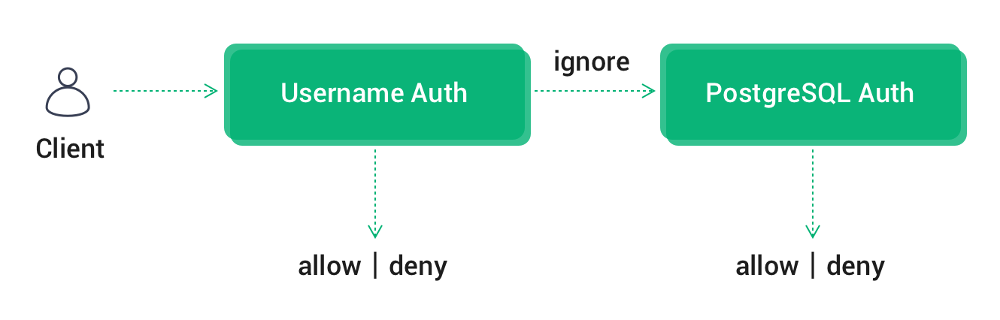
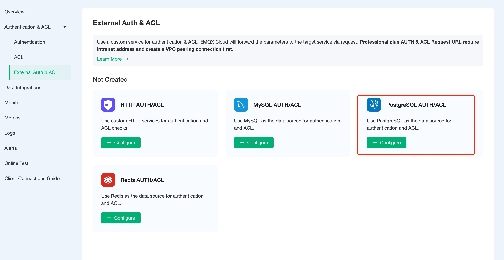
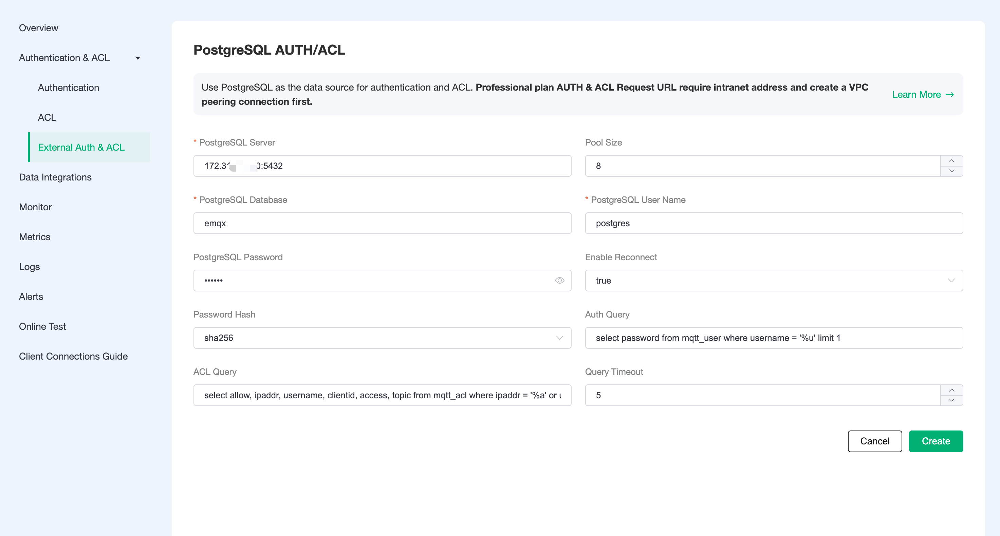

# PostgreSQL Authentication/Access Control

In addition to supporting the default authentication and authentication method, EMQX Cloud can also use an external PostgreSQL database as a data source to store large amounts of data and to facilitate integration with external device management systems.

## Authentication Chain

If built-in authentication is also enabled, EMQX Cloud will chain [default authentication](https://docs.emqx.com/en/cloud/latest/deployments/auth.html) and PostgreSQL authentication in the following order Authentication.

- Once authentication is successful, terminate the authentication chain and allow client access
- In case of authentication failure, terminate the chain and disable client access



## PostgreSQL Configuration

1. PostgreSQL installation

    ```bash
     docker run -d --name postgresql -p 5432:5432 -e POSTGRES_PASSWORD=public postgres:13
    ```

2. database creation

    ```bash
     docker exec -it postgresql psql -U postgres
     CREATE database emqx;
     \c emqx
    ```

3. Authentication table creation

    Using the following SQL statement will create the ``mqtt_user`` table which will be used to store user authentication data.

    ```sql
    CREATE TABLE mqtt_user (
      id SERIAL PRIMARY KEY,
      username CHARACTER VARYING(100),
      password CHARACTER VARYING(100),
      salt CHARACTER VARYING(40),
      UNIQUE (username)
     ); 
    ```

    Field Description:

    - username: username of the connecting client, a value of $all means that the rule applies to all users
    - password: the password parameter of the connected client
    - salt: password with salt string

    > You can use AS syntax in SQL to rename the field to specify password, or set the salt value to a fixed value.

4. Access Control Table Creation

    The following SQL statement will create the `mqtt_acl` table, which will be used to store the authentication data of topic subscription and publishing privileges.

    ```sql
     CREATE TABLE mqtt_acl (
       id SERIAL PRIMARY KEY,
       allow INTEGER,
       ipaddr CHARACTER VARYING(60),
       username CHARACTER VARYING(100),
       clientid CHARACTER VARYING(100),
       access INTEGER,
       topic CHARACTER VARYING(100)
     );
    ```

    Field descriptions.

    - allow: prohibit (0), allow (1)
    - ipaddr: set IP address
    - username: the username of the connecting client, if the value here is set to $all, the rule applies to all users
    - clientid: client id of the connected client
    - access: allowed operations: subscribe (1), publish (2), both subscribe and publish (3)
    - topic: the topic of the control, you can use wildcards, and you can add placeholders in the topic to match the client information, for example, t/%c will replace the topic with the current clientid when matching

## Authentication/access control configuration

1. Click `Authentication & Authentication` - `External Authentication & Authorization` in the left menu bar of EMQX Cloud deployment, and select PostgreSQL Authentication/Access Control.

    

2. Click `Configure Authentication` to enter the PostgreSQL Authentication/Access Control page, fill in the information and create a new authentication.

    - If you are currently deploying the basic version, please fill in the public address of the server.
    - If you are currently deploying Professional Edition, you need to create a [VPC peer connection](https://docs.emqx.com/en/cloud/latest/deployments/vpc_peering.html) and fill in the intranet address for the server address.
    - If you are prompted with Init resource failure! Check if the server address is correct and if the security group is enabled.

    

### Principle of permission authentication

When authenticating, EMQX Cloud will use the current client information to populate and execute the user name and password authentication SQL configured by the user, and query the authentication data in the database of the client.

```sql
select password from mqtt_user where username = '%u' limit 1;
```

You can use the following placeholders in the authentication SQL, which will be automatically populated with the client information when EMQX Cloud is executed: :

- %u: username
- %c: clientid
- %P: plaintext password

You can adapt the authentication SQL to your business needs, such as adding multiple query conditions, using database preprocessing functions, to achieve more business-related functionality. But in any case, the authentication SQL needs to meet the following conditions:

1. the query result must contain a password field, which is used by EMQX Cloud to compare with the client password
2. If the salt configuration is enabled, the query result must contain the salt field, which is used by EMQX Cloud as the salt value. 3.
3. There can only be one query result, and only the first result is taken as valid data when there are multiple results

The default configuration example data is as follows.

```sql
INSERT INTO mqtt_user (id, username, password, salt) VALUES (1, 'emqx', 'efa1f375d76194fa51a3556a97e641e61685f914d446979da50a551a4333ffd7', NULL);
```

With PostgreSQL authentication enabled, you can connect via username: emqx, password: public.

### Access control principle

When access control authentication is performed for topic subscription and publication, EMQX Cloud will use the current client information to populate and execute the user-configured access control authentication SQL to find the data related to the client from PostgreSQL and then perform authentication.

```sql
select allow, ipaddr, username, clientid, access, topic from mqtt_acl where ipaddr = '%a' or username = '%u' or username = '$all' or clientid = '%c';
```

You can use the following placeholders in the authentication SQL, which will be automatically populated with client information by EMQX Cloud when executed: :

- %u: username
- %c: clientid
- %a: client IP address
- %P: plaintext password

The following example data is configured by default.

```sql
-- All users are not allowed to subscribe to system topics
INSERT INTO mqtt_acl (allow, ipaddr, username, clientid, access, topic) VALUES (0, NULL, '$all', NULL, 1, '$SYS/#');

-- Allow clients on 10.59.1.100 to subscribe to system topics
INSERT INTO mqtt_acl (allow, ipaddr, username, clientid, access, topic) VALUES (1, '10.59.1.100', NULL, NULL, 1, '$SYS/#');

-- Disable client subscription to /smarthome/+/temperature topic
 INSERT INTO mqtt_acl (allow, ipaddr, username, clientid, access, topic) VALUES (0, NULL, '$all', NULL, 1, '/smarthome/+/temperature');

-- Allow clients to subscribe to the /smarthome/${clientid}/temperature topic containing their own Client ID
INSERT INTO mqtt_acl (allow, ipaddr, username, clientid, access, topic) VALUES (1, NULL, '$all', NULL, 1, '/smarthome/%c/temperature');

```

### Encryption rules

Most external authentication on EMQX Cloud can be enabled with the hash method, and only the cipher text of the password is stored in the data source to ensure data security. When hashing is enabled, you can specify a salt for each client and configure the salt rules, and the password stored in the database is the cipher text processed according to the salt rules and the hashing method.

> Available from: [Salting rules and hashing methods](https://www.emqx.io/docs/en/v4.4/advanced/auth.html#password-salting-rules-and-hash-methods)。

```bash
## unsalted, plaintext
plain

## No salt, hash only
sha256

 ## salt prefix: use sha256 to encrypt the salt + password concatenated string
salt,sha256

## salt suffix: encrypted with sha256 password + salt concatenated string
sha256,salt

## pbkdf2 with macfun iterations dklen
## macfun: md4, md5, ripemd160, sha, sha224, sha256, sha384, sha512
pbkdf2, sha256, 1000, 20
```
