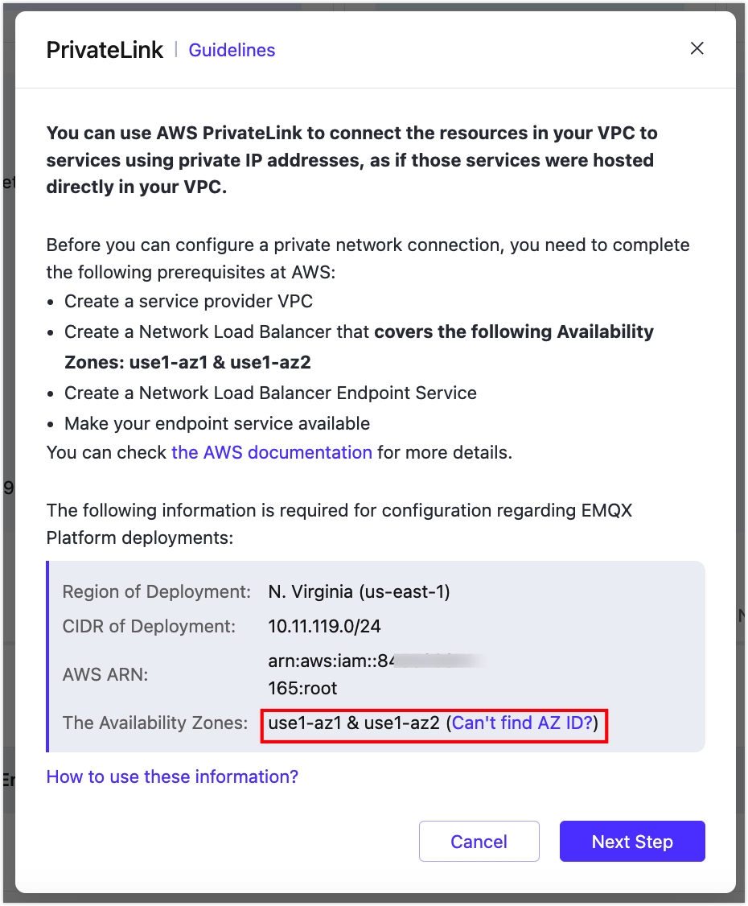
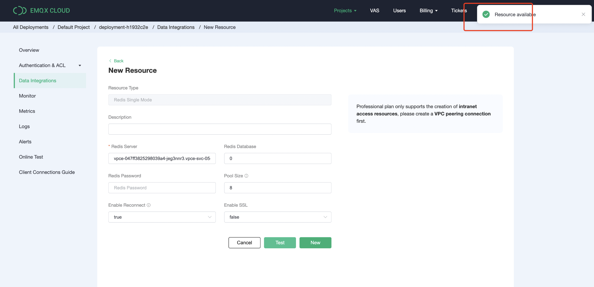

# AWS PrivateLink

This page provides instructions on how to enable the PrivateLink feature for the EMQX Cloud deployment on the Amazon AWS platform. Once the PrivateLink is enabled, the EMQX Cloud deployment can access AWS hosted services through a private connection in your virtual network. In the private connection, the EMQX Cloud deployment's Virtual Private Cloud (VPC) functions as the service user, sending requests to the VPC where your cloud-based resources reside, namely, the service provider's VPC.

<LazyIframeVideo vendor="youtube" src="https://www.youtube.com/embed/vu_3KW4pq9A/?autoplay=1&null" />

## Create Endpoint Service Using AWS PrivateLink

When creating Endpoint Service in AWS, the LB Availability Zone [AZ ID](https://us-east-1.console.aws.amazon.com/ram/home?region=us-east-1#Home) created should be identical to that in the EMQX Cloud deployment. To get the AZ ID in EMQX cloud:

Login to [EMQX Cloud Console](<https://cloud.emqx.com/console>), go to the desired deployment creation details, and click the `+PrivateLink` button to get the deployment availability zone.

Before you can configure PrivateLink, you need to complete the following prerequisite steps on the AWS platform.

1. Register an AWS account and enable the PrivateLink service

2. Create an instance and VPC

3. Create a target group for load balancing

   On **Basic configuration**, set the **Target group name**, **Protocol** （TCP） and **Port**.

   

   On **Health checks**, set the **Override** port, and for the rest, you can keep the default setting or set as your business needs.
   

   Then register target group and create instance.
   

4. Create and configure the Load Balancer with the AZ ID you obtained from EMQX Cloud Console.

   Select the type of load balancing as **Network Load Balancer**.
   

   Select the schema type as internal to facilitate requests to private IP addresses.
   

   Select the TCP protocol, fill in the listening port and the corresponding target group.
   

   After creating the load balancer, check whether the listening port status of the target group is healthy.
   

5. Create an endpoint service

   Find the Endpoint Services in the left menu bar of your AWS account and click Create. The load balancer type is Network, select the load balancer created in the previous step.
   

   In the additional settings, select the IP address type as IPV4.
   

   Once created, you will get the endpoint service name.
   

   You can refer to [AWS Help](https://docs.aws.amazon.com/vpc/latest/privatelink/create-endpoint-service.html#create-endpoint-service-nlb) to complete the above configuration.

## Enable EMQX Cloud PrivateLink

1. After getting the AWS ARN where the deployment is located in EMQX Cloud console, add it to the allowed principals entry of your AWS Platform-Endpoint Service.

   

   Once added, click `Allow principals and go to the next step`.

2. Locate the Endpoint service on your AWS platform, copy the service name, fill it to the EMQX Cloud Endpoint service name, and click `Create PrivateLink`.

   

3. Once completed, find the Endpoint Service - Endpoint Connection in your AWS platform and click `Accept Endpoint Connection Request`.

   

4. Wait for a while and check the status of the PrivateLink in the deployment details, `running` means it has been created successfully. Copy the `Address` for the next data integration-resource configuration.

   

5. Click the Data Integration menu on the left, find the resource type, fill in the `Server` on the New Resource page with the private connection service connection domain and port, database and user information，click `Test`, and the resource will be available.

   

## Delete the PrivateLink

To remove the private connection, you need to ensure that the PrivateLink status is `running`.

> - If you need to remove the PrivateLink service from your AWS platform, please remove the PrivateLink from EMQX Cloud console first, otherwise it will cause PrivateLink status of the deployment to be `failed`.
> - Please ensure that there are no associated resources in the deployment before removing the PrivateLink, otherwise it will lead to unpredictable risks.

1. Go to Deployment Details

2. Click on the `Delete button` to the right of the PrivateLink and click on Confirm to complete the deletion.

   

