# Azure PrivateLink

This page provides instructions on how to enable the PrivateLink feature for the EMQX Cloud deployment on the Microsoft Azure platform. Once the PrivateLink is enabled, the EMQX Cloud deployment can access Azure PaaS Services and Azure hosted customer-owned/partner services through a private connection in your virtual network. In the private connection, the EMQX Cloud deployment's Virtual Private Cloud (VPC) functions as the service user, sending requests to the VPC where your cloud-based resources reside, namely, the service provider's VPC.

The following contents are demonstrated on this page:

- [Create a Private Link Service Using the Azure Portal](#create-a-private-link-service-using-the-azure-portal)
  - [Create Load Balancer](#create-load-balancer)
  - [Create a Private Link Service](#create-a-private-link-service)
- [Enable PrivateLink in Your Deployment](#enable-privatelink-in-your-deployment)
- [Test PrivateLink Connection](#test-privatelink-connection)
- [Remove PrivateLink](#remove-privatelink)

## Create a Private Link Service Using the Azure Portal

To access the Azure services through a private connection from the EMQX Cloud, you need to create a Private Link Service in Azure and expose the service to EMQX Cloud. This section demonstrates how to create a private link service by using the Azure portal. 

::: tip Prerequisites

This demonstration assumes that you have already have the Azure account and created your own virtual network. For more information about creating the virtual network, see the [Azure documentation](https://learn.microsoft.com/en-us/azure/private-link/create-private-link-service-portal?tabs=dynamic-ip#load-balancer-virtual-network).

:::

### Create Load Balancer

Create an internal load balancer that load balances virtual machines.

During the creation of the load balancer, you configure:

- Frontend IP address
- Backend pool
- Inbound load-balancing rules

1. Sign in to the [Azure portal](https://portal.azure.com/#home).
2. In the search box at the top of the portal, enter **Load balancer**. Click **Load balancers** in the search results.
3. In the **Load balancer** page, click **+ Create**.
4. In the **Basics** tab of the **Create load balancer** page, enter or select the following informtaion:
   - **Subscription**: Select your Azure subscription.
   - **Resource Group**: Select the name you configured when you created the virtual network.
   - **Name**: Enter a name for the load balancer.
   - **Type**:  Select `Internal` as the network type.
   - Leave other options as default.

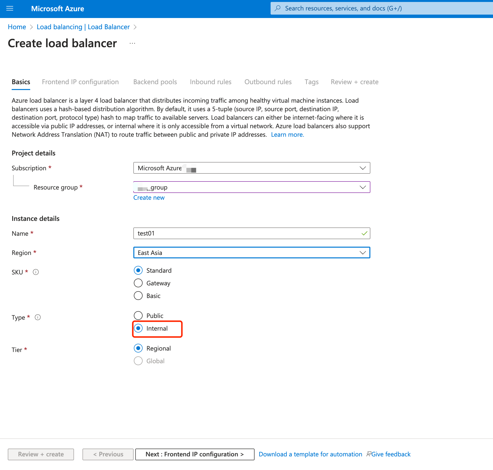

5. Click **Next: Frontend IP configuration**.

6. In **Frontend IP configuration**, click **+ Add a frontend IP configuration** and configure the following settings:

   - **Name**: Enter a name for the front IP configuration. 

     ::: tip

     The name `demo-redis` is used in this demonstration to associate with the testing on the private connection in [Test the PrivateLink Connection](#test-the-privatelink-connection).

     :::

   - **Virtual network**: Select your own virtual work.

   - **Subnet**: Select the subnet of your virtual network.

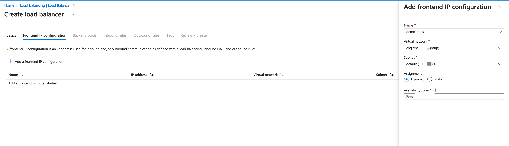

7. Click **Add**.
8. Click **Next: Backend pools**.
9. In **Backend pools**, click **+ Add a backend pool**.
10. Select `NIC` for **Backend Pool Configuration**. Click **+Add** to associate to the backend virtual machine server. Select `demo-redis` as the virtual machine.

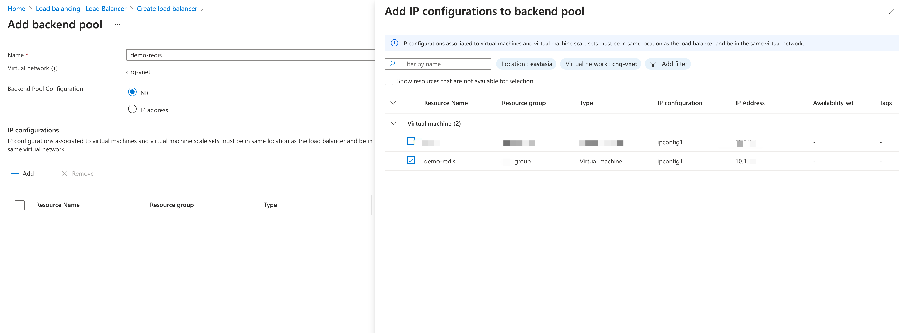

11. Click **Save**.

12. Click **Next: Inbound rules**.

13. In Inbound rules, click **+ Add an Inbound nat rule** to configure the rule for port forwarding.

    ::: tip

    The Network Address Translation (NAT) rule defines how to redirect external traffic from a specific port to a specific port on a virtual machine, allowing external users to access services on the virtual machine.

    :::

    - **Frontend IP configuration**: Select the name you configured in the **Frontend IP configuration** tab.
    - **Frontend Port** and **Backend port**: `6379` is used in the demonstration to facilitate the testing in [Test the PrivateLink Connection](#test-the-privatelink-connection). If you use other resources in data integration for testing, the port should be changed.
    - Configure other settings according to your real case.

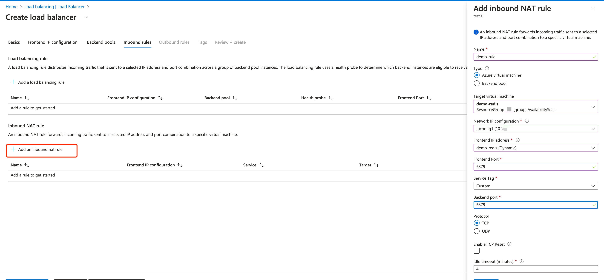

14. Click the blue **Review + create** button.

15. Click **Create**.

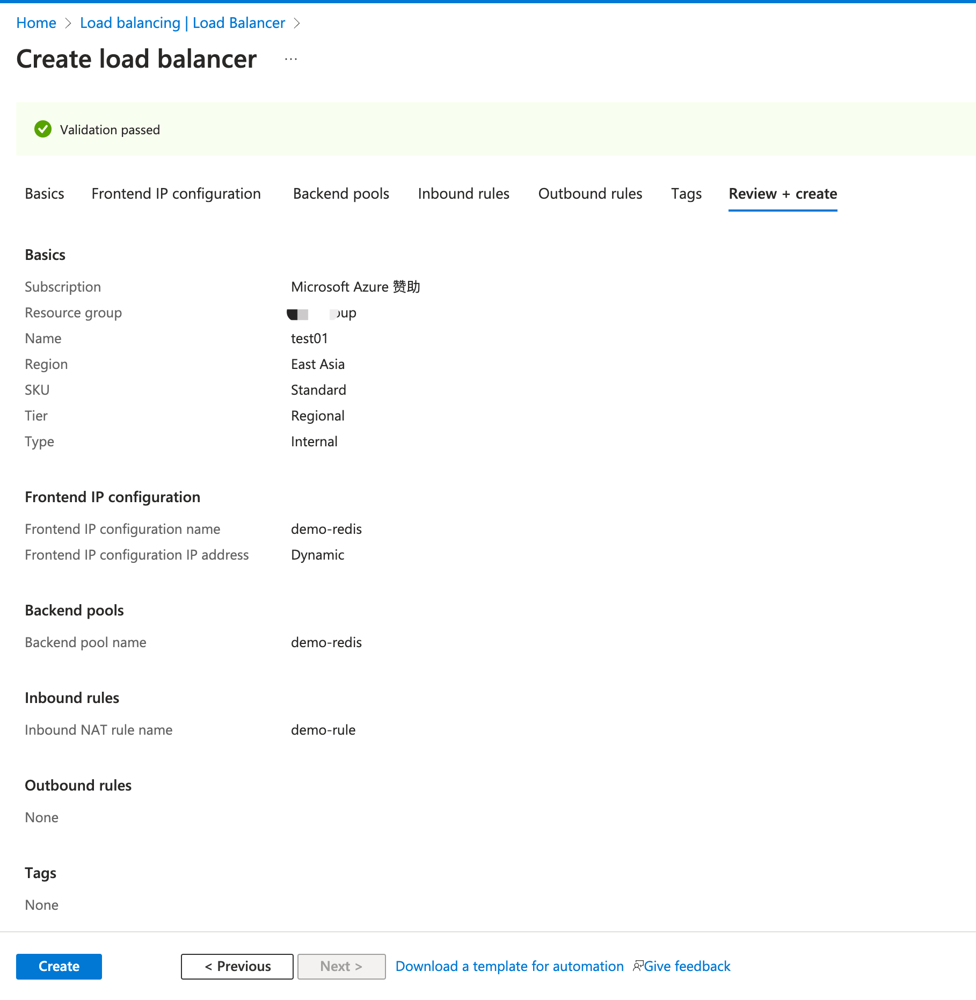

### Create a Private Link Service

Create a Private Link service behind the load balancer you created in the previous section.

1. In the search box at the top of the portal, enter **Private link**. Select **Private link services** in the search results.
2. Select **+ Create**.
3. In the **Basics** tab of the **Create private link service** page, select the resource group you previously created. Enter `demo` as the private link service name.
   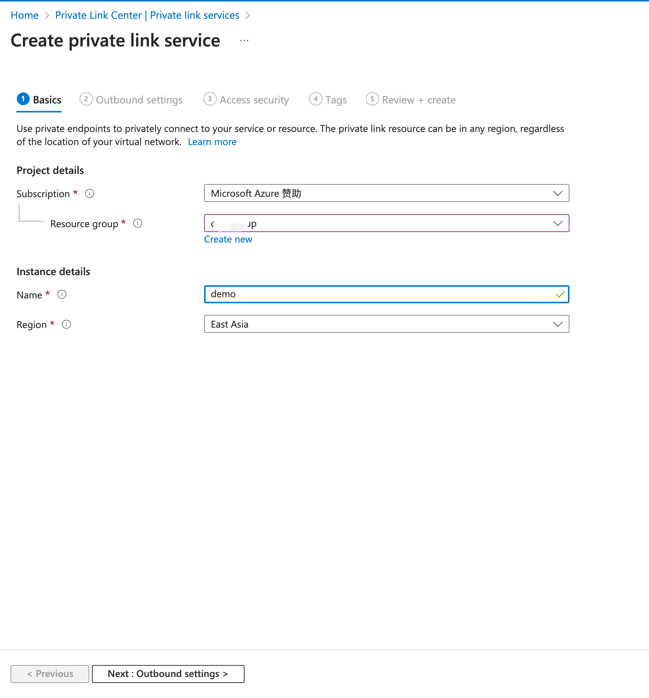

4. Select **Next: Outbound settings**.
5. In the **Outbound settings** tab, enter or select the following information:
   - **Load balancer**: Enter the load balancer name `test01` you previously created.
   - **Load balancer frontend IP address**: Select the frontend IP address `demo-redis (10.1.0.9)` you previously configured.
   - **Source NAT subnet**: Select the subnet you configured in **Frontend IP configuration** in [Create Load Balancer](#create-load-balancer).
   - **Enable TCP proxy V2**: Leave the default of **No**. If your application expects a TCP proxy v2 header, select **Yes**.
   - **Private IP address settings**: Leave the detault settings.

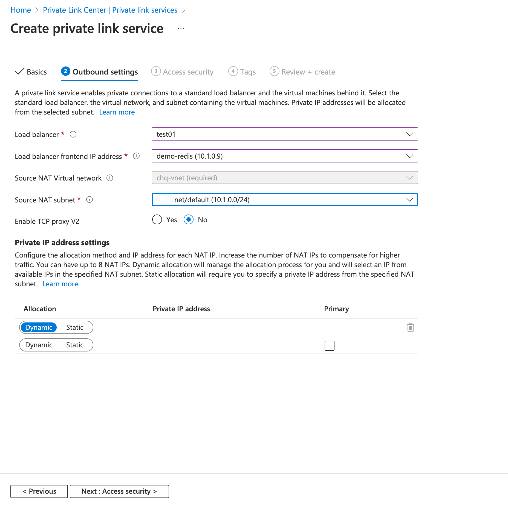

6. Select **Next: Access security**.
7. Leave the default of **Role-based access control only** in the **Access security** tab.
8. Select **Next: Tags**.
9. Select **Next: Review + create**.
10. Select **Create**.

## Enable PrivateLink in Your Deployment

By creating a PrivateLink connection in your deployment, you enable the PrivateLink feature for your deployment.

1. Go to your deployment in EMQX Cloud Console. Scroll down the **Overview** page until you see **PrivateLink**. Click **+ PrivateLink**. On the pop-up dialogue, copy the Azure subscription ID in the **Subscription ID** field.

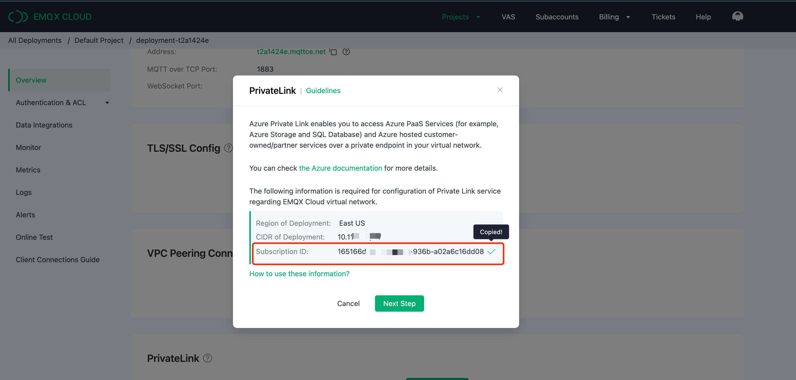

2. Go to the private link service `demo` you created in Azure Portal. 
3. Click **Access security** under **Settings**. Select **Restricted by subscription** and click **Add subscription**. Paste the Azure subscription ID copied from EMQX Cloud Console in the **Subscription** textbox.

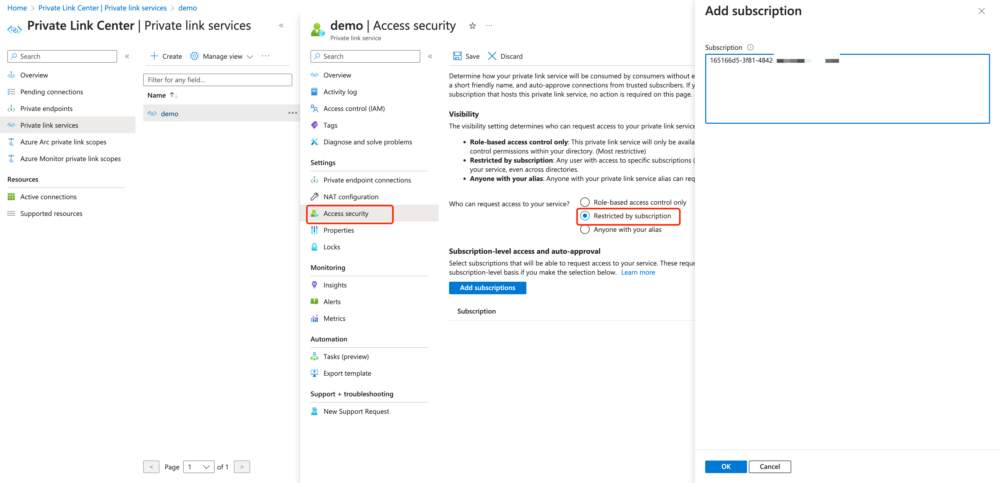

4. Click **OK**. Go to the **Overview** page and copy the alias for the private link service.

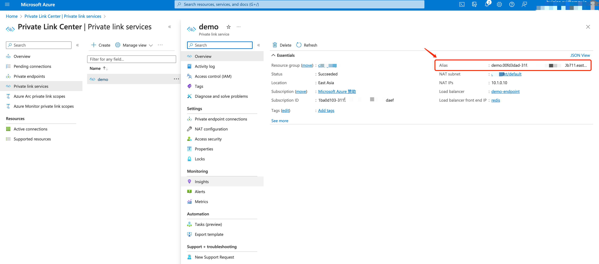

5. Go to the EMQX Cloud Console. Click **Next Step**, paste the alias you just copied in the **Enter the ID of Private Link Service** textbox. Click **Create PrivateLink**.

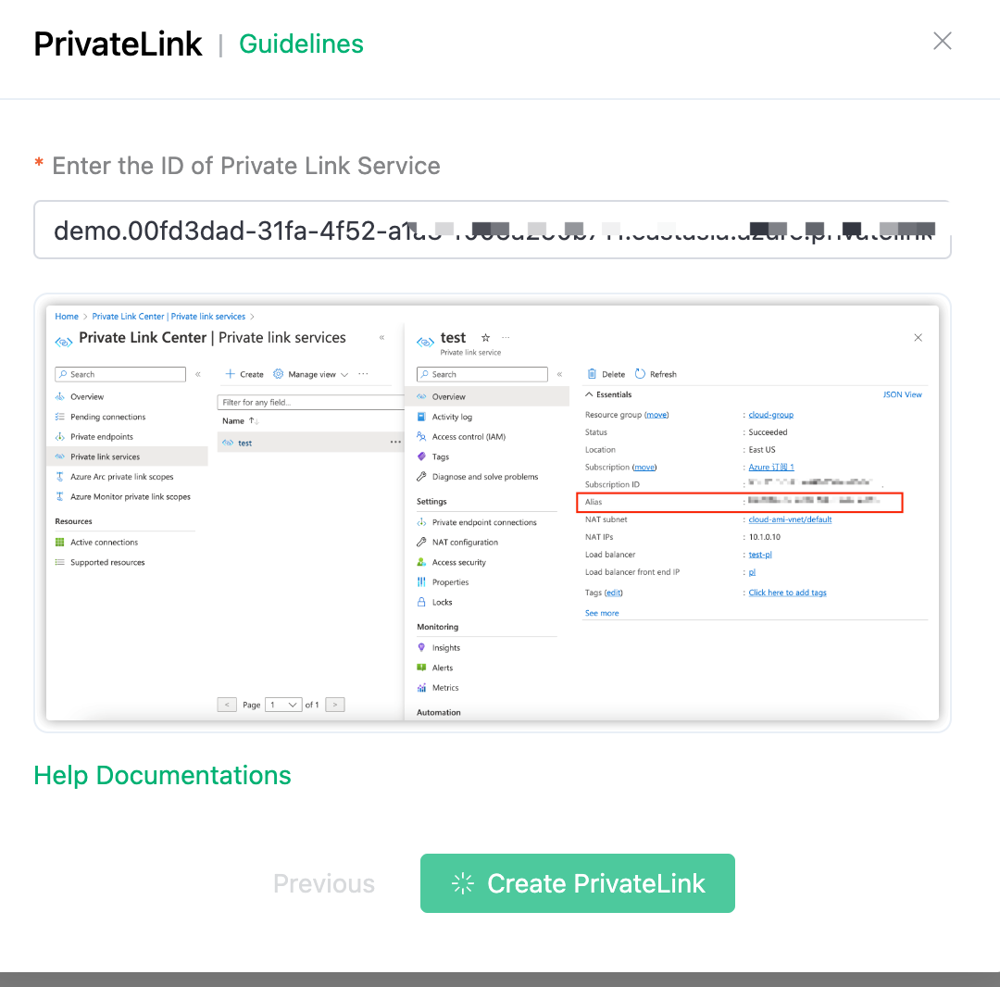

6. Once completed, go to the private link service `demo` and click **Private endpoint connections**. Select the connection and click **Approve**.

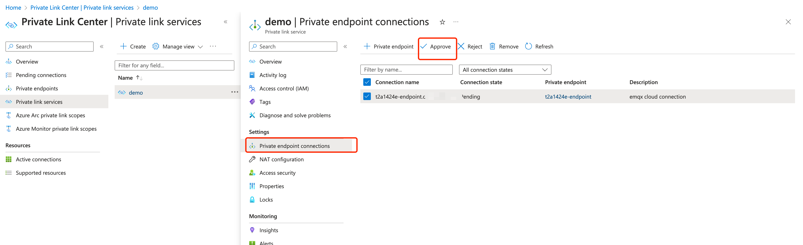

7. Wait for a while and check the status of the PrivateLink in the deployment details. When the status turns to `running`, it means the PrivateLink has been created successfully. 
8. Copy the PrivateLink IP address for later use in the configuration in [Test PrivateLink Connection](#test-privatelink-connection).

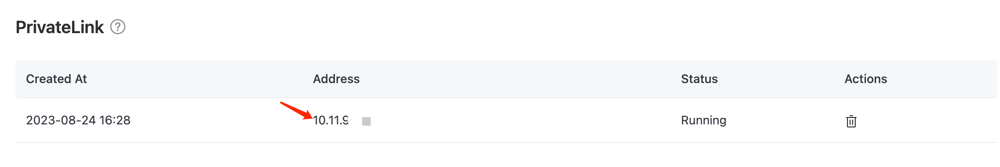

## Test PrivateLink Connection

In this section, you can test if the PrivateLink works properly by connecting to the Redis resource via the private connection in the data integration.

1. In your deployment, click the Data Integrations from the left navigation menu. 
2. Under **Data Persistence**, select **Redis Single Mode**. 
3. On the **New Resource** page, paste the IP address you copied from the **PrivateLink** to the **Redis Server** field as the connection domain. Click **Test**, and the resource should be available.

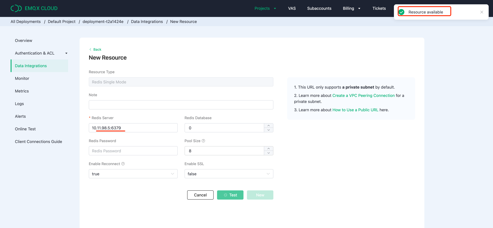

## Remove PrivateLink 

Before removing a PrivateLink connection, you need to check the following:

- Ensure that the PrivateLink status is running.
- Verify that there are no linked resources within the deployment, as neglecting this step could lead to unpredictable risks.

> If you intend to remove the private link service from your Azure platform, it is important to first remove the PrivateLink from the EMQX Cloud Console. Failing to do so may result in a "Failed" PrivateLink status for the deployment.  

1. Go to the deployment details page.

2. Click the removal icon in the **Actions** column of the PrivateLink and click **Confirm** to delete.

