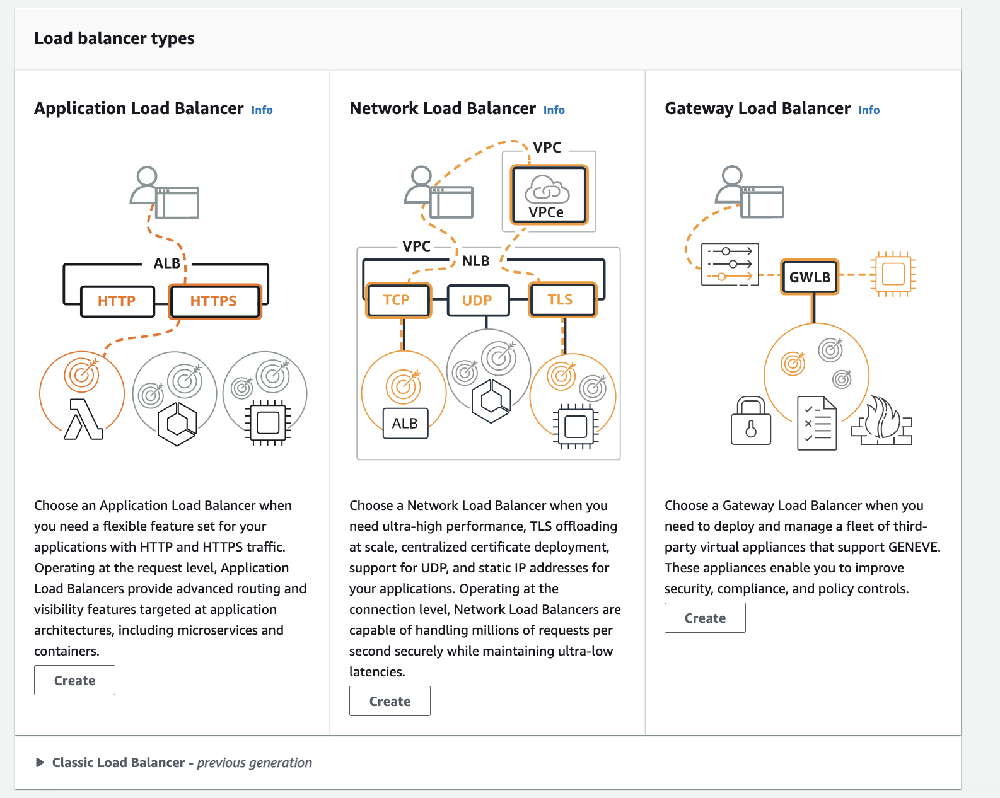
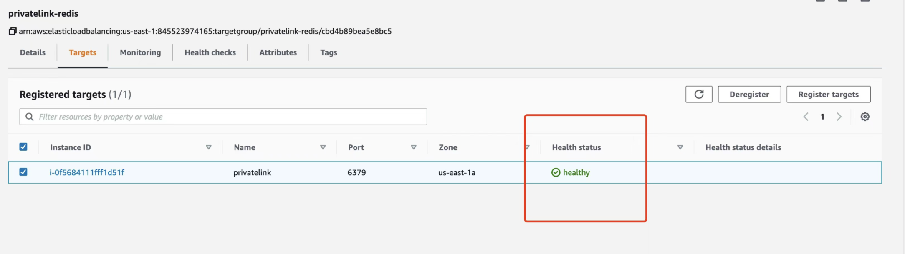
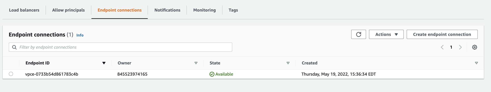
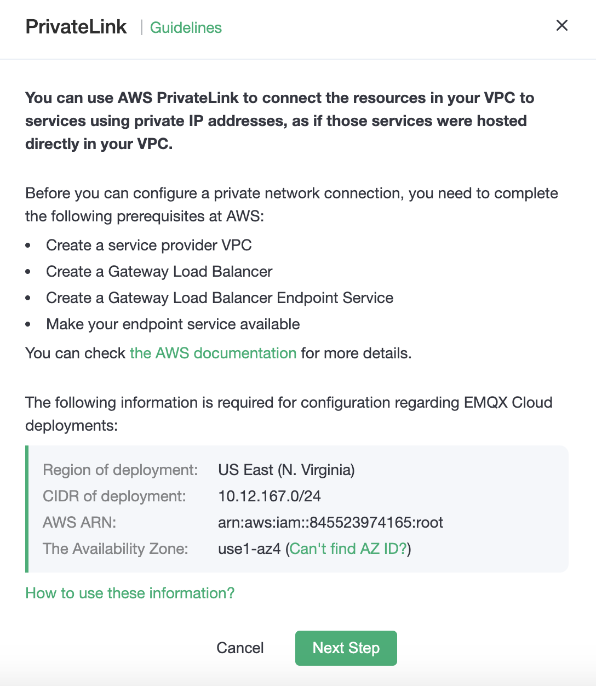
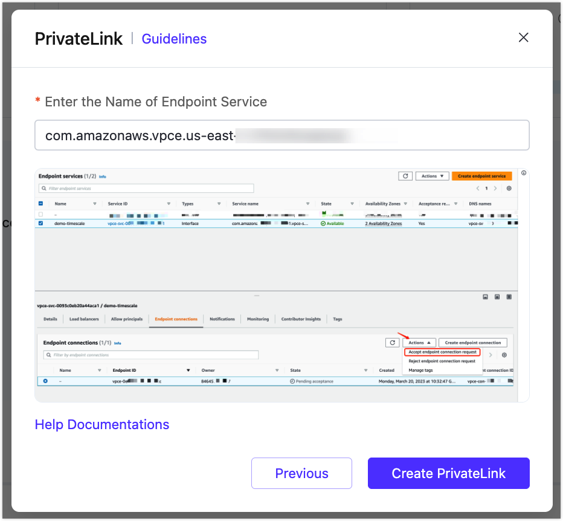
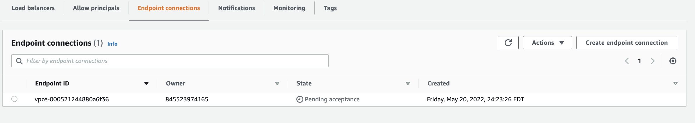
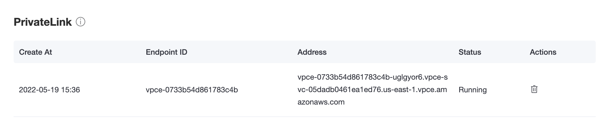
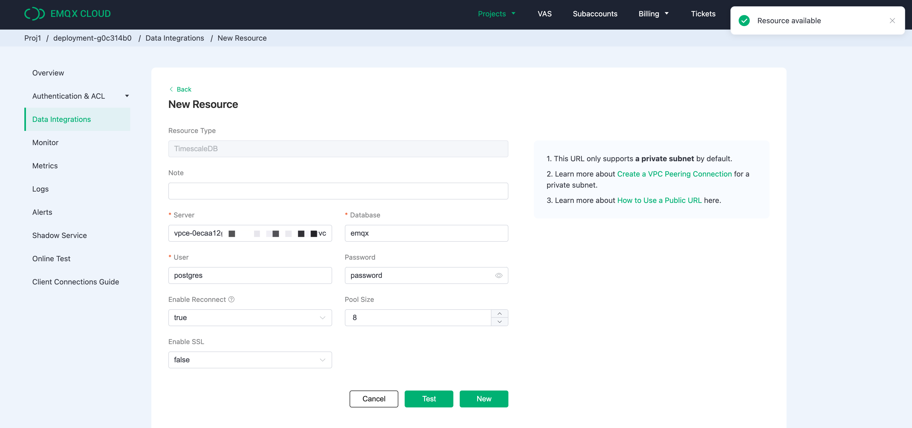

# PrivateLink Setting

PrivateLink enables the proprietary network VPC where the EMQX Cloud deployment is located to establish a secure and stable private connection to services on the public cloud. It simplifies the network architecture, enables private access to services, and avoids the potential security risks associated with accessing services over the public network.

In the private connection, the EMQX Cloud deployment VPC acts as the service user and requests the VPC where the user's resources are located in the cloud service provider, i.e., the service provider.

## AWS Platform PrivateLink Connection

### Preparation

Before you can configure PrivateLink, you need to complete the following prerequisites on the AWS platform.

1. register an AWS account and enable the PrivateLink service

2. Create an instance and VPC

3. Create and configure load balancer

> Note: The LB Availability Zone [AZ ID](https://us-east-1.console.aws.amazon.com/ram/home?region=us-east-1#Home) created here needs to match the EMQX Cloud deployment LB Availability Zone AZ ID, which is available in the This information is available in EMQX Cloud console.

After creating the LB, configure the listening ports of your resources and check if their status is normal.

Create an endpoint node service

Find the Endpoint Node Service in the left menu bar of your AWS account and click Create. The load balancer type is Gateway, select the load balancer created in the previous step.

You can refer to [AWS Help](https://docs.aws.amazon.com/vpc/latest/privatelink/create-gateway-load-balancer-endpoint-service.html) to complete the above configuration.

### Create private network connection PrivateLink

1. Login to [EMQX Cloud Console](<https://cloud.emqx.com/console>), go to the desired deployment creation details, and click the `+PrivateLink` button to get the deployment availability zone AZ ID.

    

2. After getting the AWS account ARN where the deployment is located in EMQX Cloud console, add it to the allowed principals entry of your AWS Platform-Endpoint service.

    Once added, click `Complete Configuration to go to the next step`.

3. Locate the Endpoint Node service on your AWS platform, copy the service name, fill it to the EMQX Cloud Endpoint Node service name, and click `Create Private Network Connection`.

    

4. Once completed, find the Endpoint Node Service - Endpoint Node Connection in your AWS platform and click `Accept Endpoint Node Connection Request`.

    

5. Wait for a while and check the status of the private network connection in the deployment details, `running` means it has been created successfully. Copy the `service connection domain` for the next data integration-resource configuration.

    

6. Click the Data Integration menu on the left, find the Redis resource, fill in the `Redis Server` on the New Resource page with the private connection service connection domain name and port, click `Test Connection`, and the resource will be available.

    

### Delete the private network connection

To remove the private connection, you need to ensure that the private connection status is `running`.

> - If you need to remove the private network connection service from your AWS platform, please remove the private network connection node from EMQX Cloud console first, otherwise it will cause the deployment private network connection status to be `failed`.
> - Please ensure that there are no associated resources in the deployment before removing the private connection, otherwise it will lead to unpredictable risks.

1. Go to Deployment Details

2. Click on the `Delete button` to the right of the private network connection and click on Confirm to complete the deletion.
