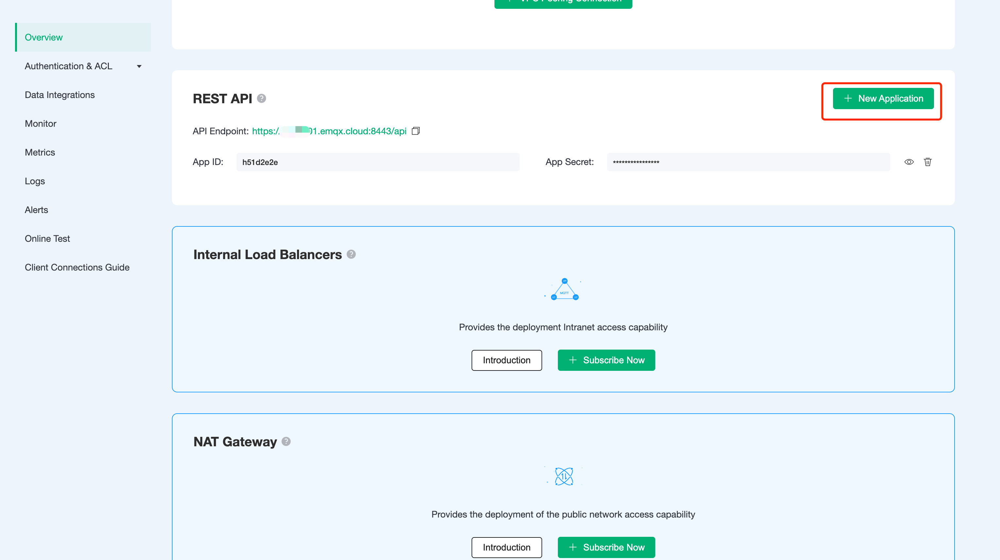
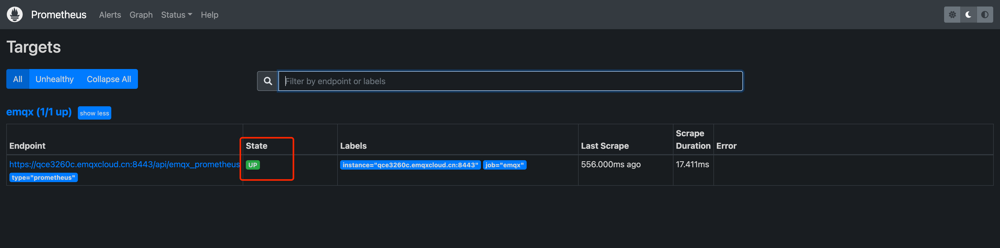
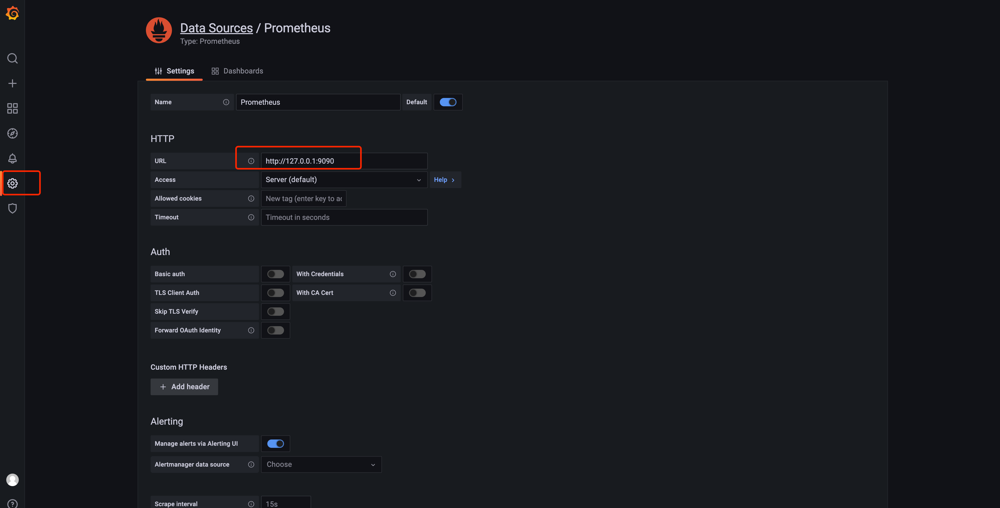
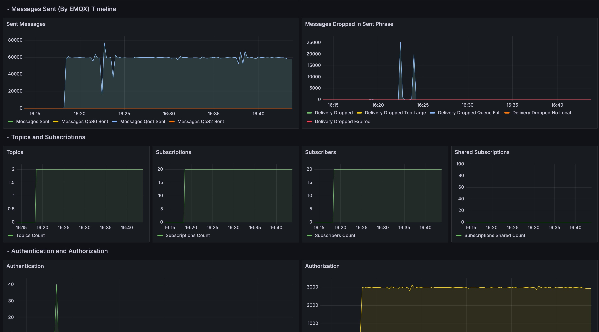

# Prometheus Monitoring Alerts

::: warning Note

This feature is available on the Dedicated Plan. 

:::

The Prometheus API is available in the EMQX Cloud and can be used to easily monitor critical metrics. In this article we will explain how to configure the Prometheus service, access to critical metrics from the EMQX Cloud API, and how to view metrics using Grafana.

## API Configuration

Go to EMQX Cloud Deployment Console, find Overview-REST API, get the API address, click on New Application, get the APP ID and APP Secret.



### Request Example

```bash
curl -u app_id:app_secret -X GET {api}/emqx_prometheus?type=prometheus
```

### Response Example

```prometheus
# TYPE emqx_vm_run_queue gauge
emqx_vm_run_queue 2
# TYPE emqx_vm_process_messages_in_queues gauge
emqx_vm_process_messages_in_queues 0
# TYPE emqx_vm_cpu_use gauge
emqx_vm_cpu_use 1
# TYPE emqx_vm_cpu_idle gauge
emqx_vm_cpu_idle 198
# TYPE emqx_vm_used_memory gauge
emqx_vm_used_memory 2100293632
# TYPE emqx_vm_total_memory gauge
emqx_vm_total_memory 8065474560
# TYPE emqx_messages_qos1_received counter
emqx_messages_qos1_received 0
# TYPE emqx_messages_dropped_expired counter
emqx_messages_dropped_expired 0
# TYPE emqx_messages_dropped counter
emqx_messages_dropped 0
# TYPE emqx_messages_qos1_sent counter
emqx_messages_qos1_sent 0
# TYPE emqx_messages_qos0_received counter
emqx_messages_qos0_received 0
# TYPE emqx_messages_received counter
emqx_messages_received 0
# TYPE emqx_messages_acked counter
emqx_messages_acked 0
# TYPE emqx_messages_publish counter
emqx_messages_publish 0
# TYPE emqx_messages_delivered counter
emqx_messages_delivered 0
# TYPE emqx_messages_sent counter
emqx_messages_sent 0
# TYPE emqx_messages_qos0_sent counter
emqx_messages_qos0_sent 0
# TYPE emqx_messages_qos2_received counter
emqx_messages_qos2_received 0
# TYPE emqx_messages_retained counter
emqx_messages_retained 660
# TYPE emqx_messages_qos2_sent counter
emqx_messages_qos2_sent 0
# TYPE emqx_messages_forward counter
emqx_messages_forward 0
# TYPE emqx_messages_delayed counter
emqx_messages_delayed 0
# TYPE emqx_messages_dropped_no_subscribers counter
emqx_messages_dropped_no_subscribers 0
# TYPE emqx_delivery_dropped counter
emqx_delivery_dropped 0
# TYPE emqx_delivery_dropped_too_large counter
emqx_delivery_dropped_too_large 0
# TYPE emqx_delivery_dropped_queue_full counter
emqx_delivery_dropped_queue_full 0
# TYPE emqx_delivery_dropped_qos0_msg counter
emqx_delivery_dropped_qos0_msg 0
# TYPE emqx_delivery_dropped_no_local counter
emqx_delivery_dropped_no_local 0
# TYPE emqx_delivery_dropped_expired counter
emqx_delivery_dropped_expired 0
# TYPE emqx_client_auth_anonymous counter
emqx_client_auth_anonymous 0
# TYPE emqx_client_unsubscribe counter
emqx_client_unsubscribe 0
# TYPE emqx_client_subscribe counter
emqx_client_subscribe 0
# TYPE emqx_client_disconnected counter
emqx_client_disconnected 0
# TYPE emqx_client_connected counter
emqx_client_connected 0
# TYPE emqx_client_check_acl counter
emqx_client_check_acl 0
# TYPE emqx_client_authenticate counter
emqx_client_authenticate 0
# TYPE emqx_cluster_nodes_stopped gauge
emqx_cluster_nodes_stopped 0
# TYPE emqx_cluster_nodes_running gauge
emqx_cluster_nodes_running 2
# TYPE emqx_suboptions_max gauge
emqx_suboptions_max 0
# TYPE emqx_subscriptions_shared_max gauge
emqx_subscriptions_shared_max 0
# TYPE emqx_subscribers_max gauge
emqx_subscribers_max 0
# TYPE emqx_retained_count gauge
emqx_retained_count 10
# TYPE emqx_sessions_max gauge
emqx_sessions_max 0
# TYPE emqx_routes_max gauge
emqx_routes_max 0
# TYPE emqx_topics_max gauge
emqx_topics_max 0
# TYPE emqx_connections_max gauge
emqx_connections_max 0
# TYPE emqx_subscribers_count gauge
emqx_subscribers_count 0
# TYPE emqx_retained_max gauge
emqx_retained_max 10
# TYPE emqx_subscriptions_count gauge
emqx_subscriptions_count 0
# TYPE emqx_subscriptions_shared_count gauge
emqx_subscriptions_shared_count 0
# TYPE emqx_suboptions_count gauge
emqx_suboptions_count 0
# TYPE emqx_routes_count gauge
emqx_routes_count 0
# TYPE emqx_topics_count gauge
emqx_topics_count 0
# TYPE emqx_sessions_count gauge
emqx_sessions_count 0
# TYPE emqx_connections_count gauge
emqx_connections_count 0
# TYPE emqx_subscriptions_max gauge
emqx_subscriptions_max 0
# TYPE emqx_session_discarded counter
emqx_session_discarded 0
# TYPE emqx_session_created counter
emqx_session_created 0
# TYPE emqx_session_terminated counter
emqx_session_terminated 0
# TYPE emqx_session_takeovered counter
emqx_session_takeovered 0
# TYPE emqx_session_resumed counter
emqx_session_resumed 0
# TYPE emqx_packets_pubrec_missed counter
emqx_packets_pubrec_missed 0
# TYPE emqx_packets_pubrel_received counter
emqx_packets_pubrel_received 0
# TYPE emqx_packets_auth_received counter
emqx_packets_auth_received 0
# TYPE emqx_packets_pingresp_sent counter
emqx_packets_pingresp_sent 0
# TYPE emqx_packets_publish_auth_error counter
emqx_packets_publish_auth_error 0
# TYPE emqx_packets_disconnect_received counter
emqx_packets_disconnect_received 0
# TYPE emqx_packets_sent counter
emqx_packets_sent 0
# TYPE emqx_packets_puback_received counter
emqx_packets_puback_received 0
# TYPE emqx_bytes_sent counter
emqx_bytes_sent 0
# TYPE emqx_packets_pubcomp_missed counter
emqx_packets_pubcomp_missed 0
# TYPE emqx_packets_pubrel_missed counter
emqx_packets_pubrel_missed 0
# TYPE emqx_packets_pubrec_inuse counter
emqx_packets_pubrec_inuse 0
# TYPE emqx_packets_pubcomp_sent counter
emqx_packets_pubcomp_sent 0
# TYPE emqx_packets_auth_sent counter
emqx_packets_auth_sent 0
# TYPE emqx_packets_pubcomp_inuse counter
emqx_packets_pubcomp_inuse 0
# TYPE emqx_bytes_received counter
emqx_bytes_received 0
# TYPE emqx_packets_publish_inuse counter
emqx_packets_publish_inuse 0
# TYPE emqx_packets_pubrec_received counter
emqx_packets_pubrec_received 0
# TYPE emqx_packets_pingreq_received counter
emqx_packets_pingreq_received 0
# TYPE emqx_packets_suback_sent counter
emqx_packets_suback_sent 0
# TYPE emqx_packets_publish_error counter
emqx_packets_publish_error 0
# TYPE emqx_packets_disconnect_sent counter
emqx_packets_disconnect_sent 0
# TYPE emqx_packets_publish_received counter
emqx_packets_publish_received 0
# TYPE emqx_packets_received counter
emqx_packets_received 0
# TYPE emqx_packets_puback_missed counter
emqx_packets_puback_missed 0
# TYPE emqx_packets_puback_sent counter
emqx_packets_puback_sent 0
# TYPE emqx_packets_publish_dropped counter
emqx_packets_publish_dropped 0
# TYPE emqx_packets_pubrec_sent counter
emqx_packets_pubrec_sent 0
# TYPE emqx_packets_pubrel_sent counter
emqx_packets_pubrel_sent 0
# TYPE emqx_packets_connack_auth_error counter
emqx_packets_connack_auth_error 0
# TYPE emqx_packets_subscribe_error counter
emqx_packets_subscribe_error 0
# TYPE emqx_packets_publish_sent counter
emqx_packets_publish_sent 0
# TYPE emqx_packets_connect counter
emqx_packets_connect 0
# TYPE emqx_packets_puback_inuse counter
emqx_packets_puback_inuse 0
# TYPE emqx_packets_connack_sent counter
emqx_packets_connack_sent 0
# TYPE emqx_packets_unsuback_sent counter
emqx_packets_unsuback_sent 0
# TYPE emqx_packets_pubcomp_received counter
emqx_packets_pubcomp_received 0
# TYPE emqx_packets_subscribe_auth_error counter
emqx_packets_subscribe_auth_error 0
# TYPE emqx_packets_unsubscribe_error counter
emqx_packets_unsubscribe_error 0
# TYPE emqx_packets_unsubscribe_received counter
emqx_packets_unsubscribe_received 0
# TYPE emqx_packets_connack_error counter
emqx_packets_connack_error 0
# TYPE emqx_packets_subscribe_received counter
emqx_packets_subscribe_received 0
```

## Prometheus Configuration

1. Install Prometheus

    ```bash
    wget -c https://github.com/prometheus/prometheus/releases/download/v2.35.0-rc0/prometheus-2.35.0-rc0.linux-amd64.tar.gz
    tar xvfz prometheus-*.tar.gz
    ```

2. Modify configuration file

    Go to the monitoring directory specified for your Prometheus service and modify the scrape_configs section of the configuration file prometheus.yml as shown in the example below.

    ```bash
    scrape_configs:
      - job_name: 'emqx'
        scheme: 'https'
        static_configs:
          - targets: [ 'xxxx:8443' ]
        metrics_path: "/api/emqx_prometheus"
        params:
          type: [ "prometheus" ]
        basic_auth:
          username: 'APP ID'
          password: 'APP Secret'
    ```

3. Launch and check service status

    Launch Prometheus

   ```bash
    ./prometheus --config.file=prometheus.yml
   ```

    Access your Prometheus service via your local IP with the corresponding port, e.g. x.x.x.x:9090 and check Status-Targets to confirm that the new scrape_config file has been read. If the status shows an exception, you may need to check the configuration file and restart the Prometheus service.

    

## Grafana Configuration

1. Install and launch Grafana

   ```bash
    wget https://dl.grafana.com/enterprise/release/grafana-enterprise-8.4.6.linux-amd64.tar.gz
    tar -zxvf grafana-enterprise-8.4.6.linux-amd64.tar.gz
    ./bin/grafana-server
   ```

2. Configure Grafana

    Access Grafana dashboard via the local IP + the corresponding port, e.g. x.x.x.x:3000. The initial ID and password are admin. You can change the password when logging in for the first time.

    

3. Import Grafana Data Templates

    EMQX Cloud provides template files for Grafana Dashboard. These templates contain a display of all EMQX Cloud monitoring data. Users can import them directly into Grafana to display EMQX monitoring status icons.

    Access to the template ：[emqx_prometheus/grafana_template/EMQ.json](https://github.com/emqx/emqx-prometheus/blob/master/grafana_template/EMQ.json)，The EMQ.json file can be uploaded locally via Upload JSON file, or written manually via the import panel json.

    

## Metrics Details

After the system has been set up and running for a while, the data collected by EMQX Cloud Prometheus will be displayed on Grafana, including the number of clients, subscriptions, topics, messages, messages and other business information history statistics. You can view the corresponding display charts for each metric, and detailed information at a certain point in time.



Prometheus tracks the following metrics data for your EMQX Cloud deployment:

| Metrics                              | Type    | Description                                                   |
| ------------------------------------ | ------- | ------------------------------------------------------------- |
| emqx_vm_used_memory                  | gauge   | Memory occupied by the VM                                     |
| emqx_vm_total_memory                 | gauge   | Total memory opened by the VM                                 |
| emqx_vm_run_queue                    | gauge   | RunQueue size                                                 |
| emqx_vm_process_messages_in_queues   | gauge   | Total number of message blocks                                |
| emqx_vm_cpu_use                      | gauge   | Number of CPUs occupied                                       |
| emqx_vm_cpu_idle                     | gauge   | CPU idle                                                      |
| emqx_topics_max                      | gauge   | Maximum number of topics in history                           |
| emqx_topics_count                    | gauge   | Number of current topics                                      |
| emqx_subscriptions_shared_max        | gauge   | Historical maximum shared subscriptions                       |
| emqx_subscriptions_shared_count      | gauge   | Current Shared Subscriptions                                  |
| emqx_subscriptions_max               | gauge   | Historical maximum number of subscription relationships       |
| emqx_subscriptions_count             | gauge   | Current number of subscription relationships                  |
| emqx_subscribers_max                 | gauge   | Historical maximum number of subscribers                      |
| emqx_subscribers_count               | gauge   | Current number of subscribers                                 |
| emqx_suboptions_max                  | gauge   | Historical maximum number of subscription configuration items |
| emqx_suboptions_count                | gauge   | Historical maximum number of subscription configuration items |
| emqx_sessions_max                    | gauge   | Historical maximum number of sessions                         |
| emqx_sessions_count                  | gauge   | Number of current sessions                                    |
| emqx_session_terminated              | counter | Sessions terminated                                           |
| emqx_session_takeovered              | counter | Sessions taken over                                           |
| emqx_session_resumed                 | counter | Session reactivated                                           |
| emqx_session_discarded               | counter | Sessions discarded                                            |
| emqx_session_created                 | counter | Sessions created                                              |
| emqx_routes_max                      | gauge   | Historical maximum number of routes                           |
| emqx_routes_count                    | gauge   | Current number of routes                                      |
| emqx_retained_max                    | gauge   | Historical maximum number of reserved messages                |
| emqx_retained_count                  | gauge   | Number of current hold messages                               |
| emqx_packets_unsubscribe_received    | counter | Number of UNSUB messages received                             |
| emqx_packets_unsubscribe_error       | counter | Number of UNSUB messages rejected                             |
| emqx_packets_unsuback_sent           | counter | Number of UNSUBACK messages sent                              |
| emqx_packets_subscribe_received      | counter | Number of SUB messages received                               |
| emqx_packets_subscribe_error         | counter | Rejected SUB messages                                         |
| emqx_packets_subscribe_auth_error    | counter | Number of SUB messages rejected (ACL check failed)            |
| emqx_packets_suback_sent             | counter | Number of SUBACK messages sent                                |
| emqx_packets_sent                    | counter | Number of messages sent                                       |
| emqx_packets_received                | counter | Received messages                                             |
| emqx_packets_pubrel_sent             | counter | Number of PUBREL messages sent                                |
| emqx_packets_pubrel_received         | counter | Number of PUBREL messages received                            |
| emqx_packets_pubrel_missed           | counter | Number of PUBREL messages rejected (PacketId not found)       |
| emqx_packets_pubrec_sent             | counter | Number of PUBREC messages sent                                |
| emqx_packets_pubrec_received         | counter | Number of PUBREC messages received                            |
| emqx_packets_pubrec_missed           | counter | Number of PUBREC messages rejected (PacketId not found)       |
| emqx_packets_pubrec_inuse            | counter | Number of PUBREC messages rejected (PacketId occupied)        |
| emqx_packets_publish_sent            | counter | Number of PUB messages sent                                   |
| emqx_packets_publish_received        | counter | Number of PUB messages received                               |
| emqx_packets_publish_inuse           | counter | Number of rejected PUB messages (PacketId occupied)           |
| emqx_packets_publish_error           | counter | Number of incorrect PUB messages                              |
| emqx_packets_publish_dropped         | counter | Number of PUB messages discarded                              |
| emqx_packets_publish_auth_error      | counter | Number of PUB messages rejected (ACL check failed)            |
| emqx_packets_pubcomp_sent            | counter | Number of PUBCOMP messages sent                               |
| emqx_packets_pubcomp_received        | counter | Number of PUBCOMP messages received                           |
| emqx_packets_pubcomp_missed          | counter | Number of PUBCOMP messages rejected (PacketId not found)      |
| emqx_packets_pubcomp_inuse           | counter | Number of PUBCOMP messages rejected (PacketId occupied)       |
| emqx_packets_puback_sent             | counter | Number of PUBACK messages sent                                |
| emqx_packets_puback_received         | counter | Number of PUBACK messages received                            |
| emqx_packets_puback_missed           | counter | Number of PUBACK messages rejected (PacketId not found)       |
| emqx_packets_puback_inuse            | counter | Number of PUBACK messages rejected (PacketId occupied)        |
| emqx_packets_pingresp_sent           | counter | Number of PONG messages sent                                  |
| emqx_packets_pingreq_received        | counter | Number of PING messages received                              |
| emqx_packets_disconnect_sent         | counter | Number of disconnect messages sent                            |
| emqx_packets_disconnect_received     | counter | Number of disconnect messages received                        |
| emqx_packets_connect                 | counter | Number of connection messages received                        |
| emqx_packets_connack_sent            | counter | Number of connection confirmation messages sent               |
| emqx_packets_connack_error           | counter | Number of connection failure messages sent                    |
| emqx_packets_connack_auth_error      | counter | Number of failed connection authentication messages sent      |
| emqx_packets_auth_sent               | counter | Number of authentication messages sent                        |
| emqx_packets_auth_received           | counter | Number of authentication messages received                    |
| emqx_messages_sent                   | counter | Total number of messages sent                                 |
| emqx_messages_retained               | counter | Total number of messages stored as reserved messages          |
| emqx_messages_received               | counter | Total number of messages received                             |
| emqx_messages_qos2_sent              | counter | Total number of QoS2 messages sent                            |
| emqx_messages_qos2_received          | counter | Total number of QoS2 messages received                        |
| emqx_messages_qos1_sent              | counter | Total number of QoS1 messages sent                            |
| emqx_messages_qos1_received          | counter | Total number of QoS1 messages received                        |
| emqx_messages_qos0_sent              | counter | Total number of QoS0 messages sent                            |
| emqx_messages_qos0_received          | counter | Total number of QoS0 messages received                        |
| emqx_messages_publish                | counter | Total number of messages initiated and released               |
| emqx_messages_forward                | counter | Total number of messages forwarded across nodes               |
| emqx_messages_dropped_no_subscribers | counter | Total number of non-subscriber messages discarded             |
| emqx_messages_dropped_expired        | counter | Total number of expired messages discarded                    |
| emqx_messages_dropped                | counter | Messages Discarded                                            |
| emqx_messages_delivered              | counter | Messages Delivered                                            |
| emqx_messages_delayed                | counter | Total number of messages deposited as delayed                 |
| emqx_messages_acked                  | counter | Messages received back                                        |
| emqx_delivery_dropped_too_large      | counter | Number of discards for messages delivered too large           |
| emqx_delivery_dropped_queue_full     | counter | Message Delivery Queue Full Discards                          |
| emqx_delivery_dropped_qos0_msg       | counter | Message delivered QoS0 Number of discards                     |
| emqx_delivery_dropped_no_local       | counter | Number of message delivery no_local discards                  |
| emqx_delivery_dropped_expired        | counter | Message delivery overdue discards                             |
| emqx_delivery_dropped                | counter | Message delivery discards                                     |
| emqx_connections_max                 | gauge   | Historical maximum number of connections                      |
| emqx_connections_count               | gauge   | Current connections                                           |
| emqx_cluster_nodes_stopped           | gauge   | Number of stopped nodes in the cluster                        |
| emqx_cluster_nodes_running           | gauge   | Number of running nodes in the cluster                        |
| emqx_client_unsubscribe              | counter | Client unsubscribes                                           |
| emqx_client_subscribe                | counter | Client initiated subscriptions                                |
| emqx_client_disconnected             | counter | Clients offline                                               |
| emqx_client_connected                | counter | Clients are online                                            |
| emqx_client_check_acl                | counter | Client initiated ACL request                                  |
| emqx_client_authenticate             | counter | Client initiates authentication                               |
| emqx_client_auth_anonymous           | counter | Login as anonymous client                                     |
| emqx_bytes_sent                      | counter | Total number of bytes sent                                    |
| emqx_bytes_received                  | counter | Total bytes received                                          |
