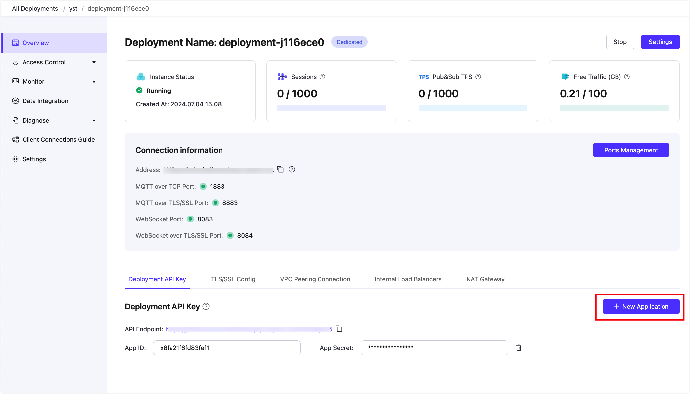

# Prometheus Monitoring

The EMQX Platform provides a Prometheus API that allows you to easily call the API to monitor key metrics of the EMQX Platform. This page introduces how to configure the Prometheus service, read key metrics from the EMQX Platform API, and use Grafana templates to visualize the metrics.

::: warning Note

This feature is only available for Dedicated and Premium deployments. 

:::

## API Configuration

Find the **Deployment API Key** on the **Overview** page of the EMQX Platform deployment console to obtain the API address. Click **Create New Application** to get the APP ID and APP Secret.



### Deployment Metrics URI

GET /deployment_metrics

Returns cluster metrics for Prometheus collection.

**Query Parameters:**

None

#### Request Message

None

#### Request Example

```bash
curl -u app_id:app_secret -X GET {api}/deployment_metrics
```

#### Response Example

```prometheus
# HELP deployment_emqx_connections_count The current number of connections for the current cluster, including active connections
# TYPE deployment_emqx_connections_count gauge
deployment_emqx_connections_count{deployment_id="b9110d11",deployment_type="dedicated",platform="aliyun_en"} 0
# HELP deployment_emqx_messages_rate The current rate of messages sent and received per second for the current cluster
# TYPE deployment_emqx_messages_rate gauge
deployment_emqx_messages_rate{deployment_id="b9110d11",deployment_type="dedicated",platform="aliyun_en"} 0
# HELP deployment_emqx_messages_receive_rate The current rate of message receiving
# TYPE deployment_emqx_messages_receive_rate gauge
deployment_emqx_messages_receive_rate{deployment_id="b9110d11",deployment_type="dedicated",platform="aliyun_en"} 0
# HELP deployment_emqx_messages_send_rate The current rate of messages sent per second for the current cluster
# TYPE deployment_emqx_messages_send_rate gauge
deployment_emqx_messages_send_rate{deployment_id="b9110d11",deployment_type="dedicated",platform="aliyun_en"} 0
# HELP deployment_emqx_metrics_authentication_failure Number of failed authentications
# TYPE deployment_emqx_metrics_authentication_failure counter
deployment_emqx_metrics_authentication_failure{deployment_id="b9110d11",deployment_type="dedicated",platform="aliyun_en"} 1
# HELP deployment_emqx_metrics_authentication_success Number of successful authentications
# TYPE deployment_emqx_metrics_authentication_success counter
deployment_emqx_metrics_authentication_success{deployment_id="b9110d11",deployment_type="dedicated",platform="aliyun_en"} 8
# HELP deployment_emqx_metrics_authentication_success_anonymous Number of successful anonymous authentications
# TYPE deployment_emqx_metrics_authentication_success_anonymous counter
deployment_emqx_metrics_authentication_success_anonymous{deployment_id="b9110d11",deployment_type="dedicated",platform="aliyun_en"} 0
# HELP deployment_emqx_metrics_authorization_allow Number of successful authorizations
# TYPE deployment_emqx_metrics_authorization_allow counter
deployment_emqx_metrics_authorization_allow{deployment_id="b9110d11",deployment_type="dedicated",platform="aliyun_en"} 0
# HELP deployment_emqx_metrics_authorization_cache_hit Number of cache hits during authorization
# TYPE deployment_emqx_metrics_authorization_cache_hit counter
deployment_emqx_metrics_authorization_cache_hit{deployment_id="b9110d11",deployment_type="dedicated",platform="aliyun_en"} 0
# HELP deployment_emqx_metrics_authorization_cache_miss Number of cache misses during authorization
# TYPE deployment_emqx_metrics_authorization_cache_miss counter
deployment_emqx_metrics_authorization_cache_miss{deployment_id="b9110d11",deployment_type="dedicated",platform="aliyun_en"} 0
# HELP deployment_emqx_metrics_authorization_deny Number of authorization denies
# TYPE deployment_emqx_metrics_authorization_deny counter
deployment_emqx_metrics_authorization_deny{deployment_id="b9110d11",deployment_type="dedicated",platform="aliyun_en"} 0
# HELP deployment_emqx_metrics_authorization_matched_allow Number of successful authorization matches
# TYPE deployment_emqx_metrics_authorization_matched_allow counter
deployment_emqx_metrics_authorization_matched_allow{deployment_id="b9110d11",deployment_type="dedicated",platform="aliyun_en"} 0
# HELP deployment_emqx_metrics_authorization_matched_deny Number of authorization deny matches
# TYPE deployment_emqx_metrics_authorization_matched_deny counter
deployment_emqx_metrics_authorization_matched_deny{deployment_id="b9110d11",deployment_type="dedicated",platform="aliyun_en"} 0
# HELP deployment_emqx_metrics_authorization_nomatch Number of authorization no match
# TYPE deployment_emqx_metrics_authorization_nomatch counter
deployment_emqx_metrics_authorization_nomatch{deployment_id="b9110d11",deployment_type="dedicated",platform="aliyun_en"} 0
# HELP deployment_emqx_metrics_authorization_superuser Number of superuser authorizations
# TYPE deployment_emqx_metrics_authorization_superuser counter
deployment_emqx_metrics_authorization_superuser{deployment_id="b9110d11",deployment_type="dedicated",platform="aliyun_en"} 0
# HELP deployment_emqx_metrics_bytes_received Number of received bytes
# TYPE deployment_emqx_metrics_bytes_received counter
deployment_emqx_metrics_bytes_received{deployment_id="b9110d11",deployment_type="dedicated",platform="aliyun_en"} 330
# HELP deployment_emqx_metrics_bytes_sent Number of sent bytes
# TYPE deployment_emqx_metrics_bytes_sent counter
deployment_emqx_metrics_bytes_sent{deployment_id="b9110d11",deployment_type="dedicated",platform="aliyun_en"} 196
# HELP deployment_emqx_metrics_channels_count sessions.count
# TYPE deployment_emqx_metrics_channels_count gauge
deployment_emqx_metrics_channels_count{deployment_id="b9110d11",deployment_type="dedicated",platform="aliyun_en"} 0
# HELP deployment_emqx_metrics_channels_max session.max
# TYPE deployment_emqx_metrics_channels_max gauge
deployment_emqx_metrics_channels_max{deployment_id="b9110d11",deployment_type="dedicated",platform="aliyun_en"} 2
# HELP deployment_emqx_metrics_client_auth_anonymous Number of client's final anonymous login
# TYPE deployment_emqx_metrics_client_auth_anonymous counter
deployment_emqx_metrics_client_auth_anonymous{deployment_id="b9110d11",deployment_type="dedicated",platform="aliyun_en"} 0
# HELP deployment_emqx_metrics_client_authenticate client.authenticate hook trigger times
# TYPE deployment_emqx_metrics_client_authenticate counter
deployment_emqx_metrics_client_authenticate{deployment_id="b9110d11",deployment_type="dedicated",platform="aliyun_en"} 9
# HELP deployment_emqx_metrics_client_authorize client.authorize hook trigger times
# TYPE deployment_emqx_metrics_client_authorize counter
deployment_emqx_metrics_client_authorize{deployment_id="b9110d11",deployment_type="dedicated",platform="aliyun_en"} 0
# HELP deployment_emqx_metrics_client_connack client.connack hook trigger times
# TYPE deployment_emqx_metrics_client_connack counter
deployment_emqx_metrics_client_connack{deployment_id="b9110d11",deployment_type="dedicated",platform="aliyun_en"} 9
# HELP deployment_emqx_metrics_client_connect client.connect hook trigger times
# TYPE deployment_emqx_metrics_client_connect counter
deployment_emqx_metrics_client_connect{deployment_id="b9110d11",deployment_type="dedicated",platform="aliyun_en"} 9
# HELP deployment_emqx_metrics_client_connected client.connected hook trigger times
# TYPE deployment_emqx_metrics_client_connected counter
deployment_emqx_metrics_client_connected{deployment_id="b9110d11",deployment_type="dedicated",platform="aliyun_en"} 8
# HELP deployment_emqx_metrics_client_disconnected client.disconnected hook trigger times
# TYPE deployment_emqx_metrics_client_disconnected counter
deployment_emqx_metrics_client_disconnected{deployment_id="b9110d11",deployment_type="dedicated",platform="aliyun_en"} 8
# HELP deployment_emqx_metrics_client_subscribe client.subscribe hook trigger times
# TYPE deployment_emqx_metrics_client_subscribe counter
deployment_emqx_metrics_client_subscribe{deployment_id="b9110d11",deployment_type="dedicated",platform="aliyun_en"} 0
# HELP deployment_emqx_metrics_client_unsubscribe client.unsubscribe hook trigger times
# TYPE deployment_emqx_metrics_client_unsubscribe counter
deployment_emqx_metrics_client_unsubscribe{deployment_id="b9110d11",deployment_type="dedicated",platform="aliyun_en"} 0
# HELP deployment_emqx_metrics_cluster_nodes_running Number of running nodes in the cluster
# TYPE deployment_emqx_metrics_cluster_nodes_running gauge
deployment_emqx_metrics_cluster_nodes_running{deployment_id="b9110d11",deployment_type="dedicated",platform="aliyun_en"} 2
# HELP deployment_emqx_metrics_cluster_nodes_stopped Number of stopped nodes in the cluster
# TYPE deployment_emqx_metrics_cluster_nodes_stopped gauge
deployment_emqx_metrics_cluster_nodes_stopped{deployment_id="b9110d11",deployment_type="dedicated",platform="aliyun_en"} 0
# HELP deployment_emqx_metrics_cluster_sessions_count Number of sessions in the cluster
# TYPE deployment_emqx_metrics_cluster_sessions_count gauge
deployment_emqx_metrics_cluster_sessions_count{deployment_id="b9110d11",deployment_type="dedicated",platform="aliyun_en"} 0
# HELP deployment_emqx_metrics_cluster_sessions_max Historical maximum number of sessions in the cluster
# TYPE deployment_emqx_metrics_cluster_sessions_max gauge
deployment_emqx_metrics_cluster_sessions_max{deployment_id="b9110d11",deployment_type="dedicated",platform="aliyun_en"} 1
# HELP deployment_emqx_metrics_connections_count Current connections
# TYPE deployment_emqx_metrics_connections_count gauge
deployment_emqx_metrics_connections_count{deployment_id="b9110d11",deployment_type="dedicated",platform="aliyun_en"} 0
# HELP deployment_emqx_metrics_connections_max Historical maximum number of connections
# TYPE deployment_emqx_metrics_connections_max gauge
deployment_emqx_metrics_connections_max{deployment_id="b9110d11",deployment_type="dedicated",platform="aliyun_en"} 2
# HELP deployment_emqx_metrics_delayed_count Number of delayed messages
# TYPE deployment_emqx_metrics_delayed_count gauge
deployment_emqx_metrics_delayed_count{deployment_id="b9110d11",deployment_type="dedicated",platform="aliyun_en"} 0
# HELP deployment_emqx_metrics_delayed_max Historical maximum number of delayed messages
# TYPE deployment_emqx_metrics_delayed_max gauge
deployment_emqx_metrics_delayed_max{deployment_id="b9110d11",deployment_type="dedicated",platform="aliyun_en"} 0
# HELP deployment_emqx_metrics_delivery_dropped Total number of messages that were dropped when sent
# TYPE deployment_emqx_metrics_delivery_dropped counter
deployment_emqx_metrics_delivery_dropped{deployment_id="b9110d11",deployment_type="dedicated",platform="aliyun_en"} 0
# HELP deployment_emqx_metrics_delivery_dropped_expired Number of messages that were dropped due to message expiration when sending
# TYPE deployment_emqx_metrics_delivery_dropped_expired counter
deployment_emqx_metrics_delivery_dropped_expired{deployment_id="b9110d11",deployment_type="dedicated",platform="aliyun_en"} 0
# HELP deployment_emqx_metrics_delivery_dropped_no_local Number of messages that were dropped due to the No Local subscription option when sending
# TYPE deployment_emqx_metrics_delivery_dropped_no_local counter
deployment_emqx_metrics_delivery_dropped_no_local{deployment_id="b9110d11",deployment_type="dedicated",platform="aliyun_en"} 0
# HELP deployment_emqx_metrics_delivery_dropped_qos0_msg Number of messages with QoS of 0 that were dropped because the message queue was full when sending
# TYPE deployment_emqx_metrics_delivery_dropped_qos0_msg counter
deployment_emqx_metrics_delivery_dropped_qos0_msg{deployment_id="b9110d11",deployment_type="dedicated",platform="aliyun_en"} 0
# HELP deployment_emqx_metrics_delivery_dropped_queue_full Number of messages with a non-zero QoS that were dropped because the message queue was full when sending
# TYPE deployment_emqx_metrics_delivery_dropped_queue_full counter
deployment_emqx_metrics_delivery_dropped_queue_full{deployment_id="b9110d11",deployment_type="dedicated",platform="aliyun_en"} 0
# HELP deployment_emqx_metrics_delivery_dropped_too_large Number of messages that were dropped because the length exceeded the limit when sending
# TYPE deployment_emqx_metrics_delivery_dropped_too_large counter
deployment_emqx_metrics_delivery_dropped_too_large{deployment_id="b9110d11",deployment_type="dedicated",platform="aliyun_en"} 0
# HELP deployment_emqx_metrics_live_connections_count Number of live connections
# TYPE deployment_emqx_metrics_live_connections_count gauge
deployment_emqx_metrics_live_connections_count{deployment_id="b9110d11",deployment_type="dedicated",platform="aliyun_en"} 0
# HELP deployment_emqx_metrics_live_connections_max Historical maximum number of live connections
# TYPE deployment_emqx_metrics_live_connections_max gauge
deployment_emqx_metrics_live_connections_max{deployment_id="b9110d11",deployment_type="dedicated",platform="aliyun_en"} 2
# HELP deployment_emqx_metrics_messages_acked Number of acked messages
# TYPE deployment_emqx_metrics_messages_acked counter
deployment_emqx_metrics_messages_acked{deployment_id="b9110d11",deployment_type="dedicated",platform="aliyun_en"} 0
# HELP deployment_emqx_metrics_messages_delayed Number of delay-published messages stored by EMQX Broker
# TYPE deployment_emqx_metrics_messages_delayed counter
deployment_emqx_metrics_messages_delayed{deployment_id="b9110d11",deployment_type="dedicated",platform="aliyun_en"} 0
# HELP deployment_emqx_metrics_messages_delivered Number of messages forwarded to the subscription process internally by EMQX Broker
# TYPE deployment_emqx_metrics_messages_delivered counter
deployment_emqx_metrics_messages_delivered{deployment_id="b9110d11",deployment_type="dedicated",platform="aliyun_en"} 0
# HELP deployment_emqx_metrics_messages_dropped Total number of messages dropped by EMQX Broker before forwarding to the subscription process
# TYPE deployment_emqx_metrics_messages_dropped counter
deployment_emqx_metrics_messages_dropped{deployment_id="b9110d11",deployment_type="dedicated",platform="aliyun_en"} 0
# HELP deployment_emqx_metrics_messages_dropped_expired Number of messages that were dropped due to message expiration when receiving
# TYPE deployment_emqx_metrics_messages_dropped_expired counter
deployment_emqx_metrics_messages_dropped_expired{deployment_id="b9110d11",deployment_type="dedicated",platform="aliyun_en"} 0
# HELP deployment_emqx_metrics_messages_dropped_no_subscribers Number of messages dropped due to no subscribers
# TYPE deployment_emqx_metrics_messages_dropped_no_subscribers counter
deployment_emqx_metrics_messages_dropped_no_subscribers{deployment_id="b9110d11",deployment_type="dedicated",platform="aliyun_en"} 0
# HELP deployment_emqx_metrics_messages_forward Number of messages forwarded to other nodes
# TYPE deployment_emqx_metrics_messages_forward counter
deployment_emqx_metrics_messages_forward{deployment_id="b9110d11",deployment_type="dedicated",platform="aliyun_en"} 0
# HELP deployment_emqx_metrics_messages_publish Number of messages published in addition to system messages
# TYPE deployment_emqx_metrics_messages_publish counter
deployment_emqx_metrics_messages_publish{deployment_id="b9110d11",deployment_type="dedicated",platform="aliyun_en"} 0
# HELP deployment_emqx_metrics_messages_qos0_received Number of QoS 0 messages received from clients
# TYPE deployment_emqx_metrics_messages_qos0_received counter
deployment_emqx_metrics_messages_qos0_received{deployment_id="b9110d11",deployment_type="dedicated",platform="aliyun_en"} 0
# HELP deployment_emqx_metrics_messages_qos0_sent Number of QoS 0 messages sent to clients
# TYPE deployment_emqx_metrics_messages_qos0_sent counter
deployment_emqx_metrics_messages_qos0_sent{deployment_id="b9110d11",deployment_type="dedicated",platform="aliyun_en"} 0
# HELP deployment_emqx_metrics_messages_qos1_received Number of QoS 2 messages received from clients
# TYPE deployment_emqx_metrics_messages_qos1_received counter
deployment_emqx_metrics_messages_qos1_received{deployment_id="b9110d11",deployment_type="dedicated",platform="aliyun_en"} 0
# HELP deployment_emqx_metrics_messages_qos1_sent Number of QoS 1 messages sent to clients
# TYPE deployment_emqx_metrics_messages_qos1_sent counter
deployment_emqx_metrics_messages_qos1_sent{deployment_id="b9110d11",deployment_type="dedicated",platform="aliyun_en"} 0
# HELP deployment_emqx_metrics_messages_qos2_received Number of QoS 1 messages received from clients
# TYPE deployment_emqx_metrics_messages_qos2_received counter
deployment_emqx_metrics_messages_qos2_received{deployment_id="b9110d11",deployment_type="dedicated",platform="aliyun_en"} 0
# HELP deployment_emqx_metrics_messages_qos2_sent Number of QoS 2 messages sent to clients
# TYPE deployment_emqx_metrics_messages_qos2_sent counter
deployment_emqx_metrics_messages_qos2_sent{deployment_id="b9110d11",deployment_type="dedicated",platform="aliyun_en"} 0
# HELP deployment_emqx_metrics_messages_received Number of messages received from the client, which is equal to the sum of messages.qos0.received,messages.qos1.received, and messages.qos2.received
# TYPE deployment_emqx_metrics_messages_received counter
deployment_emqx_metrics_messages_received{deployment_id="b9110d11",deployment_type="dedicated",platform="aliyun_en"} 0
# HELP deployment_emqx_metrics_messages_retained Number of retained messages stored by EMQX Broker
# TYPE deployment_emqx_metrics_messages_retained counter
deployment_emqx_metrics_messages_retained{deployment_id="b9110d11",deployment_type="dedicated",platform="aliyun_en"} 0
# HELP deployment_emqx_metrics_messages_sent The number of messages sent to the client, which is equal to the sum of messages.qos0.sent,messages.qos1.sent, and messages.qos2.sent
# TYPE deployment_emqx_metrics_messages_sent counter
deployment_emqx_metrics_messages_sent{deployment_id="b9110d11",deployment_type="dedicated",platform="aliyun_en"} 0
# HELP deployment_emqx_metrics_packets_auth_received Number of received AUTH packets
# TYPE deployment_emqx_metrics_packets_auth_received counter
deployment_emqx_metrics_packets_auth_received{deployment_id="b9110d11",deployment_type="dedicated",platform="aliyun_en"} 0
# HELP deployment_emqx_metrics_packets_auth_sent Number of sent AUTH packets
# TYPE deployment_emqx_metrics_packets_auth_sent counter
deployment_emqx_metrics_packets_auth_sent{deployment_id="b9110d11",deployment_type="dedicated",platform="aliyun_en"} 0
# HELP deployment_emqx_metrics_packets_connack_auth_error Number of sent CONNACK messages with reason codes 0x86 and 0x87
# TYPE deployment_emqx_metrics_packets_connack_auth_error counter
deployment_emqx_metrics_packets_connack_auth_error{deployment_id="b9110d11",deployment_type="dedicated",platform="aliyun_en"} 1
# HELP deployment_emqx_metrics_packets_connack_error Number of sent CONNACK packets where reason code is not 0x00. The value of this indicator is greater than or equal to the value of packets.connack.auth_error
# TYPE deployment_emqx_metrics_packets_connack_error counter
deployment_emqx_metrics_packets_connack_error{deployment_id="b9110d11",deployment_type="dedicated",platform="aliyun_en"} 1
# HELP deployment_emqx_metrics_packets_connack_sent Number of sent CONNACK packets
# TYPE deployment_emqx_metrics_packets_connack_sent counter
deployment_emqx_metrics_packets_connack_sent{deployment_id="b9110d11",deployment_type="dedicated",platform="aliyun_en"} 9
# HELP deployment_emqx_metrics_packets_connect Number of sent CONNECT packets
# TYPE deployment_emqx_metrics_packets_connect counter
deployment_emqx_metrics_packets_connect{deployment_id="b9110d11",deployment_type="dedicated",platform="aliyun_en"} 9
# HELP deployment_emqx_metrics_packets_disconnect_received Number of received DISCONNECT packets
# TYPE deployment_emqx_metrics_packets_disconnect_received counter
deployment_emqx_metrics_packets_disconnect_received{deployment_id="b9110d11",deployment_type="dedicated",platform="aliyun_en"} 4
# HELP deployment_emqx_metrics_packets_disconnect_sent Number of sent DISCONNECT packets
# TYPE deployment_emqx_metrics_packets_disconnect_sent counter
deployment_emqx_metrics_packets_disconnect_sent{deployment_id="b9110d11",deployment_type="dedicated",platform="aliyun_en"} 0
# HELP deployment_emqx_metrics_packets_pingreq_received Number of received PINGREQ packets
# TYPE deployment_emqx_metrics_packets_pingreq_received counter
deployment_emqx_metrics_packets_pingreq_received{deployment_id="b9110d11",deployment_type="dedicated",platform="aliyun_en"} 0
# HELP deployment_emqx_metrics_packets_pingresp_sent Number of sent PUBRESP packets
# TYPE deployment_emqx_metrics_packets_pingresp_sent counter
deployment_emqx_metrics_packets_pingresp_sent{deployment_id="b9110d11",deployment_type="dedicated",platform="aliyun_en"} 0
# HELP deployment_emqx_metrics_packets_puback_inuse Number of received PUBACK messages with occupied identifiers
# TYPE deployment_emqx_metrics_packets_puback_inuse counter
deployment_emqx_metrics_packets_puback_inuse{deployment_id="b9110d11",deployment_type="dedicated",platform="aliyun_en"} 0
# HELP deployment_emqx_metrics_packets_puback_missed Number of received PUBACK packets with unknown identifiers
# TYPE deployment_emqx_metrics_packets_puback_missed counter
deployment_emqx_metrics_packets_puback_missed{deployment_id="b9110d11",deployment_type="dedicated",platform="aliyun_en"} 0
# HELP deployment_emqx_metrics_packets_puback_received Number of received PUBACK packets
# TYPE deployment_emqx_metrics_packets_puback_received counter
deployment_emqx_metrics_packets_puback_received{deployment_id="b9110d11",deployment_type="dedicated",platform="aliyun_en"} 0
# HELP deployment_emqx_metrics_packets_puback_sent Number of sent PUBACK packets
# TYPE deployment_emqx_metrics_packets_puback_sent counter
deployment_emqx_metrics_packets_puback_sent{deployment_id="b9110d11",deployment_type="dedicated",platform="aliyun_en"} 0
# HELP deployment_emqx_metrics_packets_pubcomp_inuse Number of received PUBCOMP messages with occupied identifiers
# TYPE deployment_emqx_metrics_packets_pubcomp_inuse counter
deployment_emqx_metrics_packets_pubcomp_inuse{deployment_id="b9110d11",deployment_type="dedicated",platform="aliyun_en"} 0
# HELP deployment_emqx_metrics_packets_pubcomp_missed Number of missed PUBCOMP packets
# TYPE deployment_emqx_metrics_packets_pubcomp_missed counter
deployment_emqx_metrics_packets_pubcomp_missed{deployment_id="b9110d11",deployment_type="dedicated",platform="aliyun_en"} 0
# HELP deployment_emqx_metrics_packets_pubcomp_received Number of received PUBCOMP packets
# TYPE deployment_emqx_metrics_packets_pubcomp_received counter
deployment_emqx_metrics_packets_pubcomp_received{deployment_id="b9110d11",deployment_type="dedicated",platform="aliyun_en"} 0
# HELP deployment_emqx_metrics_packets_pubcomp_sent Number of sent PUBCOMP packets
# TYPE deployment_emqx_metrics_packets_pubcomp_sent counter
deployment_emqx_metrics_packets_pubcomp_sent{deployment_id="b9110d11",deployment_type="dedicated",platform="aliyun_en"} 0
# HELP deployment_emqx_metrics_packets_publish_auth_error Number of received PUBLISH packets that failed the ACL check
# TYPE deployment_emqx_metrics_packets_publish_auth_error counter
deployment_emqx_metrics_packets_publish_auth_error{deployment_id="b9110d11",deployment_type="dedicated",platform="aliyun_en"} 0
# HELP deployment_emqx_metrics_packets_publish_dropped Number of PUBLISH packets that were discarded due to the receiving limit
# TYPE deployment_emqx_metrics_packets_publish_dropped counter
deployment_emqx_metrics_packets_publish_dropped{deployment_id="b9110d11",deployment_type="dedicated",platform="aliyun_en"} 0
# HELP deployment_emqx_metrics_packets_publish_error Number of received PUBLISH packets that cannot be published
# TYPE deployment_emqx_metrics_packets_publish_error counter
deployment_emqx_metrics_packets_publish_error{deployment_id="b9110d11",deployment_type="dedicated",platform="aliyun_en"} 0
# HELP deployment_emqx_metrics_packets_publish_inuse Number of received PUBLISH packets with occupied packet identifiers
# TYPE deployment_emqx_metrics_packets_publish_inuse counter
deployment_emqx_metrics_packets_publish_inuse{deployment_id="b9110d11",deployment_type="dedicated",platform="aliyun_en"} 0
# HELP deployment_emqx_metrics_packets_publish_received Number of received PUBLISH packets
# TYPE deployment_emqx_metrics_packets_publish_received counter
deployment_emqx_metrics_packets_publish_received{deployment_id="b9110d11",deployment_type="dedicated",platform="aliyun_en"} 0
# HELP deployment_emqx_metrics_packets_publish_sent Number of sent PUBLISH packets
# TYPE deployment_emqx_metrics_packets_publish_sent counter
deployment_emqx_metrics_packets_publish_sent{deployment_id="b9110d11",deployment_type="dedicated",platform="aliyun_en"} 0
# HELP deployment_emqx_metrics_packets_pubrec_inuse Number of received PUBREC messages with occupied identifiers
# TYPE deployment_emqx_metrics_packets_pubrec_inuse counter
deployment_emqx_metrics_packets_pubrec_inuse{deployment_id="b9110d11",deployment_type="dedicated",platform="aliyun_en"} 0
# HELP deployment_emqx_metrics_packets_pubrec_missed Number of received PUBREC packets with unknown identifiers
# TYPE deployment_emqx_metrics_packets_pubrec_missed counter
deployment_emqx_metrics_packets_pubrec_missed{deployment_id="b9110d11",deployment_type="dedicated",platform="aliyun_en"} 0
# HELP deployment_emqx_metrics_packets_pubrec_received Number of received PUBREC packets
# TYPE deployment_emqx_metrics_packets_pubrec_received counter
deployment_emqx_metrics_packets_pubrec_received{deployment_id="b9110d11",deployment_type="dedicated",platform="aliyun_en"} 0
# HELP deployment_emqx_metrics_packets_pubrec_sent Number of sent PUBREC packets
# TYPE deployment_emqx_metrics_packets_pubrec_sent counter
deployment_emqx_metrics_packets_pubrec_sent{deployment_id="b9110d11",deployment_type="dedicated",platform="aliyun_en"} 0
# HELP deployment_emqx_metrics_packets_pubrel_missed Number of received PUBREL packets with unknown identifiers
# TYPE deployment_emqx_metrics_packets_pubrel_missed counter
deployment_emqx_metrics_packets_pubrel_missed{deployment_id="b9110d11",deployment_type="dedicated",platform="aliyun_en"} 0
# HELP deployment_emqx_metrics_packets_pubrel_received Number of received PUBREL packets
# TYPE deployment_emqx_metrics_packets_pubrel_received counter
deployment_emqx_metrics_packets_pubrel_received{deployment_id="b9110d11",deployment_type="dedicated",platform="aliyun_en"} 0
# HELP deployment_emqx_metrics_packets_pubrel_sent Number of sent PUBREL packets
# TYPE deployment_emqx_metrics_packets_pubrel_sent counter
deployment_emqx_metrics_packets_pubrel_sent{deployment_id="b9110d11",deployment_type="dedicated",platform="aliyun_en"} 0
# HELP deployment_emqx_metrics_packets_received Number of received packets
# TYPE deployment_emqx_metrics_packets_received counter
deployment_emqx_metrics_packets_received{deployment_id="b9110d11",deployment_type="dedicated",platform="aliyun_en"} 13
# HELP deployment_emqx_metrics_packets_sent Number of sent packets
# TYPE deployment_emqx_metrics_packets_sent counter
deployment_emqx_metrics_packets_sent{deployment_id="b9110d11",deployment_type="dedicated",platform="aliyun_en"} 9
# HELP deployment_emqx_metrics_packets_suback_sent Number of sent SUBACK packets
# TYPE deployment_emqx_metrics_packets_suback_sent counter
deployment_emqx_metrics_packets_suback_sent{deployment_id="b9110d11",deployment_type="dedicated",platform="aliyun_en"} 0
# HELP deployment_emqx_metrics_packets_subscribe_auth_error Number of received SUBACK packets that failed the ACL check
# TYPE deployment_emqx_metrics_packets_subscribe_auth_error counter
deployment_emqx_metrics_packets_subscribe_auth_error{deployment_id="b9110d11",deployment_type="dedicated",platform="aliyun_en"} 0
# HELP deployment_emqx_metrics_packets_subscribe_error Number of received SUBSCRIBE packets with failed subscriptions
# TYPE deployment_emqx_metrics_packets_subscribe_error counter
deployment_emqx_metrics_packets_subscribe_error{deployment_id="b9110d11",deployment_type="dedicated",platform="aliyun_en"} 0
# HELP deployment_emqx_metrics_packets_subscribe_received Number of received SUBSCRIBE packets
# TYPE deployment_emqx_metrics_packets_subscribe_received counter
deployment_emqx_metrics_packets_subscribe_received{deployment_id="b9110d11",deployment_type="dedicated",platform="aliyun_en"} 0
# HELP deployment_emqx_metrics_packets_unsuback_sent Number of sent UNSUBACK packets
# TYPE deployment_emqx_metrics_packets_unsuback_sent counter
deployment_emqx_metrics_packets_unsuback_sent{deployment_id="b9110d11",deployment_type="dedicated",platform="aliyun_en"} 0
# HELP deployment_emqx_metrics_packets_unsubscribe_error Number of received UNSUBSCRIBE packets with failed unsubscriptions
# TYPE deployment_emqx_metrics_packets_unsubscribe_error counter
deployment_emqx_metrics_packets_unsubscribe_error{deployment_id="b9110d11",deployment_type="dedicated",platform="aliyun_en"} 0
# HELP deployment_emqx_metrics_packets_unsubscribe_received Number of received UNSUBSCRIBE packets
# TYPE deployment_emqx_metrics_packets_unsubscribe_received counter
deployment_emqx_metrics_packets_unsubscribe_received{deployment_id="b9110d11",deployment_type="dedicated",platform="aliyun_en"} 0
# HELP deployment_emqx_metrics_retained_count Number of currently retained messages
# TYPE deployment_emqx_metrics_retained_count gauge
deployment_emqx_metrics_retained_count{deployment_id="b9110d11",deployment_type="dedicated",platform="aliyun_en"} 0
# HELP deployment_emqx_metrics_retained_max Historical maximum number of retained messages
# TYPE deployment_emqx_metrics_retained_max gauge
deployment_emqx_metrics_retained_max{deployment_id="b9110d11",deployment_type="dedicated",platform="aliyun_en"} 0
# HELP deployment_emqx_metrics_session_created session.created hook trigger times
# TYPE deployment_emqx_metrics_session_created counter
deployment_emqx_metrics_session_created{deployment_id="b9110d11",deployment_type="dedicated",platform="aliyun_en"} 8
# HELP deployment_emqx_metrics_session_discarded session.discarded hook trigger times
# TYPE deployment_emqx_metrics_session_discarded counter
deployment_emqx_metrics_session_discarded{deployment_id="b9110d11",deployment_type="dedicated",platform="aliyun_en"} 0
# HELP deployment_emqx_metrics_session_resumed session.resumed hook trigger times
# TYPE deployment_emqx_metrics_session_resumed counter
deployment_emqx_metrics_session_resumed{deployment_id="b9110d11",deployment_type="dedicated",platform="aliyun_en"} 0
# HELP deployment_emqx_metrics_session_takenover session.takenover hook trigger times
# TYPE deployment_emqx_metrics_session_takenover counter
deployment_emqx_metrics_session_takenover{deployment_id="b9110d11",deployment_type="dedicated",platform="aliyun_en"} 0
# HELP deployment_emqx_metrics_session_terminated session.terminated hook trigger times
# TYPE deployment_emqx_metrics_session_terminated counter
deployment_emqx_metrics_session_terminated{deployment_id="b9110d11",deployment_type="dedicated",platform="aliyun_en"} 8
# HELP deployment_emqx_metrics_sessions_count Number of current sessions
# TYPE deployment_emqx_metrics_sessions_count gauge
deployment_emqx_metrics_sessions_count{deployment_id="b9110d11",deployment_type="dedicated",platform="aliyun_en"} 0
# HELP deployment_emqx_metrics_sessions_max Historical maximum number of sessions
# TYPE deployment_emqx_metrics_sessions_max gauge
deployment_emqx_metrics_sessions_max{deployment_id="b9110d11",deployment_type="dedicated",platform="aliyun_en"} 2
# HELP deployment_emqx_metrics_suboptions_count subscriptions.count
# TYPE deployment_emqx_metrics_suboptions_count gauge
deployment_emqx_metrics_suboptions_count{deployment_id="b9110d11",deployment_type="dedicated",platform="aliyun_en"} 0
# HELP deployment_emqx_metrics_suboptions_max subscriptions.max
# TYPE deployment_emqx_metrics_suboptions_max gauge
deployment_emqx_metrics_suboptions_max{deployment_id="b9110d11",deployment_type="dedicated",platform="aliyun_en"} 0
# HELP deployment_emqx_metrics_subscribers_count Number of current subscribers
# TYPE deployment_emqx_metrics_subscribers_count gauge
deployment_emqx_metrics_subscribers_count{deployment_id="b9110d11",deployment_type="dedicated",platform="aliyun_en"} 0
# HELP deployment_emqx_metrics_subscribers_max Historical maximum number of subscribers
# TYPE deployment_emqx_metrics_subscribers_max gauge
deployment_emqx_metrics_subscribers_max{deployment_id="b9110d11",deployment_type="dedicated",platform="aliyun_en"} 0
# HELP deployment_emqx_metrics_subscriptions_count Number of current subscriptions, including shared subscriptions
# TYPE deployment_emqx_metrics_subscriptions_count gauge
deployment_emqx_metrics_subscriptions_count{deployment_id="b9110d11",deployment_type="dedicated",platform="aliyun_en"} 0
# HELP deployment_emqx_metrics_subscriptions_max Historical maximum number of subscriptions
# TYPE deployment_emqx_metrics_subscriptions_max gauge
deployment_emqx_metrics_subscriptions_max{deployment_id="b9110d11",deployment_type="dedicated",platform="aliyun_en"} 0
# HELP deployment_emqx_metrics_subscriptions_shared_count Number of current shared subscriptions
# TYPE deployment_emqx_metrics_subscriptions_shared_count gauge
deployment_emqx_metrics_subscriptions_shared_count{deployment_id="b9110d11",deployment_type="dedicated",platform="aliyun_en"} 0
# HELP deployment_emqx_metrics_subscriptions_shared_max Historical maximum number of shared subscriptions
# TYPE deployment_emqx_metrics_subscriptions_shared_max gauge
deployment_emqx_metrics_subscriptions_shared_max{deployment_id="b9110d11",deployment_type="dedicated",platform="aliyun_en"} 0
# HELP deployment_emqx_metrics_topics_count Number of current topics
# TYPE deployment_emqx_metrics_topics_count gauge
deployment_emqx_metrics_topics_count{deployment_id="b9110d11",deployment_type="dedicated",platform="aliyun_en"} 0
# HELP deployment_emqx_metrics_topics_max Historical maximum number of topics
# TYPE deployment_emqx_metrics_topics_max gauge
deployment_emqx_metrics_topics_max{deployment_id="b9110d11",deployment_type="dedicated",platform="aliyun_en"} 0
# HELP deployment_emqx_sessions_count The current number of sessions for the current cluster, including active and inactive sessions
# TYPE deployment_emqx_sessions_count gauge
deployment_emqx_sessions_count{deployment_id="b9110d11",deployment_type="dedicated",platform="aliyun_en"} 0
# HELP deployment_emqx_subscriptions_count The current number of subscriptions for the current cluster
# TYPE deployment_emqx_subscriptions_count gauge
deployment_emqx_subscriptions_count{deployment_id="b9110d11",deployment_type="dedicated",platform="aliyun_en"} 0
# HELP deployment_emqx_topics_count The current number of topics for the current cluster
# TYPE deployment_emqx_topics_count gauge
deployment_emqx_topics_count{deployment_id="b9110d11",deployment_type="dedicated",platform="aliyun_en"} 0
```

### Data Integration Metrics URI

GET /deployment_metrics/data_integration

Returns data integration metrics for Prometheus collection.

**Query Parameters:**

None

#### Request Message

None

#### Request Example

```bash
curl -u app_id:app_secret -X GET {api}/deployment_metrics/data_integration
```

#### Response Example

```prometheus
# HELP deployment_emqx_resource_status The current status of a specific resource
# TYPE deployment_emqx_resource_status gauge
deployment_emqx_resource_status{deployment_id="gde1d4ab",deployment_type="dedicated",platform="aliyun_en",resource_id="http:connector-fe4fb3d3"} 1
# HELP deployment_emqx_rule_action_execution_count The execution count of a specific rule action
# TYPE deployment_emqx_rule_action_execution_count gauge
deployment_emqx_rule_action_execution_count{deployment_id="gde1d4ab",deployment_type="dedicated",execution_status="failed",platform="aliyun_en",rule_id="rule-3394ce25"} 0
deployment_emqx_rule_action_execution_count{deployment_id="gde1d4ab",deployment_type="dedicated",execution_status="success",platform="aliyun_en",rule_id="rule-3394ce25"} 0
deployment_emqx_rule_action_execution_count{deployment_id="gde1d4ab",deployment_type="dedicated",execution_status="taken",platform="aliyun_en",rule_id="rule-3394ce25"} 0
# HELP deployment_emqx_rule_matched_count The matching count of a specific rule
# TYPE deployment_emqx_rule_matched_count gauge
deployment_emqx_rule_matched_count{deployment_id="gde1d4ab",deployment_type="dedicated",match_status="exception",platform="aliyun_en",rule_id="rule-3394ce25"} 0
deployment_emqx_rule_matched_count{deployment_id="gde1d4ab",deployment_type="dedicated",match_status="failed",platform="aliyun_en",rule_id="rule-3394ce25"} 0
deployment_emqx_rule_matched_count{deployment_id="gde1d4ab",deployment_type="dedicated",match_status="matched",platform="aliyun_en",rule_id="rule-3394ce25"} 0
deployment_emqx_rule_matched_count{deployment_id="gde1d4ab",deployment_type="dedicated",match_status="no_result",platform="aliyun_en",rule_id="rule-3394ce25"} 0
deployment_emqx_rule_matched_count{deployment_id="gde1d4ab",deployment_type="dedicated",match_status="passed",platform="aliyun_en",rule_id="rule-3394ce25"} 0
# HELP deployment_emqx_rule_status The current status of a specific rule
# TYPE deployment_emqx_rule_status gauge
deployment_emqx_rule_status{deployment_id="gde1d4ab",deployment_type="dedicated",platform="aliyun_en",rule_id="rule-3394ce25"} 1
```

## Prometheus Configuration

1. Install Prometheus:

    ```bash
    wget -c https://github.com/prometheus/prometheus/releases/download/v2.35.0-rc0/prometheus-2.35.0-rc0.linux-amd64.tar.gz
    tar xvfz prometheus-*.tar.gz
    ```

2. Modify the configuration file.

    Go to the monitoring directory specified for your Prometheus service and modify the `scrape_configs` section of the configuration file prometheus.yml as shown in the example below.

    ```bash
    scrape_configs:
      - job_name: 'emqx_cloud_deployment_metrics'
        scheme: 'https'
        static_configs:
          - targets: [ 'xxxx:8443' ]
        metrics_path: "/api/v5/deployment_metrics"
        params:
          type: [ "prometheus" ]
        basic_auth:
          username: 'APP ID'
          password: 'APP Secret'
      - job_name: 'emqx_cloud_deployment_data_integration_metrics'
        scheme: 'https'
        static_configs:
          - targets: [ 'xxxx:8443' ]
        metrics_path: "/api/v5/deployment_metrics/data_integration"
        params:
          type: [ "prometheus" ]
        basic_auth:
          username: 'APP ID'
          password: 'APP Secret'
    ```

3. Launch and check service status.

    Launch Prometheus:

   ```bash
    ./prometheus --config.file=prometheus.yml
   ```

   Access your Prometheus service via your local IP with the corresponding port, e.g. x.x.x.x:9090, and check Status-Targets to confirm that the new scrape_config file has been read. If the status shows an exception, you should check the configuration file and restart the Prometheus service.

    

## Grafana Configuration

1. Install and launch Grafana:

   ```bash
    wget https://dl.grafana.com/enterprise/release/grafana-enterprise-8.4.6.linux-amd64.tar.gz
    tar -zxvf grafana-enterprise-8.4.6.linux-amd64.tar.gz
    ./bin/grafana-server
   ```

2. Configure Grafana.

    Access Grafana Dashboard via the local IP + the corresponding port, e.g. x.x.x.x:3000. The initial ID and password are admin. You can change the password when logging in for the first time.

    

3. Import Grafana Data Templates.

    The EMQX Platform provides template files for Grafana dashboards. These templates include displays of all EMQX Platform monitoring data. Users can directly import these templates into Grafana to generate charts showing the monitoring status of EMQX.

    The template file is located at: [grafana_template.json](https://github.com/emqx/emqx-cloud-grafana). You can upload the local grafana_template.json file via "Upload JSON file" or manually configure it via "Import via panel json".

    

## Metrics Details

After completing the system setup and running it for a period, the data collected by EMQX Platform Prometheus will be displayed on Grafana. This includes historical statistics on the number of clients, subscriptions, topics, messages, packets, and other business information. You can view charts corresponding to each metric and detailed information at specific points in time.


Prometheus tracks the following metrics data for your EMQX Platform deployment:

| Metrics                                                 | Type    | Description                                      |
| ------------------------------------------------------- | ------- | ------------------------------------------------ |
| deployment_emqx_connections_count                       | gauge   | Number of cluster connections                    |
| deployment_emqx_sessions_count                          | gauge   | Total number of sessions                         |
| deployment_emqx_messages_rate                           | gauge   | Total message rate                               |
| deployment_emqx_messages_send_rate                      | gauge   | Message send rate                                |
| deployment_emqx_messages_receive_rate                   | gauge   | Message receive rate                             |
| deployment_emqx_metrics_bytes_received                  | gauge   | Number of bytes received                         |
| deployment_emqx_metrics_bytes_sent                      | gauge   | Number of bytes sent                             |
| deployment_emqx_metrics_retained_count                  | gauge   | Number of retained messages                      |
| deployment_emqx_metrics_messages_received               | counter | Number of Messages received                      |
| deployment_emqx_metrics_messages_qos0_received          | counter | Number of  QoS=0 messages received               |
| deployment_emqx_metrics_messages_qos1_received          | counter | Number of QoS=1 messages received                |
| deployment_emqx_metrics_messages_qos2_received          | counter | Number of QoS=2 messages received                |
| deployment_emqx_metrics_messages_dropped                | counter | Number of messages dropped at receive stage      |
| deployment_emqx_metrics_messages_dropped_expired        | counter | Number of messages dropped due to expiration     |
| deployment_emqx_metrics_messages_dropped_no_subscribers | counter | Number of messages dropped due to no subscribers |
| deployment_emqx_metrics_messages_sent                   | counter | Number of messages sent                          |
| deployment_emqx_metrics_messages_qos0_sent              | counter | Number of  QoS=0 messages sent                   |
| deployment_emqx_metrics_messages_qos1_sent              | counter | Number of  QoS=1 messages sent                   |
| deployment_emqx_metrics_messages_qos2_sent              | counter | Number of  QoS=2 messages sent                   |
| deployment_emqx_metrics_delivery_dropped                | counter | Number of messages dropped at the delivery stage |
| deployment_emqx_metrics_delivery_dropped_too_large      | counter | Number of messages dropped due to size           |
| deployment_emqx_metrics_delivery_dropped_queue_full     | counter | Number of messages dropped due to full queue     |
| deployment_emqx_metrics_delivery_dropped_no_local       | counter | Number of messages dropped due to No Local       |
| deployment_emqx_metrics_delivery_dropped_expired        | counter | Number of messages dropped due to expiration     |
| deployment_emqx_metrics_topics_count                    | gauge   | Number of topics                                 |
| deployment_emqx_metrics_subscriptions_count             | gauge   | Number of subscriptions                          |
| deployment_emqx_metrics_subscriptions_shared_count      | gauge   | Number of shared subscriptions                   |
| deployment_emqx_metrics_subscribers_count               | gauge   | Number of subscribers                            |
| deployment_emqx_metrics_authentication_success          | counter | Number of successful authentications             |
| deployment_emqx_metrics_authentication_failure          | counter | Number of failed authentications                 |
| deployment_emqx_metrics_client_authorize                | counter | Number of client authorizations                  |
| deployment_emqx_metrics_authorization_allow             | counter | Number of successful authorizations              |
| deployment_emqx_metrics_authorization_deny              | counter | Number of authorization denials                  |
| deployment_emqx_metrics_authorization_matched_allow     | counter | Number of successful authorization matches       |
| deployment_emqx_metrics_authorization_matched_deny      | counter | Number of authorization denial matches           |
| deployment_emqx_metrics_authorization_nomatch           | counter | Number of authorization mismatches               |
| deployment_emqx_metrics_packets_received                | counter | Number of packets received                       |
| deployment_emqx_metrics_packets_sent                    | counter | Number of packets sent                           |
| deployment_emqx_metrics_packets_connect_received        | counter | Number of  CONNET packets received               |
| deployment_emqx_metrics_packets_connack_sent            | counter | Number of CONNACK packets sent                   |
| deployment_emqx_metrics_packets_disconnect_received     | counter | Number of DISCONNECT packets received            |
| deployment_emqx_metrics_packets_disconnect_sent         | counter | Number of DISCONNECT packets sent                |
| deployment_emqx_metrics_packets_publish_received        | counter | Number of PUBLISH packets received               |
| deployment_emqx_metrics_packets_publish_sent            | counter | Number of PUBLISH packets sent                   |
| deployment_emqx_metrics_packets_subscribe_received      | counter | Number of SUBSCRIBE packets received             |
| deployment_emqx_metrics_packets_unsubscribe_received    | counter | Number of UNSUBSCRIBE packets received           |
| deployment_emqx_metrics_packets_pingreq_received        | counter | Number of PINGREQ packets received               |
| deployment_emqx_metrics_packets_pingresp_sent           | counter | Number of PINGRESP packets sent                  |
| deployment_emqx_metrics_packets_auth_received           | counter | Number of AUTH packets received                  |
| deployment_emqx_metrics_packets_auth_sent               | counter | Number of AUTH packets sent                      |
| deployment_emqx_rule_status                             | gauge   | Rule status                                      |
| deployment_emqx_rule_matched_rate                       | gauge   | Rule match rate                                  |
| deployment_emqx_rule_matched_count                      | gauge   | Number of rule matches                           |
| deployment_emqx_rule_action_execution_count             | gauge   | Number of rule action executions                 |
