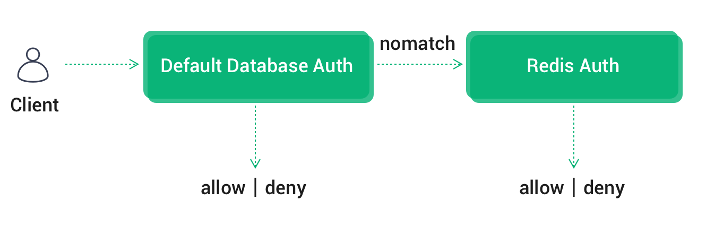
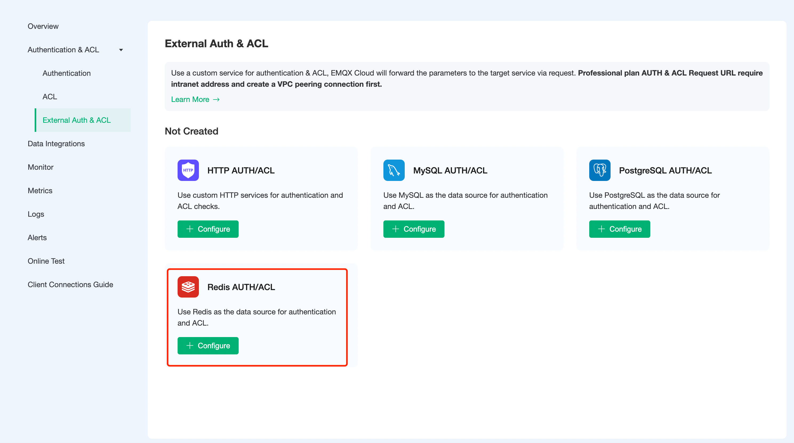
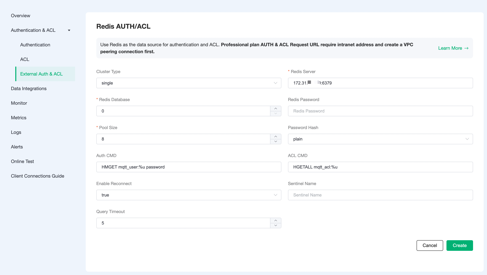
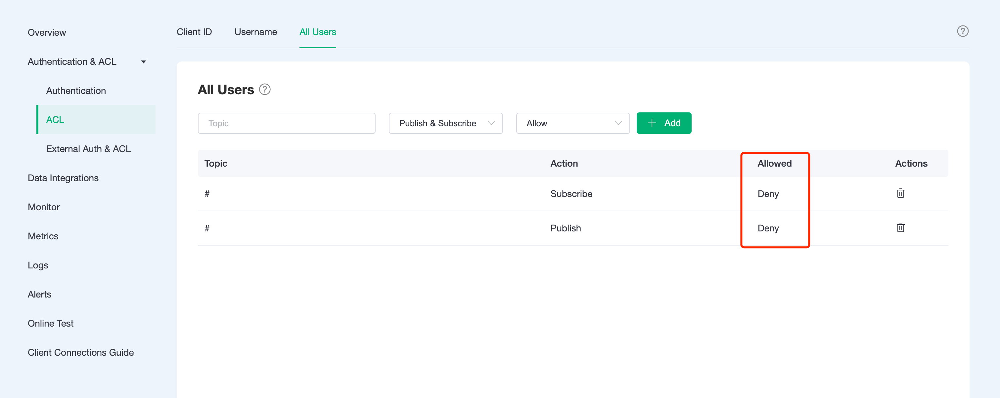

# Redis Authentication/Access Control

In addition to supporting the default authentication method, EMQX Cloud can also use an external Redis database as a data source to store large amounts of data and to facilitate integration with external device management systems.

## Authentication Chain

If built-in authentication is also enabled, EMQX Cloud will chain authentication in the order of [default authentication](https://docs.emqx.com/en/cloud/latest/deployments/auth.html), Redis authentication.

* Once the authentication is successful, terminate the authentication chain and allow the client to access
* Once authentication fails, terminate the authentication chain and disable client access



## Redis Configuration

In your cloud server, create a Redis service. For demonstration purposes, here is a quick build using Docker.

1. Pull the newest version of Redis mirror

    ```bash
    docker pull redis:latest
    ```

2. Run Redis Container

    ```bash
    docker run -itd --name redis -p 6379:6379 redis:latest
    ```

## Authentication/access control configuration

1. Click `Authentication Authentication` - `External Authentication Authorization` in the left menu bar of the EMQX Cloud deployment and select Redis Authentication/Access Control.

    

2. Click `Configure Authentication` to go to the Redis Authentication/Access Control page and fill in the information to create a new authentication.

    ::: tip
     * If the current deployment is Basic Edition, please fill in the public address for the server address
     * If the current deployment is Professional Edition, you need to create a [VPC peer connection](https://docs.emqx.com/en/cloud/latest/deployments/vpc_peering.html), please fill in the intranet address for the server address.
     * If you are prompted with Init resource failure! check whether the server address is correct, and whether the security group is enabled
    :::

    

3. As the EMQX Cloud ACL is `blacklisted` by default, to enable Redis ACL whitelisting, you need to set the default (built-in) access control module in EMQX Cloud to deny all users to subscribe/publish all topics.

   

### Permissions authentication principle

When authenticating, EMQX Cloud will use the current client information to populate and execute the user-configured authentication query command to query the client's authentication data in Redis.

```sql
HMGET mqtt_user:%u password
```

The following placeholders can be used in the authentication SQL and will be automatically populated with client information when EMQX Cloud is executed:

* %u: username
* %c: clientid

You can adapt the authentication query command to your business needs, using any [Redis supported command](http://redisdoc.com/index.html), but in any case the authentication query command needs to satisfy the following conditions.

1. The first data in the query result must be the password, which is used by EMQX Cloud to match against the client password

2. If the salt configuration is enabled, the second data in the query result must be the salt field, which is used by EMQX Cloud as the salt value

#### Default data structure for permission authentication

The default configuration for Redis authentication uses a hash table to store authentication data, using mqtt_user: as the Redis key prefix, with the following data structure.

```sql
redis> hgetall mqtt_user:emqx
password public
```

Example data for the default configuration is as follows.

```sql
HMSET mqtt_user:emqx password public
```

With Redis authentication enabled, you can connect via username: emqx, password: public.

### Access control principle

When access control authentication is performed for topic subscription and publication, EMQX Cloud will use the current client information to populate and execute the user-configured access control authentication SQL, find the data related to the client from Redis, and then perform authentication.

```sql
HGETALL mqtt_acl:%u
```

You can use the following placeholders in the ACL query command, which will be automatically populated with client information by EMQX when executed.

* %u: username
* %c: clientid

You can adapt the ACL query command to suit your business needs, but in any case the ACL query command needs to satisfy the following conditions.

1. The hash uses topic as the key and access as the value

#### Access control default data structure

An example of the ACL rule data format and structure is as follows.

* username: the user name of the connected client
* clientid: the clientid of the connecting client
* topic: the topic to subscribe/publish to
* access: allowed actions: subscribe (1), publish (2), both subscribe and publish (3)

```sql
## Format
HSET mqtt_acl:[username clientid][topic] [access]
## Structure
redis> hgetall mqtt_acl:emqx
testtopic/1 1
```

Example data for the default configuration is as follows.

```sql
HSET mqtt_acl:emqx # 1
HSET mqtt_acl:testtopic/2 2
```

### Encryption rules

Most external authentication on EMQX Cloud can be enabled with the hash method, and only the cipher text of the password is stored in the data source to ensure data security. When hashing is enabled, you can specify a salt for each client and configure the salt rules, and the password stored in the database is the cipher text processed according to the salt rules and the hashing method.

> Available from: [Salting rules and hashing methods](https://www.emqx.io/docs/en/v4.4/advanced/auth.html#password-salting-rules-and-hash-methods)

```bash
## unsalted, plaintext
plain

## No salt, hash only
sha256

 ## salt prefix: use sha256 to encrypt the salt + password concatenated string
salt,sha256

## salt suffix: encrypted with sha256 password + salt concatenated string
sha256,salt

## pbkdf2 with macfun iterations dklen
## macfun: md4, md5, ripemd160, sha, sha224, sha256, sha384, sha512
pbkdf2, sha256, 1000, 20
```
