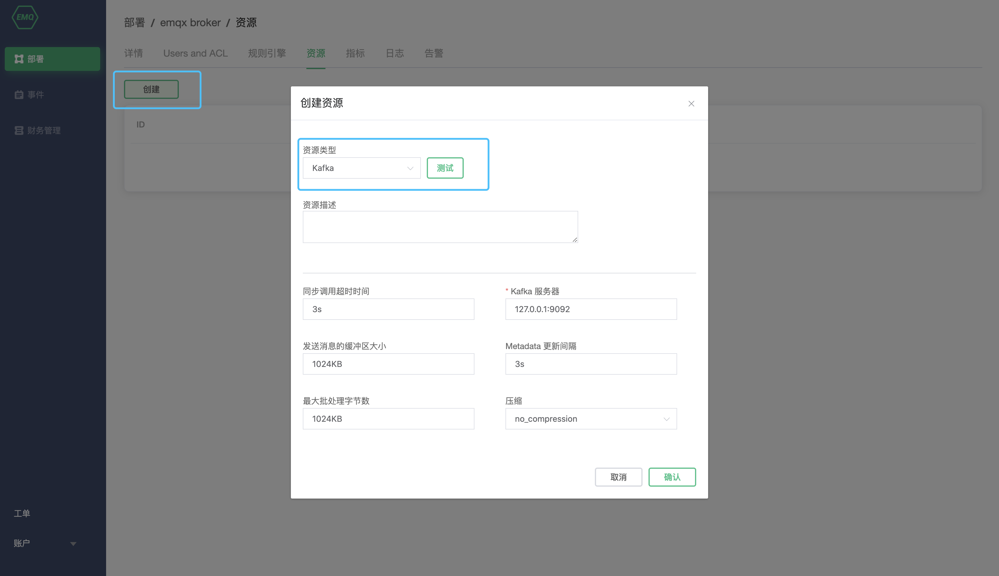
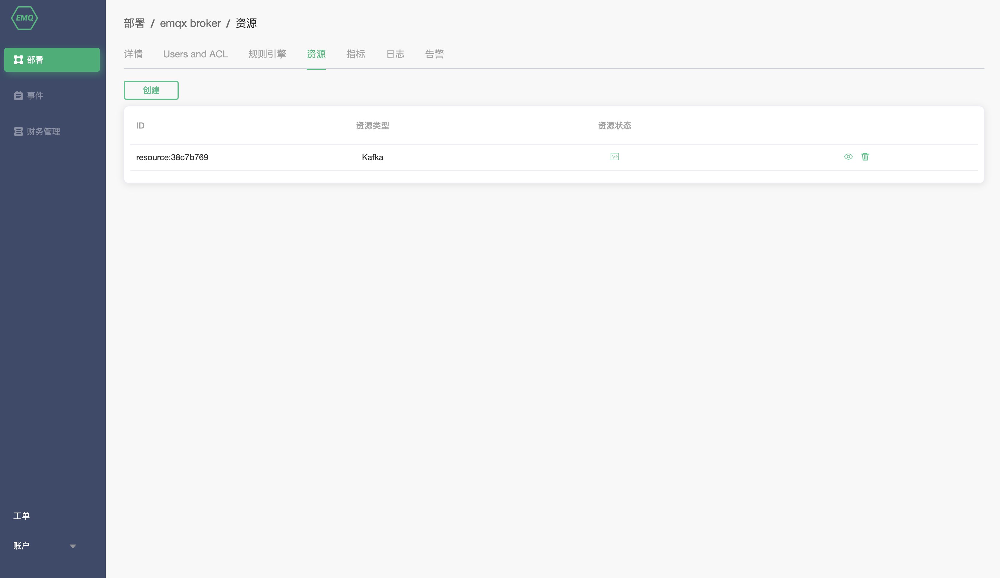
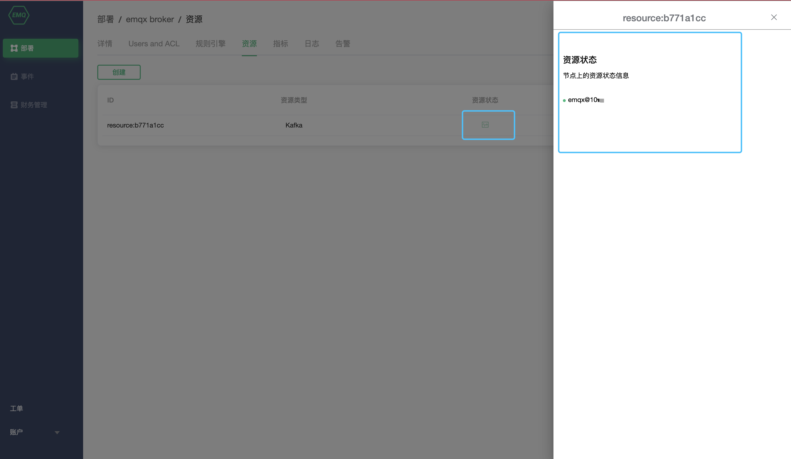

# Resource

EMQ X Cloud resource is used for the response actions of rule engine. You need to ensure that the status of deployment is `running` before that.

### Note

1. If you want to use EMQ X Cloud resources, you need to create [VPC Peer Connection](./vpc_peering.md) at first.
2. All resources must be **intranet resources**.

### Create resources

1. Log in [EMQ X Cloud console](https://cloud.emqx.io/console/).

2. Enter the deployment details page.

3. Click Create, select the corresponding resource type, and fill in the corresponding resource configuration information

   

4. Click Test. If no error is reported, click Confirm, otherwise please check the resource configuration information carefully.

5. Click Confirm and you will return to the resource list.

   

### Delete resources

1. Log in [EMQ X Cloud console](https://cloud.emqx.io/console/).
2. Enter the deployment resource page.
3. Click the delete button to the right of the resource to delete it.

### View status

1. Log in [EMQ X Cloud console](https://cloud.emqx.io/console/).

2. Enter the deployment resource page.

3. Click the resource status icon.

   

