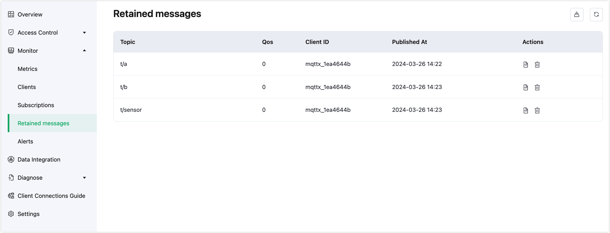
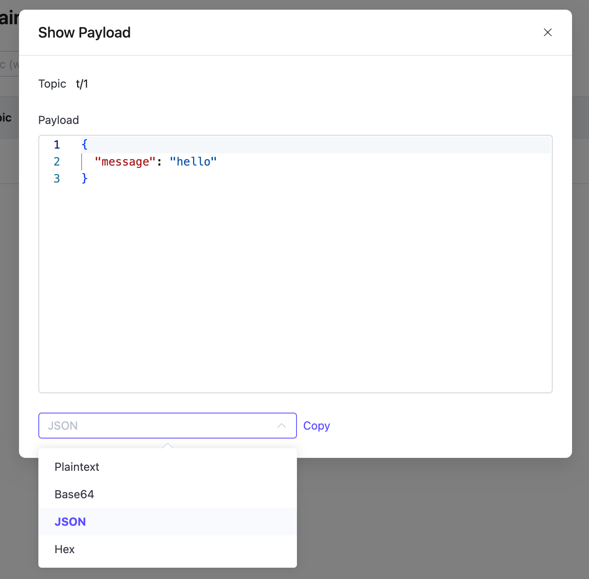

# Retained Message

When a user publishes a retained message, the deployment will save this message in the system, and the user can view this message on the current Retained Messages page. When a user subscribes to the topic of this retained message, the deployment will send this message to the user. The validity period of a retained message is by default never expiring, unless the user manually deletes this message.

To access the Retained Messages page, you can click **Monitoring** -> **Retained Messages** in the left navigation menu in your deployment. On this page, you can view all the retained messages currently in the system.

## Retained Messages List

The Retained Messages list presents all the retained messages currently stored in the system. The list includes the topic of the retained message, the Quality of Service (QoS) level of the retained message, the time the retained message was published, and the client ID that published the retained message. 

Clicking the refresh button in the upper right corner of the list can refresh the current retained messages list.

## Search Retained Messages

When there are many retained messages in the list, you can filter retained messages by topic to display the retained messages you want to view. You can enter a specific topic name in the search box or use a wildcard.

::: tip Note

For Serverless deployments, the search function is not supported.

:::

## View Payload

You can view the payload of a retained message. Click the view button in the **Action** column of a retained message entry in the list to view the message payload.

In the Payload popup, you can view the specific content of the Payload of the retained message. You can click the copy button to quickly copy the Payload of the retained message. In the dropdown box in the lower left corner, you can also format the output of the Payload, which allows for more intuitive viewing for some special Payload formats, such as JSON or Hex format.

## Delete Retained Messages

You can use the following ways to delete retained messages:

1. Publish an empty message on the topic of the retained message.

2. Click the delete icon in the **Action** column to delete a single entry of the retained message.

3. Click the delete icon in the upper right corner to delete all retained messages in the list.

   ::: tip Note

   For Serverless deployments, the delete-all function is not supported.

   :::

::: tip 

Please check [Quotas and Limits](../create/restriction.md) for the size and storage entry limits of retained messages. 

:::