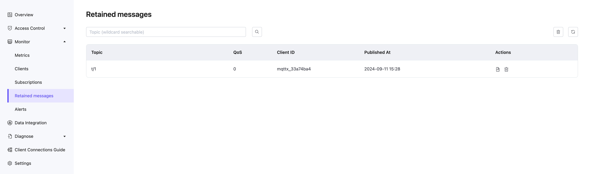

# Retained Message

Click **Monitoring** -> **Retained Message** in the left navigation menu to access the Retained Message page. On this page, you can view all the retained messages currently in the system.

When a user publishes a retained message, the deployment will save this message in the system, and the user can view this message on the current retained message list page. When a user subscribes to the topic of this retained message, the deployment will send this message to the user. The validity period of a retained message is by default never expiring, unless the user manually deletes this message.

## Retained Message List

The Retained Message List presents all the retained messages currently in the system. The list includes the topic of the retained message, the Quality of Service (QoS) level of the retained message, the time the retained message was published, and the client ID that published the retained message. 

In the list, you can also click to view the Payload and the delete button to view the payload of the retained message and delete a retained message. Clicking the refresh button in the upper right corner of the list can refresh the current retained message list.

### View Payload

You can view the Payload of the retained message. Click the view button in the Operation column on the list page of the retained messages to view the Payload of the retained message.

In the Payload popup, you can view the specific content of the Payload of the retained message. You can click the copy button to quickly copy the Payload of the retained message. In the dropdown box in the lower left corner, you can also format the output of the Payload, which allows for more intuitive viewing for some special Payload formats, such as JSON or Hex format.

### Delete Retained Messages

There are generally the following ways to delete retained messages:

1. Publish an empty message on the topic of the retained message.
2. Click the delete button in the retained message operation options.
3. Click the clear button in the upper right corner to clear all retained messages in the deployment.

::: tip 

Please check [Quotas and Limits](../create/restriction.md) for the size and storage entry limits of retained messages. 

:::