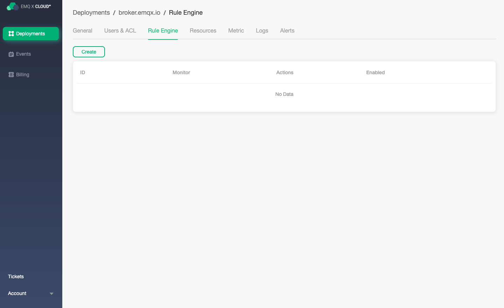
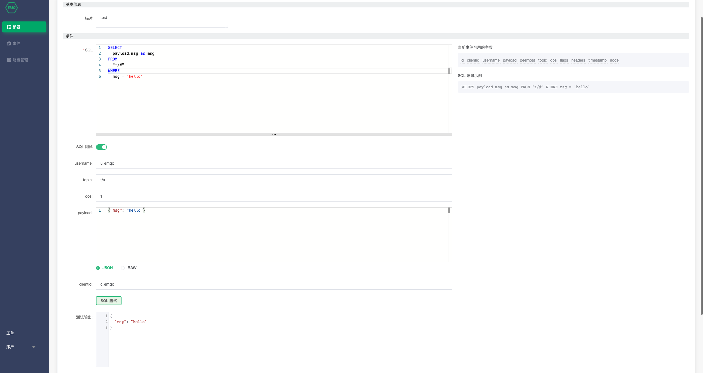
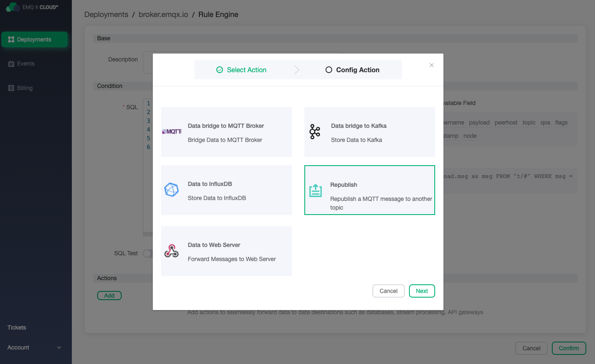

# Rule Engine
EMQ X Cloud rule engine is used to configure the processing and response rules of EMQ X message flows and device events. Rule engine provides a clear and flexible "configurable" business integration solution, which is used to simplify the business development process, improve usability, and reduce the coupling degree between the business system and EMQ X

> Note: If you are new to EMQ X Rule Engine, you can go to  [EMQ X Rule Engine](<https://docs.emqx.io/broker/latest/cn/rule/rule-engine.html>) to learn more about how to use the rules engine.

## Create your first rule engine

Before creating a rule engine, you need to ensure that the status of deployment is `running`

1. Log in  [EMQ X Cloud console](https://cloud.emqx.io/console/)

2. Click on the deployment you want to connect, and you will enter the deployment details page

2. Click on the rule engine, and you will jump to the rule engine page

4. Click on the Create button on the left

   

5. Create a new test SQL and click the test button

   

6. Add actions.

   > Note: Before adding actions, you need to ensure that [VPC Peer Connection]() has been added, and [resource creation](./) has been finished.

   

