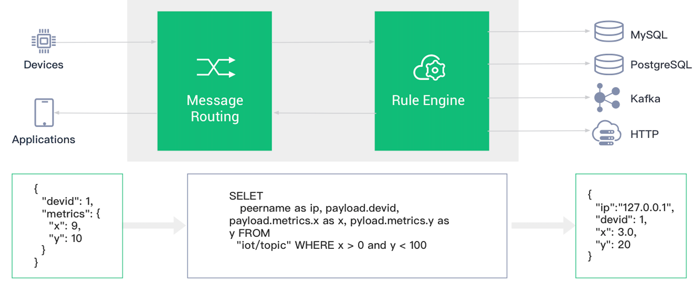

# Overview

The EMQX Cloud Data Integrations is used to configure the rules for handling and responding to EMQX message flows and device events. The Data Integrations not only provides a clear and flexible "configurable" business integration solution, but also simplifies the business development process, improves user usability, and reduces the coupling degree between the business system and EMQX Cloud. It also provides a superior infrastructure for customization of EMQX Cloud's proprietary capabilities.

In EMQX Cloud, using the Data Integrations has the following requirements and restrictions:

- Basic Deployment
    - The resource only supports public access, so you need to ensure that the resource has public access and open security groups before creating the resource.
    - Only Webhook and MQTT bridges are open for the resource type.
- Professional Deployment
    - The resource only supports internal network access, so you need to configure VPC peering before creating the resource and open the security group.

## [Rule Management](../rule_engine/rules.md)

The Data Integrations not only provides a clear and flexible "configurable" business integration solution, simplifies the business development process, improves user usability, and reduces the coupling degree between the business system and EMQX, but also provides a superior infrastructure for EMQX's proprietary functionality customization.

## [Resource Management](../rule_engine/resources.md)

EMQX Cloud resources are used for Data Integrations response actions, before which you need to ensure that the deployment status is running.

## [Write Rules Using SQL](https://docs.emqx.io/en/broker/v4.3/rule/rule-engine.html#sql-statement)

Learn and understand how to use SQL to write rules.