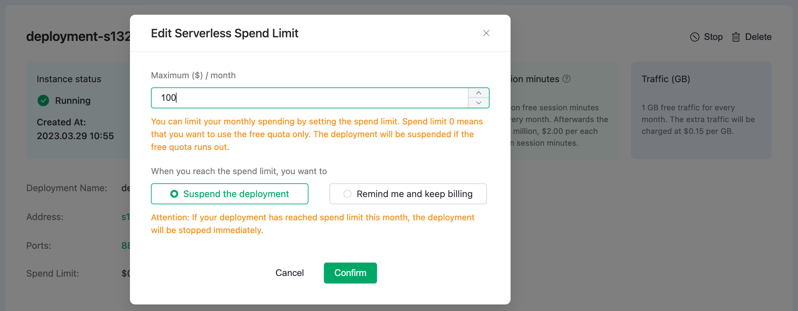

# Serverless Spend Limit

The spend limit allows you to control the monthly spending of the Serverless deployment. It can provide a reminder when the limit is reached. The spend limit is set during deployment creation and can be modified afterward.

If the spend limit is set to 0, the deployment will only use the free resources, which includes 1 million connection minutes and 1 GB of traffic per month. Once the free resources are exhausted, the deployment will be stopped.

   

When the spend limit is set to an integer between 1 and 10000, you can choose an action to be taken when the total spend for the month reaches the limit, either to stop the deployment or be notified and continue to incur charges. If you choose the latter option, we will send a reminder via email, and the deployment will continue to run and be charged.

   

- If you set a spending limit above zero and there is not a payment method attached, you need to add a payment method first. 
- If your deployment's monthly consumption has already exceeded the modified spending limit, changing the limit will result in the deployment being stopped. Please proceed with caution.
- If there is an overdue bill, your deployment will be stopped regardless of the spending limit.

