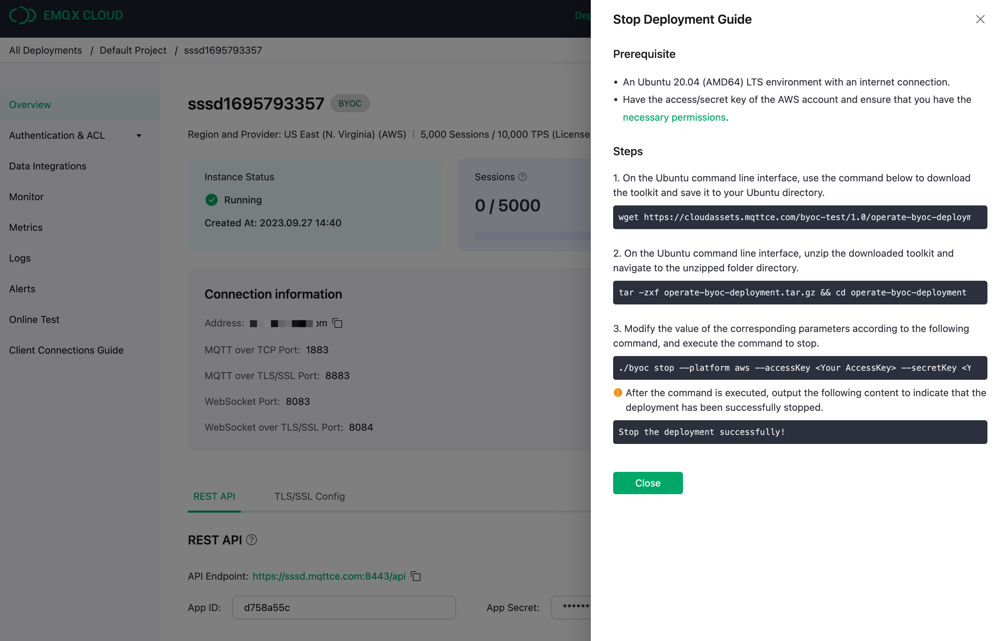
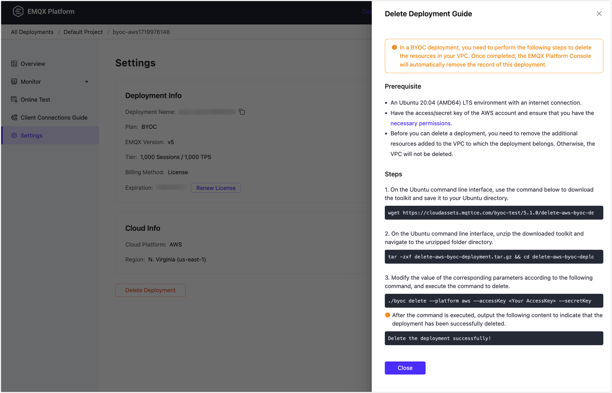

# Stop and Delete Deployments

## Serverless

### Stop a Deployment

1. Go to the **Cloud Console**. Click on the deployment you want to **stop** to access the deployment overview page.
2. Click the **Stop** button and enter the name of the deployment in the pop-up box.
3. Click **Confirm** to stop the deployment.

::: warning
Stopping a deployment will disconnect devices from the deployment, but your data and connection address will be preserved.
:::

### Delete a Deployment

1. Go to the **Cloud Console**. Click on the deployment you want to **delete** to access the deployment overview page.
2. Click the **Delete** button and enter the name of the deployment in the pop-up box.
3. Click **Confirm** to stop the deployment .

::: warning
Deleting a deployment will disconnect devices from the deployment and remove all deployment data and configurations.
:::


## Dedicated

### Stop a Deployment
::: warning
After stopping the deployment, you will no longer be able to connect to it, but your data and connection address will be preserved. Please note that data retention fees will apply.
:::

Before stopping the deployment, please make sure that the deployment's status is **Running**.

1. Go to the **Cloud Console** and click on the deployment you wan t to **stop** to access the deployment overview page.
2. Click the **Stop** button and enter the name of the deployment in the pop-up box.
3. Click **Confirm** to stop the deployment .


### Delete a Deployment
::: warning
After deleting the deployment, you will no longer be able to connect to it, and all deployment data and configurations will be removed. The deployment billing will also be stopped.
:::

Before deleting the deployment, please make sure that the deployment's status is **Running**.

1. Go to the **Cloud Console** and click on the deployment you wan t to **delete** to access the deployment overview page.
2. Click the **Delete** button and enter the name of the deployment in the pop-up box.
3. Click **Confirm** to stop the deployment.


## BYOC

### Stop a Deployment
Before operating a deployment stop, please make sure you've set the right [IAM policy definition](../deployments/byoc_prerequisite.md#iam-permissions).

To begin the stop process, access the console and navigate to the deployment you wish to stop. Go to the deployment overview page and click on the **Stop** button. This will prompt the **Stop Deployment Guide** to appear, as shown in the following image:



Here is the deployment stop process:
:::: tabs
::: tab "AWS"
1. On the Ubuntu command line interface, use the command below to download the toolkit and save it to your Ubuntu directory.
```bash
wget https://cloudassets.emqx.com/en/byoc-deployments/1.3/operate-byoc-deployment.tar.gz
```

2. On the Ubuntu command line interface, unzip the downloaded toolkit and navigate to the unzipped folder directory.
```bash
tar -zxf operate-byoc-deployment.tar.gz && cd operate-byoc-deployment
```
3. Modify the value of the corresponding parameters according to the following command, and execute the command to stop.
```bash
./byoc stop \
     --platform aws \
     --accessKey <Your AccessKey> \
     --secretKey <Your SecretKey> \
     --byocEndpoint https://cloud-intl.emqx.com \
     --byocKey 58825600h0eb010ee6xxxxx
```

- `--accessKey`: Enter your access key ID for your AWS IAM user.
- `--secretKey`: Enter your access key secret for your AWS IAM user.

Do not modify the following three values that are automatically filled in when the deployment guide is generated in the console.

- `--platform`: specifies the cloud provider.
- `--byocEndpoint`: is the EMQX Cloud access address.
- `--byocKey`: is the authentication key for BYOC deployment. The generated byocKey is valid for one hour, and should be executed as soon as possible after generating the script command.

After the command is executed, output the following content to indicate that the deployment has been successfully stopped.
```bash
Stop the deployment successfully!
```
:::
::: tab "Google Cloud"
1. On the Ubuntu command line interface, use the command below to download the toolkit and save it to your Ubuntu directory.
```bash
wget https://cloudassets.emqx.com/en/byoc-deployments/1.3/operate-byoc-deployment.tar.gz
```

2. On the Ubuntu command line interface, unzip the downloaded toolkit and navigate to the unzipped folder directory.
```bash
tar -zxf operate-byoc-deployment.tar.gz && cd operate-byoc-deployment
```
3. Modify the value of the corresponding parameters according to the following command, and execute the command to delete.
```bash
./byoc stop \
      --platform gcp \
      --projectID <Your Project ID> \
      --authJSONPath <The absolute path of your Service Account JSON file> \
      --byocEndpoint https://cloud-intl.emqx.com \
      --byocKey 58825600se85d4cf1cxxxxxxxx
```

- `--projectID`: Enter your Google Cloud project ID. You can find it in the project selector at the top bar of Google Cloud Console.
- `--authJSONPath`: Enter the path to the JSON file for your [Google Cloud service account key](https://cloud.google.com/iam/docs/keys-create-delete#creating).

Do not modify the following three values that are automatically filled in when the deployment guide is generated in the console.

- `--platform` specifies the cloud provider.
- `--byocEndpoint` is the EMQX Cloud access address.
- `--byocKey` is the authentication key for BYOC deployment. The generated byocKey is valid for one hour, and should be executed as soon as possible after generating the script command.

After the command is executed, output the following content to indicate that the deployment has been successfully stopped.
```bash
Stop the deployment successfully!
```
:::
::::


### Start a Deployment
Before operating a deployment start, please make sure you've set the right [IAM policy definition](../deployments/byoc_prerequisite.md#iam-permissions).

To begin the start process, access the console and navigate to the deployment you wish to start. Go to the deployment overview page and click on the **Start** button. This will prompt the **Start Deployment Guide** to appear, as shown in the following image:


Here is the deployment start process:
:::: tabs
::: tab "AWS"
1. On the Ubuntu command line interface, use the command below to download the toolkit and save it to your Ubuntu directory.
```bash
wget https://cloudassets.emqx.com/en/byoc-deployments/1.3/operate-byoc-deployment.tar.gz
```

2. On the Ubuntu command line interface, unzip the downloaded toolkit and navigate to the unzipped folder directory.
```bash
tar -zxf operate-byoc-deployment.tar.gz && cd operate-byoc-deployment
```
3. Modify the value of the corresponding parameters according to the following command, and execute the command to stop.
```bash
./byoc start \
     --platform aws \
     --accessKey <Your AccessKey> \
     --secretKey <Your SecretKey> \
     --byocEndpoint https://cloud-intl.emqx.com \
     --byocKey 58825600h0eb010ee6xxxxx
```

- `--accessKey`: Enter your access key ID for your AWS IAM user.
- `--secretKey`: Enter your access key secret for your AWS IAM user.

Do not modify the following three values that are automatically filled in when the deployment guide is generated in the console.

- `--platform` specifies the cloud provider.
- `--byocEndpoint` is the EMQX Cloud access address.
- `--byocKey` is the authentication key for BYOC deployment. The generated byocKey is valid for one hour, and should be executed as soon as possible after generating the script command.

After the command is executed, output the following content to indicate that the deployment has been successfully started.
```bash
Start the deployment successfully!
```
:::
::: tab "Google Cloud"
1. On the Ubuntu command line interface, use the command below to download the toolkit and save it to your Ubuntu directory.
```bash
wget https://cloudassets.emqx.com/en/byoc-deployments/1.3/operate-byoc-deployment.tar.gz
```

2. On the Ubuntu command line interface, unzip the downloaded toolkit and navigate to the unzipped folder directory.
```bash
tar -zxf operate-byoc-deployment.tar.gz && cd operate-byoc-deployment
```
3. Modify the value of the corresponding parameters according to the following command, and execute the command to delete.
```bash
./byoc start \
     --platform gcp \
     --projectID <Your Project ID> \
     --authJSONPath <The absolute path of your Service Account JSON file> \
     --byocEndpoint https://cloud-intl.emqx.com \
     --byocKey abcdXXXXXXXXXX111
```

- `--projectID`: Enter your Google Cloud project ID. You can find it in the project selector at the top bar of Google Cloud Console.
- `--authJSONPath`: Enter the path to the JSON file for your [Google Cloud service account key](https://cloud.google.com/iam/docs/keys-create-delete#creating).

Do not modify the following three values that are automatically filled in when the deployment guide is generated in the console.

- `--platform` specifies the cloud provider.
- `--byocEndpoint` is the EMQX Cloud access address.
- `--byocKey` is the authentication key for BYOC deployment. The generated byocKey is valid for one hour, and should be executed as soon as possible after generating the script command.

After the command is executed, output the following content to indicate that the deployment has been successfully started.
```bash
Start the deployment successfully!
```
:::
::::


### Delete a Deployment
::: warning
Once you delete the deployment, you will no longer be able to connect to it, and all data and configurations associated with the deployment will be permanently deleted.
:::

::: tip
Before deleting the deployment, please ensure that the deployment's status is **Running**.

Make sure that all customized resources created by yourself after the deployment creation in the VPC of BYOC deployment have been deleted. Otherwise, the deployment deletion process will be failed.
:::

To begin the deletion process, access the console and navigate to the deployment you wish to delete. Go to the deployment details page and click on the **Delete** button. This will prompt the **Delete Deployment Guide** to appear, as shown in the following image:



Prepare an Ubuntu 20.04 (AMD64) LTS environment with internet access and follow the steps and commands provided in the **Delete Deployment Guide** to initiate the deletion process.

::: tip
Copy the commands from the **Delete Deployment Guide** one by one and paste them into your Ubuntu command-line interface. These commands contain values provided in your settings page, as well as system-predefined information.
:::

Here is the deployment deletion process:
:::: tabs
::: tab "AWS"
1. On the Ubuntu command line interface, user the command below to download the toolkit and save it to your Ubuntu directory.
```bash
wget https://cloudassets.emqx.com/en/byoc-deployments/1.2/delete-aws-byoc-deployment.tar.gz
```

2. On the Ubuntu command line interface, unzip the downloaded toolkit and navigate to the unzipped folder directory.
```bash
tar -zxf delete-aws-byoc-deployment.tar.gz && cd delete-aws-byoc-deployment
```
3. Modify the value of the corresponding parameters according to the following command, and execute the command to delete.
```bash
./byoc delete \
     --platform aws \
     --accessKey <Your AccessKey> \
     --secretKey <Your SecretKey> \
     --byocEndpoint https://cloud-intl.emqx.com \
     --byocKey abcdXXXXXXXXXX111
```

- `--accessKey`: Enter your access key ID for your AWS IAM user.
- `--secretKey`: Enter your access key secret for your AWS IAM user.

Do not modify the following three values that are automatically filled in when the deployment guide is generated in the console.

- `--platform` specifies the cloud provider.
- `--byocEndpoint` is the EMQX Cloud access address.
- `--byocKey` is the authentication key for BYOC deployment. The generated byocKey is valid for one hour, and should be executed as soon as possible after generating the script command.

After the command is executed, output the following content to indicate that the deployment has been successfully deleted.
```bash
Delete the deployment successfully!
```
:::
::: tab "Google Cloud"
1. On the Ubuntu command line interface, user the command below to download the toolkit and save it to your Ubuntu directory.
```bash
wget https://cloudassets.emqx.com/en/byoc-deployments/1.2/delete-gcp-byoc-deployment.tar.gz
```

2. On the Ubuntu command line interface, unzip the downloaded toolkit and navigate to the unzipped folder directory.
```bash
tar -zxf delete-gcp-byoc-deployment.tar.gz && cd delete-gcp-byoc-deployment
```
3. Modify the value of the corresponding parameters according to the following command, and execute the command to delete.
```bash
./byoc delete \
     --platform gcp \
     --projectID <Your Project ID> \
     --authJSONPath <The absolute path of your Service Account JSON file> \
     --byocEndpoint https://cloud-intl.emqx.com \
     --byocKey abcdXXXXXXXXXX111
```

- `--projectID`: Enter your Google Cloud project ID. You can find it in the project selector at the top bar of Google Cloud Console.
- `--authJSONPath`: Enter the path to the JSON file for your [Google Cloud service account key](https://cloud.google.com/iam/docs/keys-create-delete#creating).

Do not modify the following three values that are automatically filled in when the deployment guide is generated in the console.

- `--platform` specifies the cloud provider.
- `--byocEndpoint` is the EMQX Cloud access address.
- `--byocKey` is the authentication key for BYOC deployment. The generated byocKey is valid for one hour, and should be executed as soon as possible after generating the script command.

After the command is executed, output the following content to indicate that the deployment has been successfully deleted.
```bash
Delete the deployment successfully!
```
:::