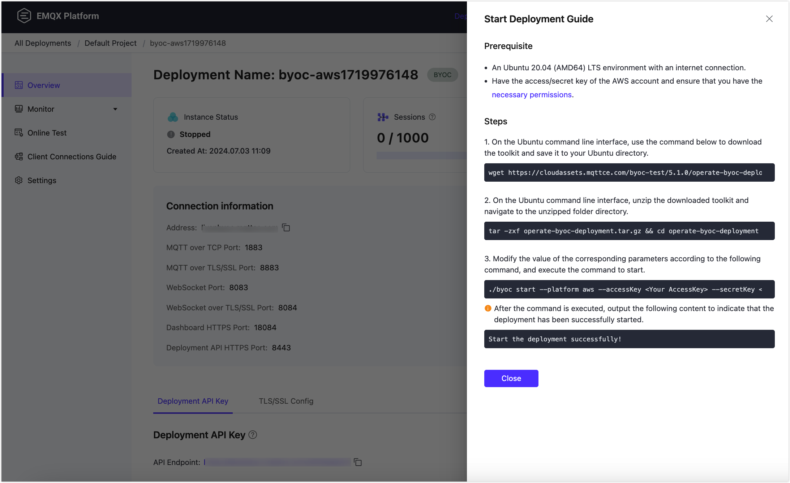
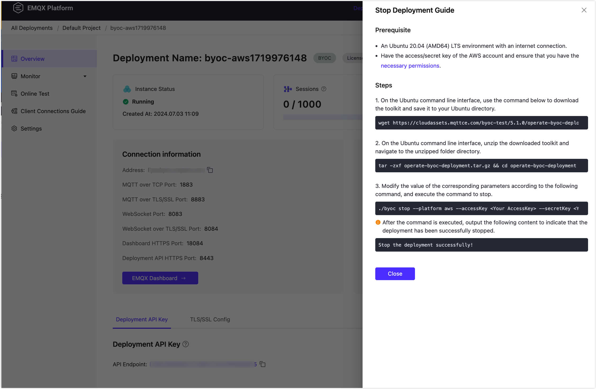

# Start, Stop and Delete Deployments

This page provides detailed instructions on how to start, stop, and delete different plans of deployments in the Cloud Console.

## Serverless Plan

This section introduces how to start, stop, and delete a serverless plan deployment.

### Start and Stop a Deployment

To start a deployment that is already stopped in the console, click on the deployment to enter the deployment overview page and click the **Start** button in the upper right corner. To stop a deployment, follow the instructions below:

::: warning Note 

After stopping the deployment, devices will not be able to connect to the deployment, and your data and connection addresses will be retained. 

:::

1. In the console, click on the deployment you want to stop to enter the deployment overview page.
2. Click the **Stop** button in the upper right corner and enter the deployment name in the pop-up box.
3. Click **Confirm** to stop the deployment.

### Delete a Deployment

::: warning Note 

After deleting the deployment, devices will not be able to connect to the deployment, and all data and configurations of the deployment will be deleted. 

:::

1. In the console, click on the deployment you want to delete to enter the deployment overview page.
2. Click the **Delete** button in the upper right corner and enter the deployment name in the pop-up box.
3. Click **Confirm** to delete the deployment.


## Dedicated Plan

This section introduces how to start, stop, and delete a dedicated plan deployment.

### Start and Stop a Deployment

To start a deployment that is already stopped in the console, click on the deployment to enter the deployment overview page and click the **Start** button in the upper right corner.

To stop a deployment, follow the instructions below. Before stopping the deployment, make sure that the deployment is in the **Running** state.

::: warning Note
After stopping the deployment, you will not be able to connect to the deployment, but your data and connection addresses will be retained, and data retention fees will be charged.
:::

1. In the console, click on the deployment you want to stop to enter the deployment overview page.
2. Click the **Stop** button in the upper right corner and enter the deployment name in the pop-up box.
3. Click **Confirm** to stop the deployment.


### Delete a Deployment
Before deleting the deployment, make sure that the deployment is in the **Running** state.

::: warning Note
After deleting the deployment, you will no longer be able to connect to it, and all deployment data and configurations will be removed. The deployment billing will also be stopped. 
:::

1. In the console, click on the deployment you want to delete to enter the deployment overview page.
2. Click the **Delete** button in the upper right corner and enter the deployment name in the pop-up box.
3. Click **Confirm** to delete the deployment.


## BYOC

This section introduces how to start, stop, and delete a BYOC deployment.

### Start a Deployment

::: tip Prerequisite

Before operating a deployment start, please make sure you've set the right [IAM policy definition](../deployments/byoc_prerequisite.md#iam-permissions).

:::

To start a deployment, go to the console, click on the deployment you want to start and enter the deployment overview page. Click the **Start** button in the upper right corner to open the **Start Deployment Guide** as shown below:



For different deployment cloud platforms, the specific operating steps are as follows:
:::: tabs
::: tab "AWS"

1. On the Ubuntu command line interface, use the command below to download the toolkit and save it to your Ubuntu directory.

```bash
wget https://cloudassets.emqx.com/en/byoc-deployments/5.1.0/operate-byoc-deployment.tar.gz
```

2. Unzip the downloaded toolkit on the Ubuntu command line interface and navigate to the unzipped folder directory.

```bash
tar -zxf operate-byoc-deployment.tar.gz && cd operate-byoc-deployment
```

3. Modify the value of the corresponding parameters according to the following command, and execute the command to stop.

```bash
./byoc start \
     --platform aws \
     --accessKey <Your AccessKey> \
     --secretKey <Your SecretKey> \
     --byocEndpoint https://cloud-intl.emqx.com \
     --byocKey 58825600h0eb010ee6xxxxx
```

- `--accessKey`: Enter your access key ID for your AWS IAM user.
- `--secretKey`: Enter your access key secret for your AWS IAM user.

Do not modify the following three values that are automatically filled in when the console generates the deployment guide.

- `--platform` specifies the cloud provider.
- `--byocEndpoint` is the EMQX Platform access address.
- `--byocKey` is the authentication key for BYOC deployment. The generated byocKey is valid for one hour and should be executed as soon as possible after generating the script command.

When the command line outputs the following content, it indicates that the deployment has been started successfully.

```bash
Start the deployment successfully!
```

:::
::: tab "Google Cloud"

1. On the Ubuntu command line interface, use the command below to download the toolkit and save it to your Ubuntu directory.

```bash
wget https://cloudassets.emqx.com/en/byoc-deployments/5.1.0/operate-byoc-deployment.tar.gz
```

2. Unzip the downloaded toolkit on the Ubuntu command line interface and navigate to the unzipped folder directory.

```bash
tar -zxf operate-byoc-deployment.tar.gz && cd operate-byoc-deployment
```

3. Modify the value of the corresponding parameters according to the following command, and execute the command to delete.

```bash
./byoc start \
     --platform gcp \
     --projectID <Your Project ID> \
     --authJSONPath <The absolute path of your Service Account JSON file> \
     --byocEndpoint https://cloud-intl.emqx.com \
     --byocKey abcdXXXXXXXXXX111
```

- `--projectID`: Enter your Google Cloud project ID. You can find it in the project selector at the top bar of Google Cloud Console.
- `--authJSONPath`: Enter the path to the JSON file for your [Google Cloud service account key](https://cloud.google.com/iam/docs/keys-create-delete#creating).

Do not modify the following three values that are automatically filled in when the console generates the deployment guide.

- `--platform` specifies the cloud provider.
- `--byocEndpoint` is the EMQX Platform access address.
- `--byocKey` is the authentication key for BYOC deployment. The generated byocKey is valid for one hour and should be executed as soon as possible after generating the script command.

When the command line outputs the following content, it indicates that the deployment has been started successfully.

```bash
Start the deployment successfully!
```

:::
::::

### Stop a Deployment

::: tip Prerequisite

Before operating a deployment stop, please make sure you've set the right [IAM policy definition](../deployments/byoc_prerequisite.md#iam-permissions).

:::

::: warning Note

After stopping the deployment, you will not be able to connect to the deployment, your data and connection addresses will be retained.

:::

To stop a deployment, go to the console, click on the deployment you want to delete to enter the deployment overview page. Click the **Stop** button in the upper right corner to open the **Stop Deployment Guide** as shown below:



For different deployment cloud platforms, the specific operating steps are as follows:
:::: tabs
::: tab "AWS"

1. On the Ubuntu command line interface, use the command below to download the toolkit and save it to your Ubuntu directory.
```bash
wget https://cloudassets.emqx.com/en/byoc-deployments/5.1.0/operate-byoc-deployment.tar.gz
```

2. Unzip the downloaded toolkit on the Ubuntu command line interface and navigate to the unzipped folder directory.
```bash
tar -zxf operate-byoc-deployment.tar.gz && cd operate-byoc-deployment
```
3. Modify the value of the corresponding parameters according to the following command, and execute the command to stop.
```bash
./byoc stop \
     --platform aws \
     --accessKey <Your AccessKey> \
     --secretKey <Your SecretKey> \
     --byocEndpoint https://cloud-intl.emqx.com \
     --byocKey 58825600h0eb010ee6xxxxx
```

- `--accessKey`: Enter your access key ID for your AWS IAM user.
- `--secretKey`: Enter your access key secret for your AWS IAM user.

Do not modify the following three values that are automatically filled in when the console generates the deployment guide.

- `--platform`: specifies the cloud provider.
- `--byocEndpoint`: is the EMQX Platform access address.
- `--byocKey`: is the authentication key for BYOC deployment. The generated byocKey is valid for one hour, and should be executed as soon as possible after generating the script command.

When the command line outputs the following content, it indicates that the deployment has been stopped successfully.
```bash
Stop the deployment successfully!
```
:::
::: tab "Google Cloud"
1. On the Ubuntu command line interface, use the command below to download the toolkit and save it to your Ubuntu directory.
```bash
wget https://cloudassets.emqx.com/en/byoc-deployments/5.1.0/operate-byoc-deployment.tar.gz
```

2. Unzip the downloaded toolkit on the Ubuntu command line interface and navigate to the unzipped folder directory.
```bash
tar -zxf operate-byoc-deployment.tar.gz && cd operate-byoc-deployment
```
3. Modify the value of the corresponding parameters according to the following command, and execute the command to delete.
```bash
./byoc stop \
      --platform gcp \
      --projectID <Your Project ID> \
      --authJSONPath <The absolute path of your Service Account JSON file> \
      --byocEndpoint https://cloud-intl.emqx.com \
      --byocKey 58825600se85d4cf1cxxxxxxxx
```

- `--projectID`: Enter your Google Cloud project ID. You can find it in the project selector at the top bar of Google Cloud Console.
- `--authJSONPath`: Enter the path to the JSON file for your [Google Cloud service account key](https://cloud.google.com/iam/docs/keys-create-delete#creating).

Do not modify the following three values that are automatically filled in when the console generates the deployment guide.

- `--platform` specifies the cloud provider.
- `--byocEndpoint` is the EMQX Platform access address.
- `--byocKey` is the authentication key for BYOC deployment. The generated byocKey is valid for one hour, and should be executed as soon as possible after generating the script command.

When the command line outputs the following content, it indicates that the deployment has been stopped successfully.
```bash
Stop the deployment successfully!
```
:::
::::


### Delete a Deployment
::: tip Prerequisites
Before deleting the deployment, please ensure that the deployment's status is **Running**. Make sure that all customized resources created by yourself after the deployment creation in the VPC of BYOC deployment have been deleted. Otherwise, the deployment deletion process will fail.
:::

::: warning Note
Once you delete the deployment, you will no longer be able to connect to it, and all data and configurations associated with the deployment will be permanently deleted.
:::

Enter the console and click on the deployment you wish to delete to go to the deployment overview page. Click the **Settings** button in the upper right corner to go to the settings page, then click the **Delete Deployment** button at the bottom of the page. A **Delete Deployment Guide** will pop up, as shown in the image below:


Prepare an Ubuntu 20.04 (AMD64) LTS environment with internet access and follow the steps and commands provided in the **Delete Deployment Guide** to initiate the deletion process.

::: tip
Copy and paste the commands in the **Delete Deployment Guide** into your Ubuntu command-line interface one by one. These commands include the values you provided on the setup page and system-predefined information.
:::

For different deployment cloud platforms, the specific operating steps are as follows:
:::: tabs
::: tab "AWS"

1. On the Ubuntu command line interface, use the command below to download the toolkit and save it to your Ubuntu directory.
```bash
wget https://cloudassets.emqx.com/en/byoc-deployments/5.1.0/delete-aws-byoc-deployment.tar.gz
```

2. Unzip the downloaded toolkit on the Ubuntu command line interface and navigate to the unzipped folder directory.
```bash
tar -zxf delete-aws-byoc-deployment.tar.gz && cd delete-aws-byoc-deployment
```
3. Modify the value of the corresponding parameters according to the following command, and execute the command to delete.
```bash
./byoc delete \
     --platform aws \
     --accessKey <Your AccessKey> \
     --secretKey <Your SecretKey> \
     --byocEndpoint https://cloud-intl.emqx.com \
     --byocKey abcdXXXXXXXXXX111
```

- `--accessKey`: Enter your access key ID for your AWS IAM user.
- `--secretKey`: Enter your access key secret for your AWS IAM user.

Do not modify the following three values that are automatically filled in when the console generates the deployment guide.

- `--platform` specifies the cloud provider.
- `--byocEndpoint` is the EMQX Platform access address.
- `--byocKey` is the authentication key for BYOC deployment. The generated byocKey is valid for one hour, and should be executed as soon as possible after generating the script command.

After executing the command, confirm that you want to delete the cloud resources. Enter "yes" and press Enter to continue.

```bash
Do you really want to destroy all resources?
  Terraform will destroy all your managed infrastructure, as shown above.
  There is no undo. Only 'yes' will be accepted to confirm.

  Enter a value: 
```

When the command line outputs the following content, it indicates that the deployment has been deleted successfully.

```bash
Delete the deployment successfully!
```
:::
::: tab "Google Cloud"
1. On the Ubuntu command line interface, use the command below to download the toolkit and save it to your Ubuntu directory.
```bash
wget https://cloudassets.emqx.com/en/byoc-deployments/5.1.0/delete-gcp-byoc-deployment.tar.gz
```

2. Unzip the downloaded toolkit on the Ubuntu command line interface and navigate to the unzipped folder directory.
```bash
tar -zxf delete-gcp-byoc-deployment.tar.gz && cd delete-gcp-byoc-deployment
```
3. Modify the value of the corresponding parameters according to the following command, and execute the command to delete.
```bash
./byoc delete \
     --platform gcp \
     --projectID <Your Project ID> \
     --authJSONPath <The absolute path of your Service Account JSON file> \
     --byocEndpoint https://cloud-intl.emqx.com \
     --byocKey abcdXXXXXXXXXX111
```

- `--projectID`: Enter your Google Cloud project ID. You can find it in the project selector at the top bar of Google Cloud Console.
- `--authJSONPath`: Enter the path to the JSON file for your [Google Cloud service account key](https://cloud.google.com/iam/docs/keys-create-delete#creating).

Do not modify the following three values that are automatically filled in when the console generates the deployment guide.

- `--platform` specifies the cloud provider.
- `--byocEndpoint` is the EMQX Platform access address.
- `--byocKey` is the authentication key for BYOC deployment. The generated byocKey is valid for one hour, and should be executed as soon as possible after generating the script command.

When the command line outputs the following content, it indicates that the deployment has been deleted successfully.
```bash
Delete the deployment successfully!
```
:::

::::