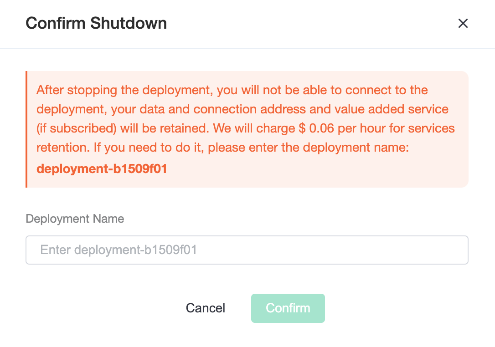

# Stop Deployment
::: tip Tip
After the deployment is stopped you will not be able to connect to the deployment, your data and connection address will be retained, and we will charge you a data retention fee.
:::

To stop the deployment, you need to make sure the deployment running status is `running`.

1. Enter the console, click the deployment you want to stop, and you will enter the deployment details page

2. Click the `stop` button and fill in the deployment name in the pop-up box

3. Click `Confirm` to stop the deployment

