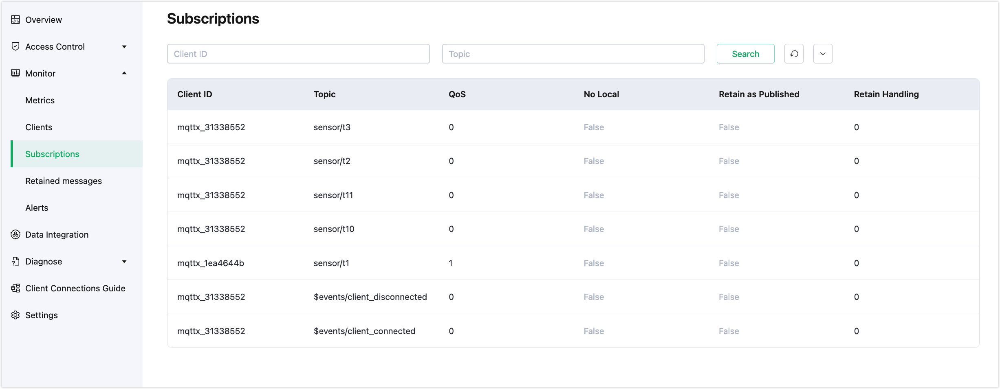

# Subscription Management

Click **Monitor**->**Subscriptions** to enter the **Subscriptions** page.

The subscription list displays all the topics subscribed by clients in the current deployment, reflecting the mapping relationship between clients and topics. Besides the client ID, topic, and QoS, the list also provides information on subscription features newly supported by MQTT v5.

**No Local:** In MQTT v3.1.1, if you subscribe to a topic from which you publish messages, you will receive all messages you publish. However, in MQTT v5, if you set this option to 1 during subscription, the server will not forward to you the messages you publish yourself.

**Retain as Published:** This option specifies whether the server should retain the RETAIN flag when forwarding messages to clients. Note that this option does not affect the RETAIN flag in retained messages. Therefore, when the Retain As Publish option is set to 0, the client relies directly on the RETAIN flag in the message to distinguish whether it is a normal forwarded message or a retained message, rather than determining whether the message is the first one received after subscription (forwarded messages may even be sent before retained messages, depending on the specific implementation of different brokers).

**Retain Handling:** This option specifies whether the server sends retained messages to the client when a subscription is established:

- Retain Handling equals 0, the server sends retained messages as soon as the client subscribes successfully.
- Retain Handling equals 1, the server sends retained messages only if the client subscribes successfully and the subscription did not previously exist. After all, sometimes a client may resubscribe just to change the QoS, which does not mean it wants to receive retained messages again.
- Retain Handling equals 2, even if the client subscribes successfully, the server will not send retained messages.

The search bar by default displays client ID and Topic to filter search fields, supporting fuzzy searches of the subscription list by client ID and Topic; clicking the arrow button on the right side of the search bar will also display input boxes for filtering by QoS and shared name.

