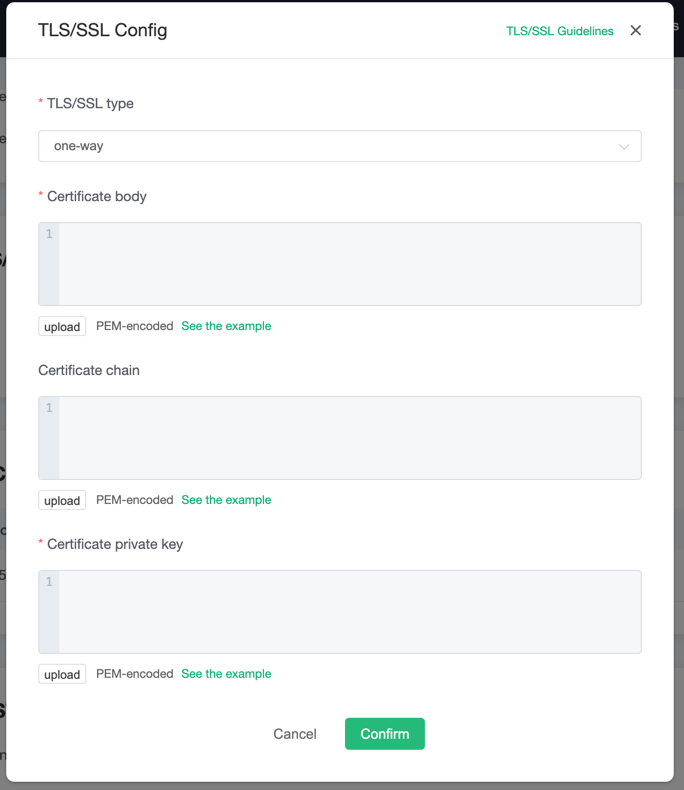

# Configure TLS/SSL

::: danger
This feature is not available in free trial and shared deployment
:::

EMQ X Cloud **Dedicated Deployment** provides custom one-way/two-way TLS/SSL configuration, as follows:

| Certification Mode  | Whether to support self-signed certificate | Server certificate | Certificate chain | Private key | Client CA certificate |
| ---------------------- | ------------------------------------------ | ------------------ | ----------------- | ----------- | --------------------- |
| one-way Authentication | Yes                                        | required           | required          | required    | not required          |
| two-way Authentication | Yes                                        | required           | required          | required    | required              |


## Certificate restrictions

- The certificate must specify the encryption algorithm and key size. EMQ X Cloud supports the following algorithms:

  - 1024 bit RSA (RSA_1024)
  - 2048 bit RSA (RSA_2048)

- The certificate must be an SSL/TLS X.509 version 3 certificate. It must contain the public key, the fully qualified domain name (FQDN) or IP address of the website, and information about the publisher. The certificate can be self-signed by your private key or the private key of the issuing CA. If the certificate is signed by a CA, the certificate chain must be included when importing the certificate.

- The certificate must be valid. The certificate cannot be imported within **60 days** before the beginning and end of the validity period.

- The certificate, private key and certificate chain must use **PEM encoding**.

- The private key must be passwordless.

- The encryption algorithm of the certificate must match the encryption algorithm of the signing CA. For example, if the key type of the signing CA is RSA, the key type of the certificate must also be RSA.

- Format description:

  - Certificate format.

  ```bash
  -----BEGIN CERTIFICATE-----
  Base64–encoded certificate
  -----END CERTIFICATE----- 
  ```

  - The certificate chain format.

  ```bash
  -----BEGIN CERTIFICATE-----
  Base64–encoded certificate
  -----END CERTIFICATE----- 
  ```

  - Private key format.

  ```bash
  -----BEGIN CERTIFICATE-----
  Base64–encoded certificate
  -----END CERTIFICATE----- 
  ```
  


## Create a certificate

1. Login to [EMQ X Cloud console](<https://cloud.emqx.io/console>).
2. Enter the deployment details, click the `+TLS/SSL configuration` button to configure the certificate content, you can upload the file or directly fill in the certificate content
   - Authentication type
     - One-way authentication: Only the client verifies the server certificate.
     - Two-way authentication: client and server mutually verify certificates.
   - Certificate: server certificate
   - Certificate chain: certificate chain, usually be provided when a third-party organization issues a certificate, if missing, you can go to [Certificate Chain Completion](Certificate Chain Completion: https://myssl.com/chain_download.html) to complete
   - Private key: private key
   - CA certificate: When you select two-way authentication, you need to provide the client's CA certificate
3. After filling in, click "OK".




## Test connection

Before testing, please make sure to create authentication information, refer to [Authentication](./dashboard/users_and_acl.md), and you can use [MQTTX](<https://mqttx.app/>) to connect and test. In this tutorial, we will use MQTTX for testing:

- Create a new connection, enter the Name, and randomly generate the Client ID
- Select Host, fill in the deployment connection address and port
  - If you choose SSL connection, select `mqtts://` and `8883` port
  - If you choose Websocket with SSL, select `wss://` and `8084` ports
- Enter the created authentication information: username and password
- Select true for SSL/TLS 
- Certificate selection
  - For certificates certified by third-party organizations, there is no need to provide CA certificates
  - For self-signed certificate, you need to provide server CA certificate, if two-way authentication is used, you also need to provide client certificate and private key
- Turn on strict mode
- Connect


## Delete certificate
Deletion of the certificate will disconnect the client from `8883` and `8084`. Please make sure that this will not affect your business.

1. Log in to [EMQ X Cloud Console](<https://cloud.emqx.io/console>).
2. Enter the deployment details and click the delete button of the certificate in the `TLS/SSL configuration` section.
3. Click "OK" in the dialog box to complete the deletion.


## Generate a self-signed certificate

Please make sure you have installed [OpenSSL](https://www.openssl.org/)
### Create server CA certificate

```bash
openssl req \
    -new \
    -newkey rsa:2048 \
    -days 3650 \
    -nodes \
    -x509 \
    -subj "/C=CN/ST=XX/L=XX/O=EMQ X Cloud/CN=CA" \
    -keyout cloud-ca.key \
    -out cloud-ca.crt
```

The generated `cloud-ca.crt` is the server CA certificate, which is used to issue the server certificate and verify the server certificate when connecting.

### Create server certificate

Generate private key
```bash
openssl genrsa -out cloud.key 2048
```
Create the ʻopenssl.cnf` file and modify the `CONNECT_ADDRESS` of ʻalt_names` to the connection address of the deployment details interface. `req_distinguished_name` is modified as required.

```
[req]
default_bits  = 2048
distinguished_name = req_distinguished_name
req_extensions = req_ext
x509_extensions = v3_req
prompt = no
[req_distinguished_name]
countryName = CN
stateOrProvinceName = XX
localityName = XX
organizationName = XX
commonName = XX
[req_ext]
subjectAltName = @alt_names
[v3_req]
subjectAltName = @alt_names
[alt_names]
IP.1 = CONNECT_ADDRESS
```

Generate certificate request file `cloud.csr`
```bash
openssl req -new -key cloud.key -config openssl.cnf -out cloud.csr 
```

Sign the server with the CA certificate
```bash
openssl x509 -req -days 3650 -in cloud.csr -CA cloud-ca.crt -CAkey cloud-ca.key -CAcreateserial -out cloud.crt  -extensions v3_req -extfile openssl.cnf 
```

The above steps mainly generated the following files:
- cloud.crt: server certificate
- cloud.key: private key

### Create client certificate (two-way authentication)

```bash
# Create client CA certificate
openssl req \
    -new \
    -newkey rsa:2048 \
    -days 3650 \
    -nodes \
    -x509 \
    -subj "/C=CN/ST=XX/L=XX/O=EMQ X Cloud/CN=Client CA" \
    -keyout client-ca.key \
    -out client-ca.crt

# Create client  key
openssl genrsa -out client.key 2048
# Create client request file
openssl req -new -key client.key -out client.csr -subj "/C=CN/ST=XX/L=XX/O=EMQ X Cloud/CN=Client"
# Sign the client with a CA certificate
openssl x509 -req -days 3650 -in client.csr -CA client-ca.crt -CAkey client-ca.key -CAcreateserial -out client.crt
```
The above steps mainly generate the following files:
- -lient-ca.crt: Client CA certificate
- client.key: client private key
- client.crt: client certificate


## Common problem

1. The certificate content contains multiple certificates
  
   The purchased certificate contains an intermediate certificate. Open the certificate in text form, and multiple certificates follow the order of user certificate-intermediate certificate-root certificate. Generally speaking, a certificate contains a user certificate and multiple intermediate certificates. You need to separate the user certificate from the intermediate certificate and fill the intermediate certificate into the certificate chain.
   
   ```
-----BEGIN CERTIFICATE-----
   
   user certificat
   
   -----END CERTIFICATE-----
   
   -----BEGIN CERTIFICATE-----
   
   intermediate certificate
   
   -----END CERTIFICATE-----
   
   -----BEGIN CERTIFICATE-----
   
   root certificate
   
   -----END CERTIFICATE-----
   ```
   
2. Certificate chain missing
  
    Certificate chain completion: https://myssl.com/chain_download.html


