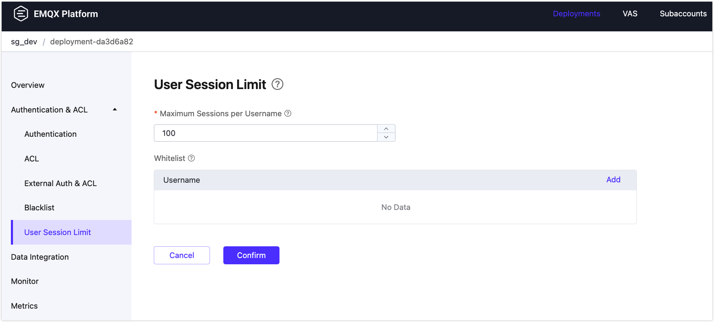
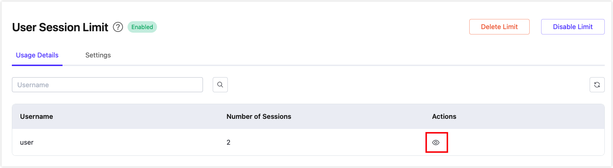

# User Session Limit

The User Session Limit feature is used to limit the maximum number of sessions for a single MQTT username. When a username exceeds its quota, new session connections will be rejected, and the corresponding CONNACK return code will be sent: "0x97 Quota Exceeded" (MQTT 5.0) or "0x03 Service Unavailable" (MQTT 3.1.1).

## Enable and Configure User Session Limit

1. Go to your deployment and click **User Session Limit** from the left navigation menu.

2. Click **Configure Limit** to enable the feature.

3. Configure the following options for the username quota.

   - **Max Sessions Per Username**: Defines the maximum number of MQTT sessions allowed for each username, with a default of `100`. This option applies to all usernames, except for those in the whitelist. 

     ::: tip

     If the MQTT client connects to the deployment using a persistent session, the session will be retained by the broker even after the client disconnects, until the session expires and is cleared. The number of sessions is calculated by adding the number of both connected clients and disconnected clients with sessions retained.

     :::

   - **Username White List** (optional): You can add username entries by clicking the **Add** button on the right. Usernames in the whitelist are not subject to session limits. For example, clients connecting to a deployment using the MQTT bridge should bypass the session limitation, you can add the usernames used by the MQTT bridge to the whitelist.

4. Click **Confirm** to complete the settings.

## Manage User Session Limit

Once the user session limit is enabled, you can monitor session usage on the **Usage Details** tab. Click the refresh icon on the right to ensure the latest data is loaded.

This page displays the usernames of currently connected clients and the number of sessions established by each username. To view session details for a specific username, click the view icon in the **Actions** column. Selecting a client ID in the **Clients** popup will direct you to the **Monitor** -> **Client Details** page.

On the **Settings** tab, you can modify your configuration of the user session limits. 

To permanently remove the session limit, click the **Delete Limit** button. Note that this action cannot be undone. Alternatively, you can temporarily deactivate the session limit by clicking the **Disable Limit** button, which will retain your configuration for future use.