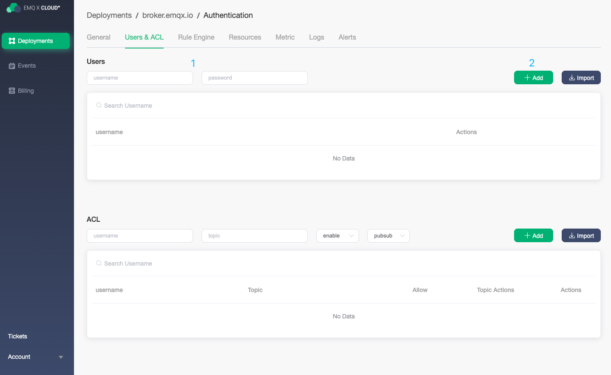
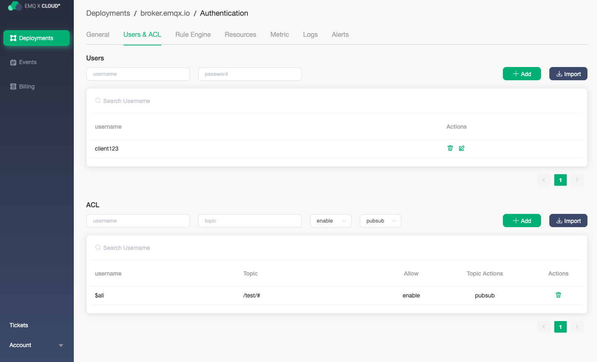
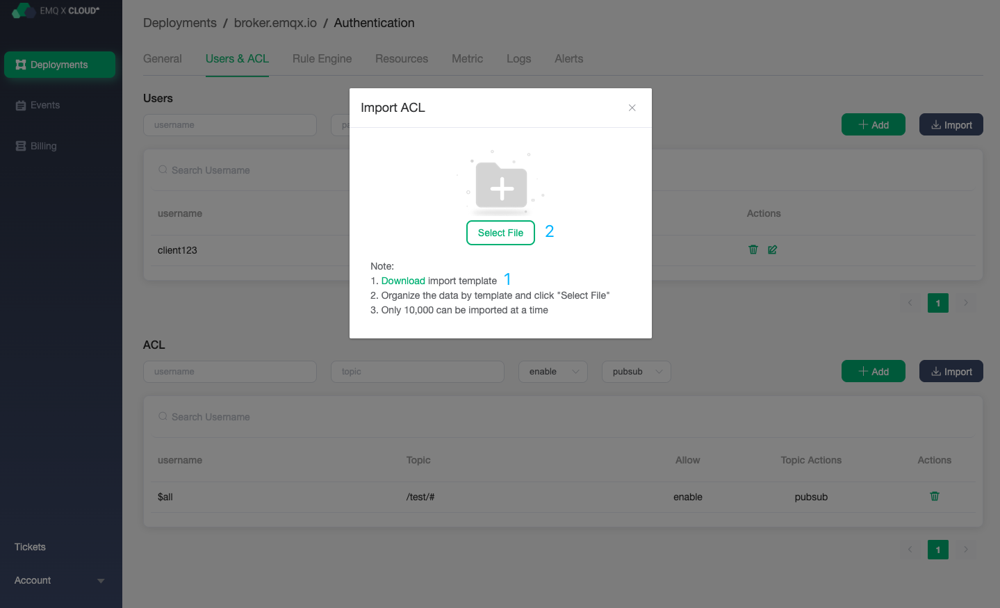
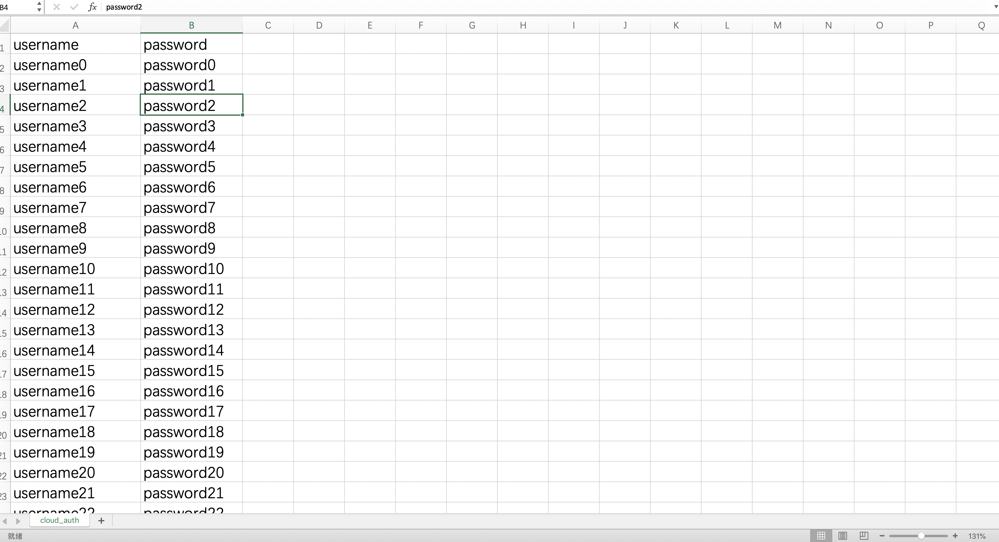
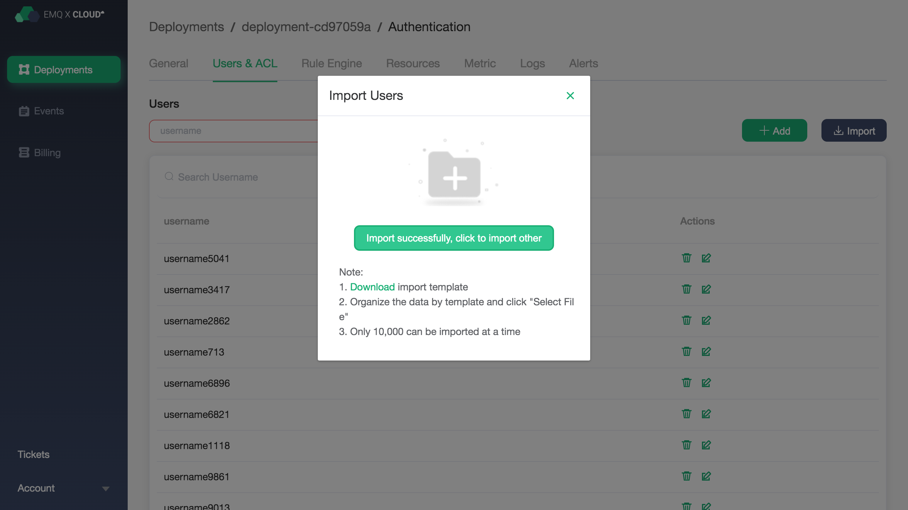
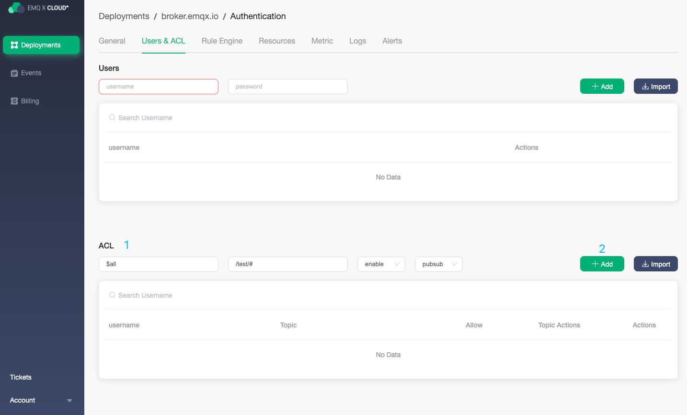
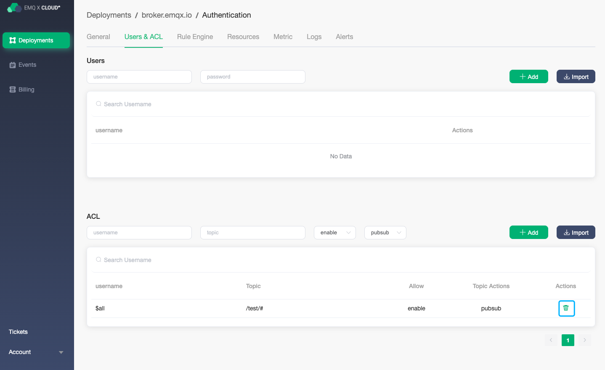
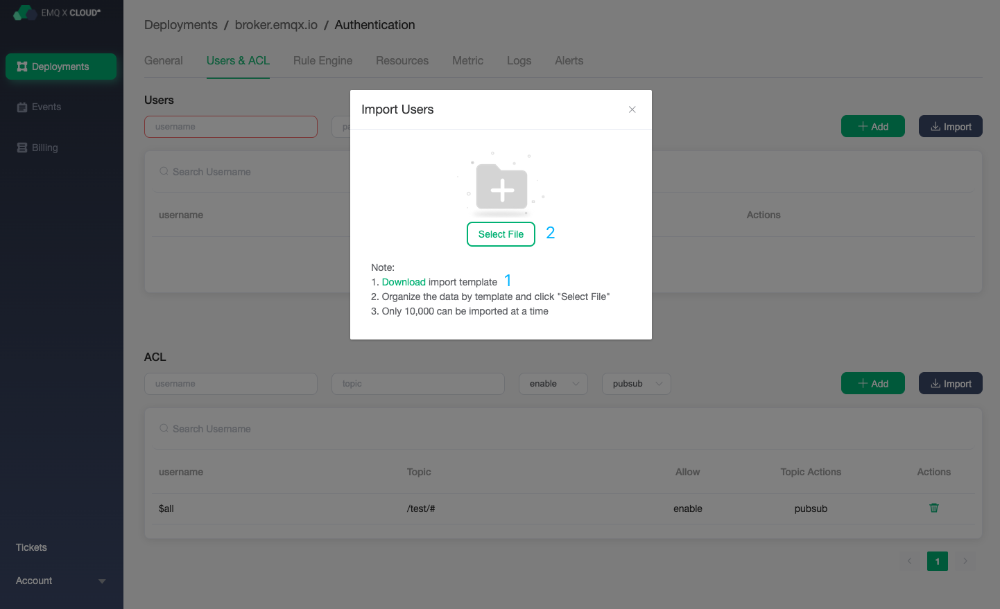
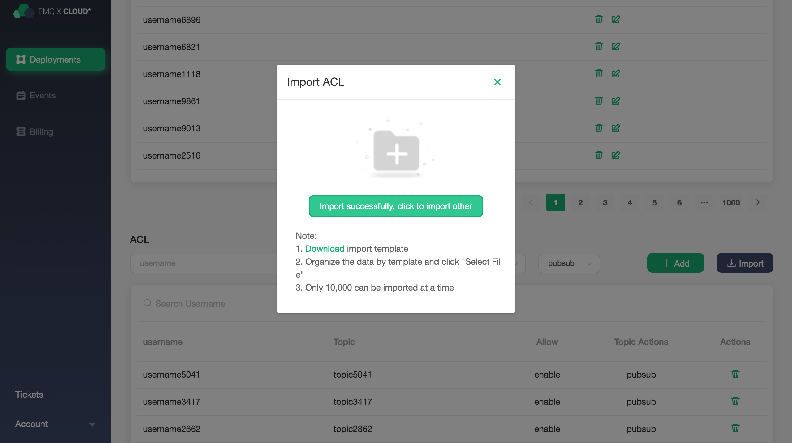

# Authentication

EMQ X Cloud fully supports all MQTT security specifications, and the built-in security functions can be used out-of-the-box without programming, which can quickly eliminate potential security risks in the project. When using Users and ACL, you need to ensure that the status of deployment is `running`

## Authentication

EMQ X Cloud client supports `username` and `password` authentication.

### Add client authentication information

### Delete client authentication information

### Import client authentication information in batches

1. Click the Import button

2. Download and import csv template

   

3. Fill in client authentication information

   > Note: You cannot change the template format and title header. The imported username and password can only start with Chinese or English uppercase and lowercase letters, and the middle field can contain Chinese, English uppercase and lowercase letters, Arabic numerals 0-9, connector (-), dot (.), and underline (_).

   

4. Upload client authentication csv

5. View imported information

   

## Publish/Subscribe ACL

Publish/subscribe ACL of EMQ X Cloud  supports `username`, `topic` pattern.

### Add ACL information

### Delete ACL information

### Import ACL information in batches

1. Click the Import button

2. Download and import csv template

   

3. Fill in the ACL information

   > Note: You cannot change the template format and title header. The imported username and password can only start with Chinese or English uppercase and lowercase letters, and the middle field can contain Chinese, English uppercase and lowercase letters, Arabic numerals 0-9, connector (-), dot (.), and underline (_).

   

4. Upload ACL information

5. View import information

   

