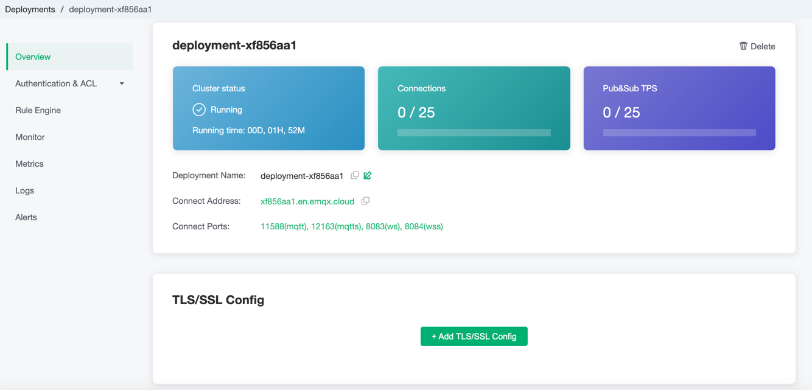

# Deployment Overview

In this tutorial, you will learn how to view deployment information, obtain connection addresses, view API addresses, etc.

## View deployment information

Here you can view the following deployment information:

- Cluster status: running status and running time.
- Number of connections: current number of connections, and the maximum number of device connections supported.
- Pub&Sub TPS: The peak value contains the total number of messages sent and received per second.
- Deployment name: the name of the deployment, which can be modified by clicking the edit button on the right.
- Connection address
  - Professional deployment connection address: IP
  - Basic deployment connection address: domain name ending with emqx.cloud suffix
- Connection port:

  - Professional deployment port: **1883**(tcp), **8083**(ws) are enabled by default, you can enable **8883**(tls) and **8084**(wss)through [Configuring TLS/SSL](security_features_and_settings/tls_ssl.md)
  - Basic deployment port: open **11xxx(mqtt) **, **11xxx(mqtts)**,  **8083(ws)**, **8084(wss)** by default

## [TLS/SSL Configuration](security_features_and_settings/tls_ssl.md)

::: danger
This feature is not available in basic deployment.
:::

EMQ X Cloud provides custom **one-way/two-way TLS/SSL** authentication, and supports **self-signed certificate** and **CA signed certificate**.

## [VPC Peering Connection Configuration](security_features_and_settings/vpc_peering.md)

::: danger
This feature is not available in basic deployment
:::

EMQ X Cloud supports peering connections with customers' existing VPC (Virtual Private Cloud) for cloud service providers in the same region. A VPC peering connection is a network connection between two VPCs. Through this connection, the instances in the two VPCs can communicate with each other as if they were in the same network.

## [API access](../api/api_overview.md)

EMQ X Cloud provides REST API to achieve integration with external systems, such as querying client information, publishing messages, and creating rules.

