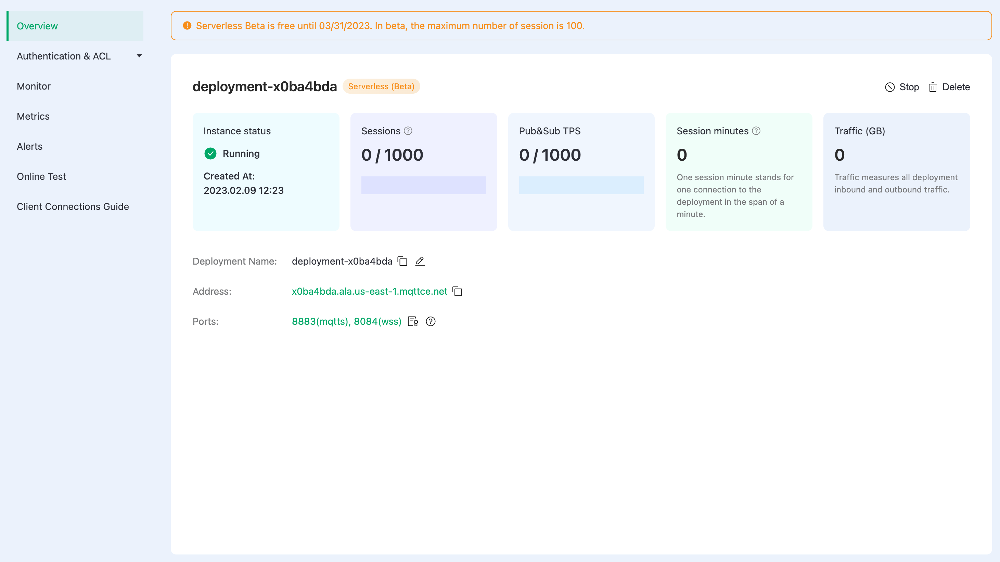
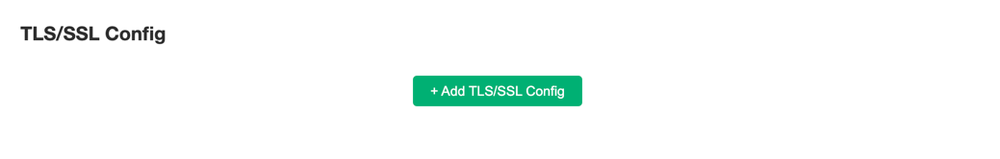

# Deployment Overview

In this tutorial, you will learn how to view deployment information, obtain connection address, view ports, etc.

:::: tabs type:card
::: tab Serverless 
## View deployment information
The Deployment overview page provides access to the status and connection information.

- Status: Deployment running status and creation time.
- Number of sessions: Concurrent sessions and maximum number of sessions, a maximum of 100 sessions are supported in the Beta version.
- TPS: The current number of messages sent and received per second and the upper limit.
- Session minutes: The total number of session minutes that have been used this month. This value is counted with a 1-hour delay.
- Traffic: The amount of inbound and outbound traffic that has been generated this month. This value is counted with a 1-hour delay.
- Deployment Name: The name of the customizable deployment.
- Address: The host address.
- Port: By default, ports 8883(mqtts) and 8084(wss) are enabled.

Serverless deployment supports ports 8883(mqtts) and 8084(wss). If your client requires the CA file for MQTT connection, [download it here](https://assets.emqx.com/data/emqxsl-ca.crt).

:::
::: tab Dedicated

## View deployment information

Here you can view the following deployment information:

- Cluster status: running status and running time.
- Number of connections: current number of connections, and the maximum number of device connections supported.
- Pub&Sub TPS: The peak value contains the total number of messages sent and received per second.
- Deployment name: the name of the deployment, which can be modified by clicking the edit button on the right.
- Connection address
  - Professional deployment connection address: IP
  - Basic deployment connection address: domain ending with emqx.cloud suffix
- Connection port:

  - Professional deployment port: **1883**(mqtt), **8083**(ws) are enabled by default, you can enable **8883**(mqtts) and **8084**(wss)through [Configuring TLS/SSL](./tls_ssl.md)
  - Basic deployment port: open **1xxxx(mqtt)**, **1xxxx(mqtts)**,  **8083(ws)**, **8084(wss)** by default

## [TLS/SSL Configuration](./tls_ssl.md)

EMQX Cloud provides custom **one-way/two-way TLS/SSL** authentication, and supports **self-signed certificate** and **CA signed certificate**.

## [VPC Peering Connection Configuration](./vpc_peering.md)

EMQX Cloud supports peering connections with customers' existing VPC (Virtual Private Cloud) for cloud service providers in the same region. A VPC peering connection is a network connection between two VPCs. Through this connection, the instances in the two VPCs can communicate with each other as if they were in the same network.

## [REST API](../api/api_overview.md)

EMQX Cloud provides REST API to achieve integration with external systems, such as querying client information, publishing messages, and creating rules.

:::
::::
