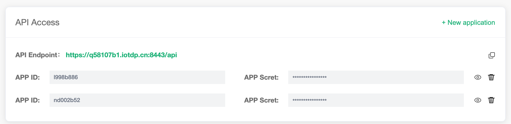

# View deployment

In this tutorial, you will learn how to view deployment information, obtain connection addresses, view API addresses and other functions,

## View deployment information

Here you can view the following deployment information:

* Deployment name: the name of the deployment, which can be modified by clicking the edit button on the right
* Maximum number of connections: the maximum number of device connections supported
* Message uplink and downlink TPS: the upper limit of the number of messages sent and received per second
* Connection address
  * Exclusive deployment connection address: IP
  * Free trial and shared deployment connection address: domain name ending with emqx.cloud suffix
* Connection port:

  * Dedicated Deployment port: **1883**(tcp), **8083**(ws) are enabled by default, you can enable **8883**(tls) and  **8084**(wss)through [Configuring TLS/SSL](./tls_ssl.md) 
  * Free Trial and Shared Deployment port: open **8883**(tls), **8084**(wss) by default 

## [EMQ X Dashboard](./dashboard/README.md)
EMQ X Dashboard (EMQ X Management Console) is a back-end web console provided by EMQ X Cloud. Through the web console, you can view the running status of the EMQ X cluster, statistical metricss, the online status of the client and the subscription relationship and other information. You can use the rule engine to implement functions such as device data storage and forwarding. Click the **EMQ X Dashboard** button to enter the EMQ X Dashboard page.

## [TLS/SSL configuration](./tls_ssl.md) 

::: danger
This feature is not available in free trial and shared deployment
:::

EMQ X Cloud provides custom **one-way TLS/SSL** authentication, and supports **self-signed certificate** and **CA signed certificate**.

## [VPC Peering Connection Configuration](./vpc_peering.md)

::: danger
This feature is not available in free trial and shared deployment
:::

EMQ X Cloud supports the creation of peering connections with customers' existing VPC (Virtual Private Cloud) for cloud service providers in the same region. A VPC peering connection is a network connection between two VPCs. Through this connection, the instances in the two VPCs can communicate with each other as if they were in the same network.

## [API access](../api.md)

EMQ X Cloud provides REST API to achieve integration with external systems, such as querying client information, publishing messages, and creating rules.

##  [Metrics](./metrics.md)

MQ X Cloud provides four cluster metrics monitoring: message, client, packet, and delivery, allowing users and operation and maintenance personnel to understand the current service status based on these metricss.

## [Log](./logs.md)

EMQ X Cloud provides real-time online viewing of EMQ X logs of each node.

## [Alert](./alerts.md)

EMQ X Cloud provides functions such as real-time viewing of alerts and alert integration.

