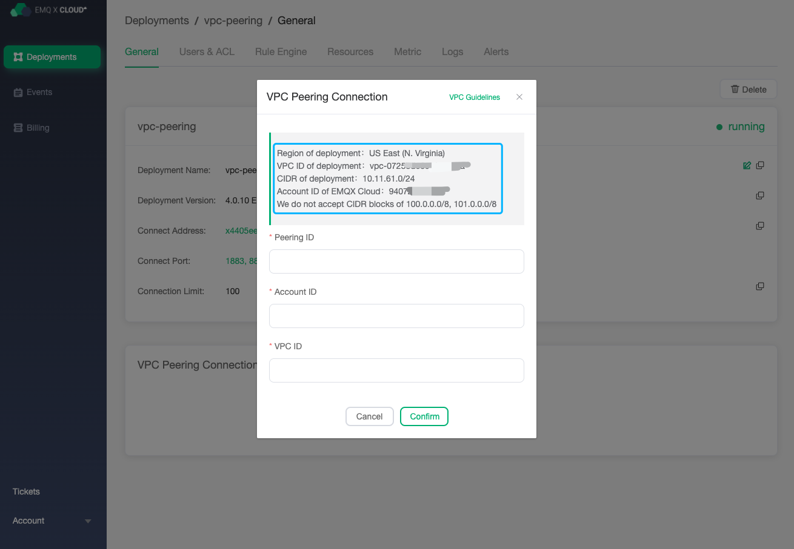
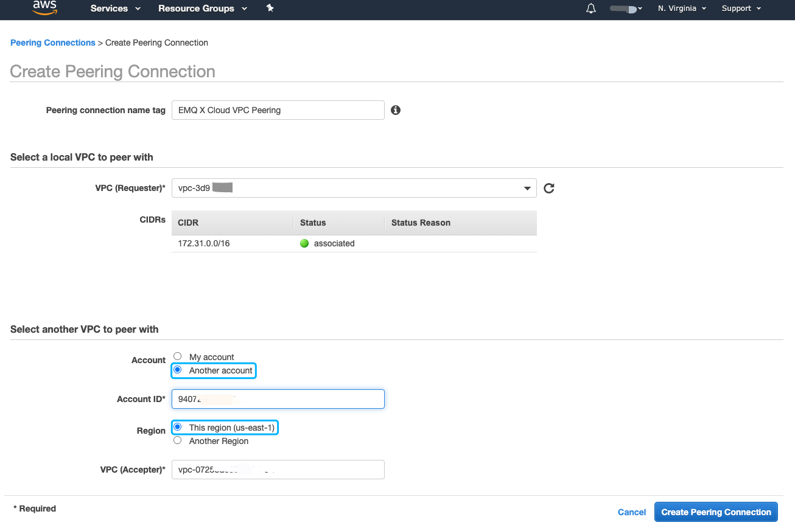
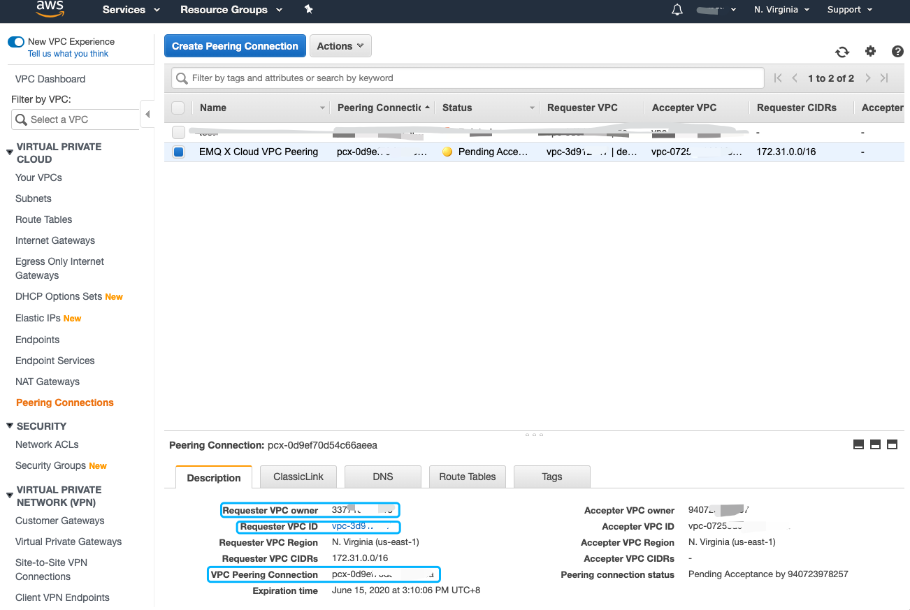
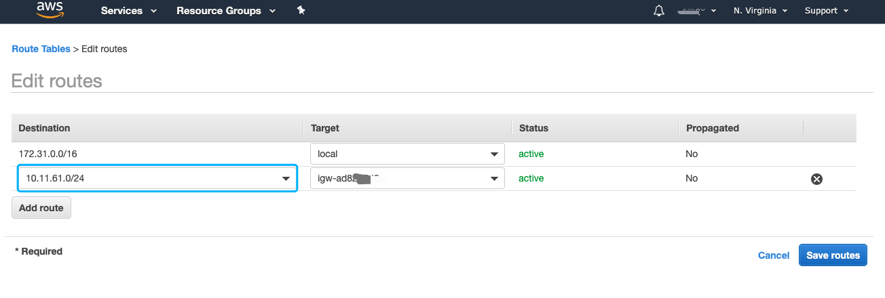
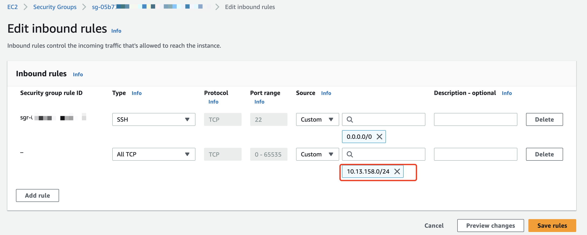
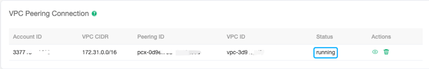
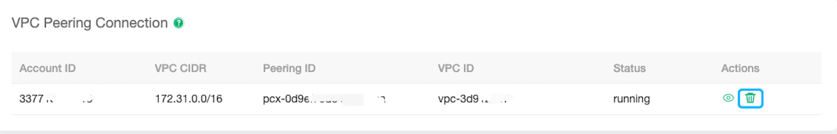

# VPC Peering Connections

VPC peering connection is a network connection between two VPCs. Through this connection, the instances in different VPCs can communicate with each other as if they are in the same network.

### Precautions

1. EMQ X Cloud only supports creating peering connection at **the same region**
2. EMQ x cloud does not support CIDR of 100.0.0.0/8，101.0.0.0/8 . Please plan your VPC CIDR reasonably
3. Peering connections are bound to resources. Please create peering connections before creating resources

### AWS Cloud VPC Peering Connection

#### Creating peering connection

1. Log in to [EMQ X Cloud console](<https://cloud.emqx.io/console>), go to the deployment details page, click the `+ VPC Peering Connection` button, and record `Region of deployment`，`VPC ID of deployment`，`CIDR of deployment`，`Account ID of EMQ X Cloud` in the pop-up dialog box, which need to be used later. Please don’t close this dialog box

   

2. Log in to the Amazon Web Services console, switch to the region where `Region of deployment` is recorded in step 1, go to `Networking & Content Delivery` -> `VPC` -> `Peering Connection`, and click the button of `Create Peering Connection`

   * Select `Another account` of `Account`，`Account ID` , fill in the `Account ID of EMQ X Cloud` recorded in step 1
   * Select `This region(us-east-1)` of `Region`
   * For VPC (Accepter), fill in the `VPC ID of deployment` in step 1.

   

   After filling in all the information, click the button of `Create Peering Connection`

3. Once created, the following will be displayed. Please record `Requester VPC owner`, `Requester VPC ID`, `VPC Peering Connection`, which need to be used later

   

4. Return to  [EMQ X Cloud console](<https://cloud.emqx.io/console>), fill in the information recorded in step 3, and click the `Confirm` button to complete the creation of the peering connection

   * For Peering ID,  fill in the recorded `VPC Peering Connection`
   * For Account ID,  fill in the recorded `Requester VPC owner`
   * For VPC ID,  fill in the recorded `Requester VPC ID`

   

5. Return to Amazon Web Services console, go to `Networking & Content Delivery` -> `VPC` -> `Route Tables`, add the `CIDR of deployment` recorded in step 1 to the route table of the corresponding VPC

   

6. Go to `Networking & Content Delivery` -> `VPC` -> `Security Groups`,configure the security group bound to the corresponding VPC, edit inbound rules and add a rule

   

#### Delete peering connections

To delete a peering connection, you need to ensure that the status of peering connection is `running`

::: tip Tip
Before deleting the peering connection, please make sure that there are no associated resources in the deployment, otherwise there will be unpredictable risks
:::

1. Go to deployment details

   

2. Click the `delete button` on the right side of the peering connection

   

