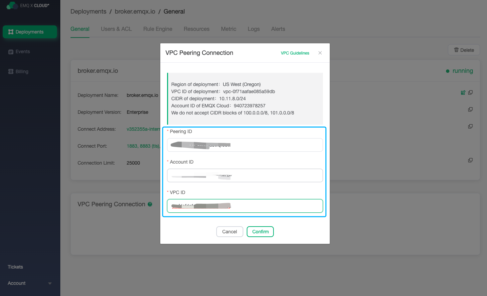

# VPC Peering connection configuration

> This feature is not available in free trial and shared deployment

A VPC peering connection is a network connection between two VPCs. Through this connection, the instances in the two VPCs can communicate with each other as if they were in the same network.

## Precautions

1. EMQ X Cloud only supports creating peering connections in **same region**.
2. EMQ X Cloud does not support network segments within the range of `10.10.0.0/24 ～ 10.32.255.0/24`, please plan your VPC network segment reasonably.
3. Resources of peering connections and rule engine  are bound to each other. Please create a peering connection before creating resources.

## Peering connection of Ali Cloud platform 

In Ali Cloud platform, VPC peering connection is also called [Cloud enterprise network](https://cn.aliyun.com/product/cbn)

### Create a peering connection

1. Log in to your Ali Cloud account and enter [Cloud Enterprise Network Page](<https://cen.console.aliyun.com/cen/list>)

2. Click to Create Cloud Enterprise Network Instance

3. Fill in the VPC related information, and click OK

   > Note: A VPC can only be associated with one cloud enterprise network

   

4. Log in to [EMQ X Cloud console](<https://cloud.emqx.io/console>), enter the page of required deployment details, click the `+VPC peering connection` button, and fill in the relevant information of your Alibaba Cloud Enterprise Network, and record the EMQ X Cloud VPC peering connection prompt

   * Peer-to-peer connection ID == Cloud Enterprise Network instance ID
   * Account ID == Alibaba Cloud account ID
   * VPC ID == VPC ID attached to the cloud enterprise network

   

5. Log in to your Alibaba Cloud account, access the details of the newly created Cloud Enterprise Network instance, click Load Network Instance, fill in the EMQ X Cloud deployment related information, and click OK

   > Note: You need to complete the EMQ X Cloud peeing connection information addition within 10 minutes, otherwise it will be regarded as a failure

   

6. Log in to the EMQ X Cloud console, access the deployment details, and view the peering connection status

   

7. Log in to your Alibaba Cloud account, configure a security group, and allow the EMQ X Cloud network segment to access your VPC

   

### Delete peering connection

To delete a peering connection, you need to make sure that the peer-to-peer connection status is `running`

> Note: Before deleting the peering connection, make sure that there are no associated resources in the deployment, otherwise it will cause unpredictable risks

1. Enter deployment details page

2. Click the `Delete button` on the right side of the peering connection

   

## Peering connection of HUAWEI cloud platform 

### Create a peering connection

1. Log in to the [EMQ X Cloud console](<https://cloud.emqx.io/console>), enter the required deployment details, click the `+VPC peering connection` button, and record the EMQ X Cloud VPC peering connection prompt
    > Note: Do not close this page yet

   * Deploy VPC ID
   * EMQ X Cloud account ID
   * Deploy VPC network segment
   
   

2. Log in to your HUAWEI CLOUD account and enter the console -> Virtual Private Cloud VPC

    

3. Click `Peeing connection` -> `Create peering connection` and select another account. Fill in the information just recorded in [EMQ X Cloud Console](<https://cloud.emqx.io/console>), click OK to create a peering connection request

    * Peering project ID == EMQ X Cloud account ID
    * Peering VPC ID == deployment VPC ID

    

4. On the peering connection information interface, record the following 3 value

    * 1 is the peering connection ID
    * 2 is the VPC network segment
    * 3 is the VPC ID

    

    

5. Find `My Credentials` and record the user ID

    

6. Go back to [EMQ X Cloud console](<https://cloud.emqx.io/console>). Fill in the `Peer Connection ID`, `VPC Network Segment`, `VPC ID` recorded in Step 4, and `User ID` recorded in Step 5. Click `OK` to complete the peering connection

    

7. In the HUAWEI CLOUD console, open `Virtual Private Cloud VPC` -> `Route Table`, and add the deployed VPC network segment in step 1 to the routing table of the corresponding VPC

    > Note: The next hop type is peering connection

    

8. VPC Configure security groups in the HUAWEI CLOUD console to allow the EMQ X Cloud network segment to access your VPC

     

### Delete peering connection

To delete a peering connection, you need to make sure that the peering connection status is `running`

> Note: Before deleting the peering connection, make sure that there are no associated resources in the deployment, otherwise it will cause unpredictable risks

1. Enter deployment details page

2. Click the `Delete button` on the right side of the peering connection

   