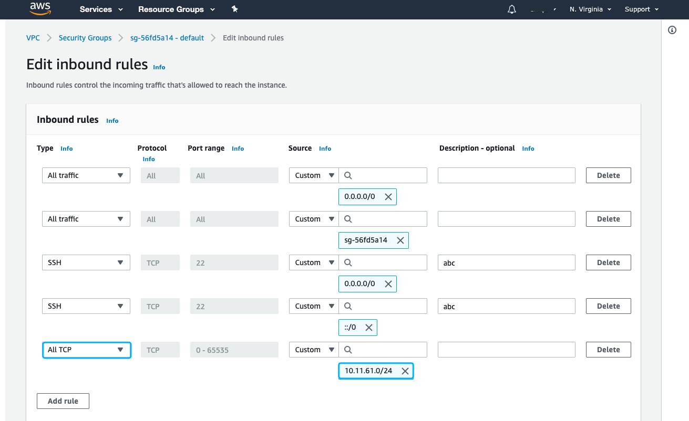
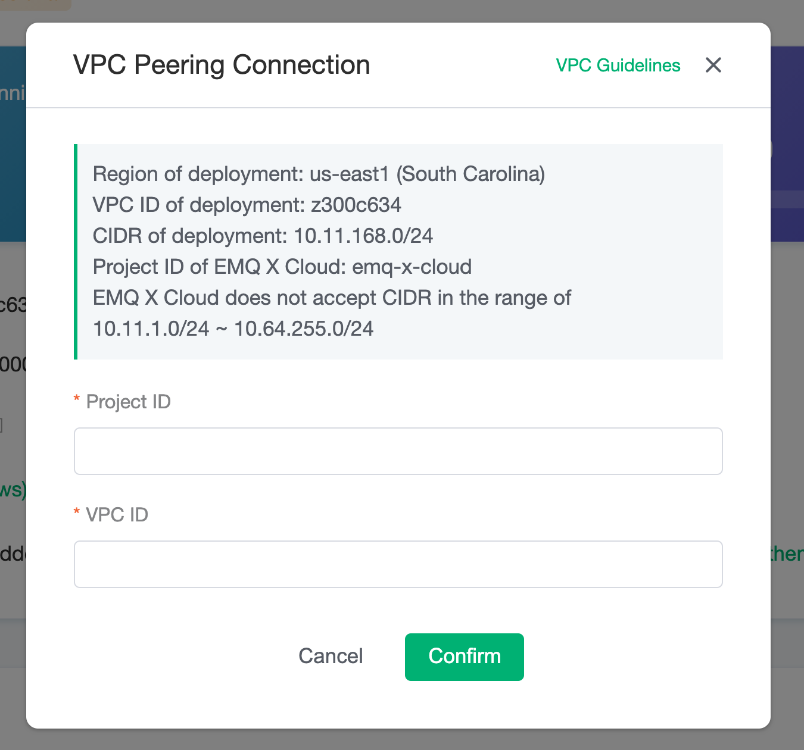
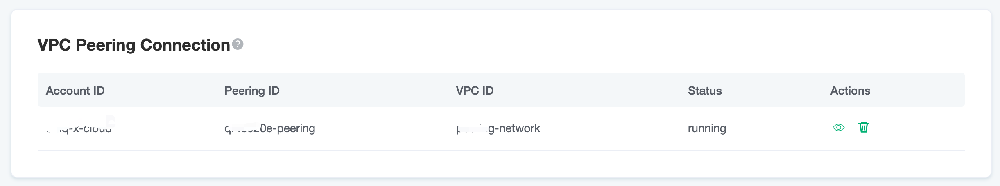

# VPC Peering Connections

VPC peering connection is a network connection between two VPCs. Through this connection, the instances in different VPCs can communicate with each other as if they are in the same network.

## Precautions

1. EMQ X Cloud only supports creating peering connection at **the same region**.
2. EMQ X Cloud does not accept CIDR in the range of 10.11.1.0/24 ~ 10.64.255.0/24.
3. Peering connections are bound to resources. Please create peering connections before creating resources.

## AWS Cloud VPC Peering Connection

  

  <iframe style="position: absolute; width: 100%; height: 100%; left: 0; top: 0;" src="https://www.youtube.com/embed/ajnLBS3LLKY" title="YouTube video player" frameborder="0" allow="accelerometer; autoplay; encrypted-media; gyroscope; picture-in-picture" allowfullscreen></iframe>
  

### Creating peering connection

1. Log in to [EMQ X Cloud console](<https://cloud-intl.emqx.com/console>), go to the deployment details page, click the `+ VPC Peering Connection` button, and record `Region of deployment`，`VPC ID of deployment`，`CIDR of deployment`，`Account ID of EMQ X Cloud` in the pop-up dialog box, which need to be used later. Please don’t close this dialog box

   

2. Log in to the Amazon Web Services console, switch to the region where `Region of deployment` is recorded in step 1, go to `Networking & Content Delivery` -> `VPC` -> `Peering Connection`, and click the button of `Create Peering Connection`

   * Select `Another account` of `Account`，`Account ID` , fill in the `Account ID of EMQ X Cloud` recorded in step 1
   * Select `This region(us-east-1)` of `Region`
   * For VPC (Accepter), fill in the `VPC ID of deployment` in step 1.

   

   After filling in all the information, click the button of `Create Peering Connection`

3. Once created, the following will be displayed. Please record `Requester VPC owner`, `Requester VPC ID`, `VPC Peering Connection`, which need to be used later

   

4. Return to  [EMQ X Cloud console](<https://cloud-intl.emqx.com/console>), fill in the information recorded in step 3, and click the `Confirm` button to complete the creation of the peering connection

   * For Peering ID,  fill in the recorded `VPC Peering Connection`
   * For Account ID,  fill in the recorded `Requester VPC owner`
   * For VPC ID,  fill in the recorded `Requester VPC ID`

   

5. Return to Amazon Web Services console, go to `Networking & Content Delivery` -> `VPC` -> `Route Tables`, add the `CIDR of deployment` recorded in step 1 to the route table of the corresponding VPC

   

6. Go to `Networking & Content Delivery` -> `VPC` -> `Security Groups`,configure the security group bound to the corresponding VPC, edit inbound rules and add a rule

   

### Delete peering connections

To delete a peering connection, you need to ensure that the status of peering connection is `running`

::: tip Tip
Before deleting the peering connection, please make sure that there are no associated resources in the deployment, otherwise there will be unpredictable risks
:::

1. Go to deployment details

   

2. Click the `delete button` on the right side of the peering connection

   

## Azure VPC Peering Connection

This feature is now not available. If you need to set up VPC peering connection with Azure, please submit [tickets](../feature/tickets.md) to contact us. 

## GCP VPC Peering Connection

### Creating peering connection

1. Log in to [EMQ X Cloud console](<https://cloud-intl.emqx.com/console>), go to the deployment details page, click the `+ VPC Peering Connection` button,  fill in the information
    * Project ID: GCP Project ID of your peering VPC
    * VPC ID:  Name of your peering VPC

   and record the information below:
    * VPC ID of deployment
    * CIDR of deployment
    * Project ID of EMQ X Cloud

   

2. Log in to your GCP console, create the peering connection
    1. In the Google Cloud Console, click **VPC network peering**.
    2. Click **CREATE PEERING CONNECTION**, and click **Continue**
    3. In **Name**, enter a name for your peering connection.
    4. In **Your VPC Network**, enter the name of your GCP VPC network.
    5. In **Peered VPC network**, select **In another project**.
    6. In **Project ID**, enter EMQ X Cloud Project ID. You can find this name in the VPC Peering view in EMQ X Cloud.
    7. In **VPC network name**, enter your EMQ X Cloud VPC Name. You can find this name in the VPC Peering view in EMQ X Cloud.
    8. Click **CREATE**.
    
   

3. You will see the status of peering connection is **Active** if succeeded.
   
   and you will see the status of VPC Peering on EMQ X Cloud is **running**.
   

4. Create firewall to allow your EMQ X CLoud deployment to access your GCP network
   1. Click **Firewall**, and Click **CREATE FIREWALL RULE**.
   2. In **Network**, select your GCP network
   3. In **Targets**, select **All instances in the network**, or you can select other option according to your situation.
   4. In **Source IP ranges**, fill in the CIDR of deployment in step 1
   5. Seletc your Protocols and ports.

### Delete peering connections

To delete a peering connection, you need to ensure that the status of peering connection is `running`

::: tip Tip
Before deleting the peering connection, please make sure that there is no associated resources in the deployment, otherwise there will be unpredictable risks
:::

1. Go to deployment details

   

2. Click the `delete button` on the right side of the peering connection

   

## Confluent Cloud Peering Connection

After the Confluent Cloud cluster has been created, we could add peering by the following steps:

*  Go to the `Networking` section of the `Cluster settings` page and click on the `Add Peering` button.

   

*  Fill in the vpc information. (You could get the information from `VPC Peering` section of the deployment console)

   

   

*  When the connection status is `Inactive`, go back to the deployment console to accept the peering request. Fill in the vpc information of the confluent cloud cluster and click `Confirm`. When the vpc status turns to `running`, you successfully create the vpc peering connection.

   

   

## Timescale Cloud Peering Connection

If you don't have a VPC for your timescale cloud project, you could log in to the timescale cloud and create a new VPC.

   
   
When the VPC is created, you are ready to create the VPC peering connection. Click on the VPC to go to the vpc peering page. Enter the EMQ X Cloud deployment's vpc information to start the vpc peering process.
You could find the deployment's vpc information in the EMQ X Cloud console, VPC peering section.

   

   

When the peering connection state turns to `Pending peer`:

   

go to the EMQ X Cloud console to accept the peering request by filling the timescale cloud vpc information

   

Click on `Confirm` to finish the creation. When the status turns to `runninng`, you are successfully created the vpc peering connection!

   
