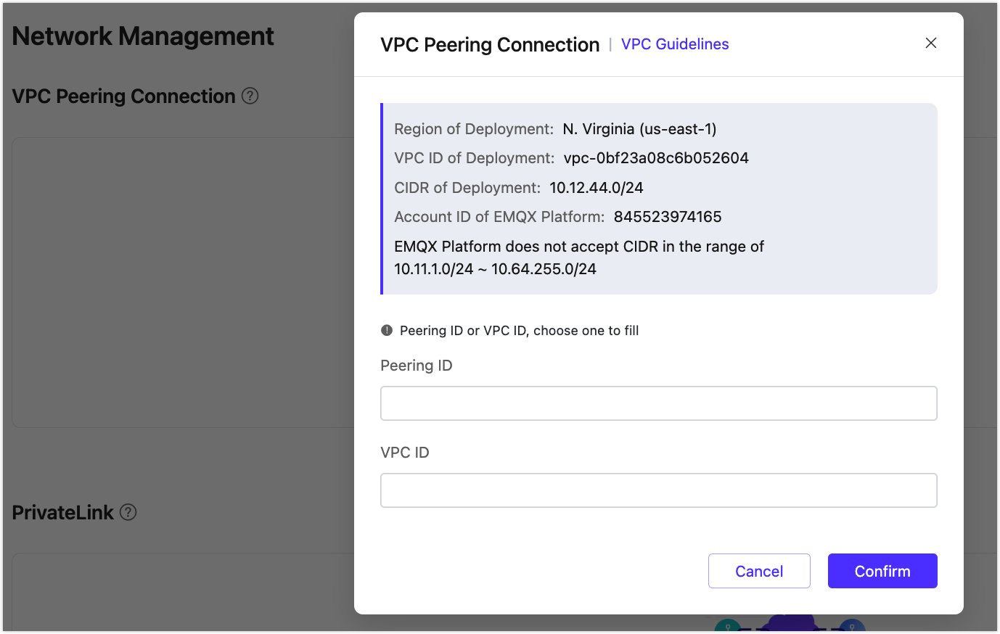
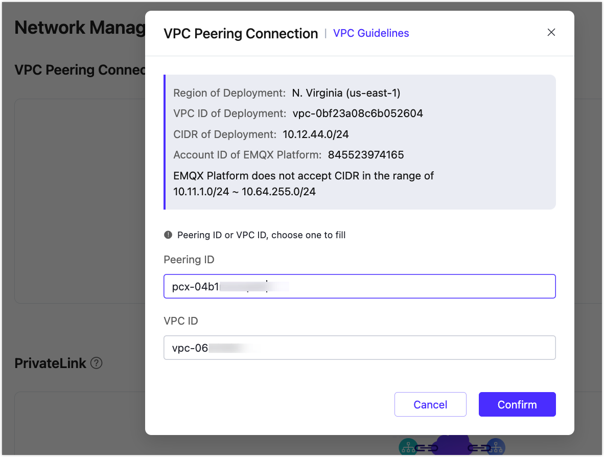
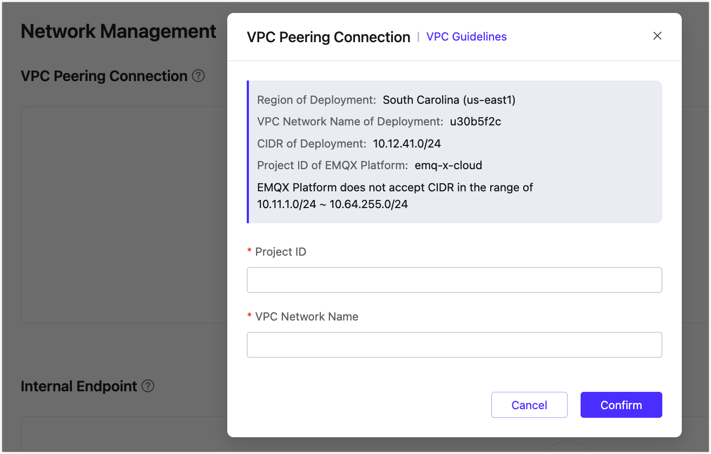

# VPC Peering Connections

::: tip Note
This feature is only available for the Dedicated and Premium Plans.
:::

VPC peering connection is a network connection between two VPCs. Through this connection, the instances in different VPCs can communicate with each other as if they are in the same network.

## Precautions

1. EMQX Platform only supports creating peering connection at **the same region**.
2. EMQX Platform does not accept CIDR in the range of 10.11.1.0/24 ~ 10.64.255.0/24.
3. Peering connections are bound to resources. Please create peering connections before creating resources.

## AWS Cloud VPC Peering Connection

<LazyIframeVideo vendor="youtube" src="https://www.youtube.com/embed/ajnLBS3LLKY/?autoplay=1&null" />

### Creating peering connection

1. Log in to [EMQX Platform console](<https://cloud-intl.emqx.com/console>), go to the deployment details page, click the `+ VPC Peering Connection` button, and record `Region of deployment`，`VPC ID of deployment`，`CIDR of deployment`，`Account ID of EMQX Platform` in the pop-up dialog box, which need to be used later. Please don’t close this dialog box

   

2. Log in to the Amazon Web Services console, switch to the region where `Region of deployment` is recorded in step 1, go to `Networking & Content Delivery` -> `VPC` -> `Peering Connection`, and click the button of `Create Peering Connection`

   * Select `Another account` of `Account`，`Account ID` , fill in the `Account ID of EMQX Platform` recorded in step 1
   * Select `This region(us-east-1)` of `Region`
   * For VPC (Accepter), fill in the `VPC ID of deployment` in step 1.

   

   After filling in all the information, click the button of `Create Peering Connection`

3. Once created, the following will be displayed. Please record `Requester VPC owner`, `Requester VPC ID`, `VPC Peering Connection`, which need to be used later

   

4. Return to the [EMQX Platform Console](<https://cloud-intl.emqx.com/console>), fill in the information recorded in step 3, and click the `Confirm` button to complete the creation of the peering connection

   * For Peering ID,  fill in the recorded `VPC Peering Connection`
   * For VPC ID,  fill in the recorded `Requester VPC ID`

   

5. Return to Amazon Web Services console, go to `Networking & Content Delivery` -> `VPC` -> `Route Tables`, add the `CIDR of deployment` recorded in step 1 to the route table of the corresponding VPC

   

6. Go to `Networking & Content Delivery` -> `VPC` -> `Security Groups`,configure the security group bound to the corresponding VPC, edit inbound rules and add a rule

   

### Delete Peering Connections

To delete a peering connection, you need to ensure that the status of peering connection is `running`

::: tip
Before deleting the peering connection, please make sure that there are no associated resources in the deployment, otherwise there will be unpredictable risks
:::

1. Go to deployment details

   

2. Click the `delete button` on the right side of the peering connection

   

## Azure VPC Peering Connection

### Step 1

Go to the deployment console and click the **+ VPC Peering Connection** button. A pop-up window will appear and ask for information on **Subscription ID**, **Tenant ID**, **Resource Group Name**, and **VNet Name**.

### Step 2

Go to the **Virtual Networks** section in your Microsoft Azure workplace. Find the network you plan to build a VPC peering connection, and copy and paste the **Subscription ID**, **Resource Group Name**, and **VNet Name** into the pop-up window in the EMQX Platform console.

### Step 3

In your Microsoft Azure workplace, go to the **Azure Active Directory** section, and copy and paste the **Tenant ID** into the pop-up window in the EMQX Platform console.

### Step 4

After providing all the required information:

1.  Click on the **Next** button.
2.  Follow the guidelines shown on the page to set up the Vnet.
3.  After doing all the steps, click on the **Validated** button to validate the setting of the connection and then click on **Initiate Peering**.

### Step 5

If all the provided information is correct, after several minutes, when the status of the VPC peering connection turns to "running," the VPC peering connection with your Azure services is created successfully.

## GCP VPC Peering Connection

### Creating peering connection

1. Log in to [EMQX Platform console](<https://cloud-intl.emqx.com/console>), go to the deployment details page, click the `+ VPC Peering Connection` button,  fill in the information
    * Project ID: GCP Project ID of your peering VPC
    * VPC Network Name :  Network Name of your peering VPC

   and record the information below:
    * VPC Network Name of deployment
    * CIDR of deployment
    * Project ID of EMQX Platform

   

2. Log in to your GCP console, create the peering connection
    1. In the Google Cloud Console, click **VPC network peering**.
    2. Click **CREATE PEERING CONNECTION**, and click **Continue**
    3. In **Name**, enter a name for your peering connection.
    4. In **Your VPC Network**, enter the name of your GCP VPC network.
    5. In **Peered VPC network**, select **In another project**.
    6. In **Project ID**, enter EMQX Platform Project ID. You can find this name in the VPC Peering view in EMQX Platform.
    7. In **VPC network name**, enter your EMQX Platform VPC Network Name. You can find this name in the VPC Peering view in EMQX Platform.
    8. Click **CREATE**.

   

3. You will see the status of peering connection is **Active** if succeeded.
   
   and you will see the status of VPC Peering on EMQX Platform is **running**.
   

4. Create firewall to allow your EMQX Platform deployment to access your GCP network
   1. Click **Firewall**, and Click **CREATE FIREWALL RULE**.
   2. In **Network**, select your GCP network
   3. In **Targets**, select **All instances in the network**, or you can select other option according to your situation.
   4. In **Source IP ranges**, fill in the CIDR of deployment in step 1
   5. Select your Protocols and ports.

### Delete Peering Connections

To delete a peering connection, you need to ensure that the status of peering connection is `running`

::: tip
Before deleting the peering connection, please make sure that there is no associated resources in the deployment, otherwise there will be unpredictable risks
:::

1. Go to deployment details

   

2. Click the `delete button` on the right side of the peering connection

   

## Confluent Cloud Peering Connection

After the Confluent Cloud cluster has been created, we could add peering by the following steps:

1. Go to the `Networking` section of the `Cluster settings` page and click on the `Add Peering` button.

   

2. Fill in the vpc information. (You could get the information from `VPC Peering` section of the deployment console)

   

   

3. When the connection status is `Inactive`, go back to the deployment console to accept the peering request. Fill in the vpc information of the confluent cloud cluster and click `Confirm`. When the vpc status turns to `running`, you successfully create the vpc peering connection.

   

### Delete Peering Connections

To delete a peering connection, you need to ensure that the status of peering connection is `running`

::: tip
Before deleting the peering connection, please make sure that there are no associated resources in the deployment, otherwise there will be unpredictable risks
:::

1. Go to deployment details

   

2. Click the `delete button` on the right side of the peering connection

   
