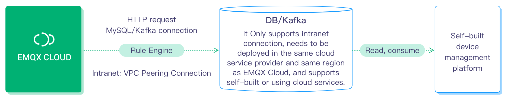

# EMQ X Cloud Device management/IoT platform integration guide

## Introduction

This document provides a guide plan for EMQ X Cloud to integrate the user's own device management system or IoT platform for device authentication, device action and status management, and message data integration management. The contents are as follows:

- **Device authentication information management:** The platform uses REST API to add, delete, check, and modify authentication information. For API usage, refer to[Authentication Management](https://docs.emqx.io/en/cloud/latest/api/auth.html)
- **View online status of device:**
  - The platform obtains a list of online devices through the REST API to check whether the device is online. For API usage, please refer to [Client Management](https://docs.emqx.io/en/cloud/latest/api/client.html).
  - The platform uses the rule engine to rewrite the status of the device in the private database or send it to a self-built service (Web service) when the device is online or offline.
- **Device offline alarm:** Notify the platform when the device is offline to determine whether an alarm is needed.
- **Device online and offline history:**
  - The platform uses the rule engine to write the online and offline information into a private database or send it to a self-built service (Web service) when the device is online or offline.
- **Device publish and subscribe to ACL permission management:** The platform uses the REST API to add, delete, check and modify ACL permissions. For API usage, refer to [Access Control(ACL) Management](https://docs.emqx.io/en/cloud/latest/api/acl.html).
- **Kick online device offline:** The platform kicked off online devices.
- **Proxy subscription:** The platform uses the REST API to subscribe or unsubscribe to topics for **online devices**. For API usage, please refer to [Topic subscription](https://docs.emqx.io/en/cloud/latest/api/topic.html).
- **Publish a message to the device:** The platform publishes messages to specified topics through REST API or MQTT access, and supports batch operations. For API usage, refer to [Message Publish](https://docs.emqx.io/en/cloud/latest/api/pub.html).
- **Get device messages for bridging/storing:** Through the rule engine, device events (online and offline, subscription/unsubscription, message publishing) and message data are stored in private databases (mainstream relational/non-relational, various time series databases) , Message queue Kafka and self-built web services.
- **Business( such as message sending and receiving, connections) statistics:** Get relevant statistics through REST API. For API usage, please refer to [Metrics](https://docs.emqx.io/en/cloud/latest/api/metrics.html).

​                        

Figure 1 Schematic diagram of EMQ X Cloud cluster architecture

On EMQ X Cloud, users can create a highly available EMQ X cluster with dedicated instance in just a few minutes, and immediately start prototype design and application development without paying attention to subsequent operation and maintenance work. After the product is online, the cluster can be expanded without stopping to cope with the capacity expansion caused by business growth, ensuring availability while maximizing cost savings.

Unlike most other public IoT Hub cloud platforms, EMQ X Cloud provides MQTT 5.0 server clusters with a unique isolated environment, which has significant cost advantages and fewer usage restrictions. In the case of a large amount of messages, EMQ X Cloud Can still maintain a low cost of use. Through functions such as peer-to-peer networks, it is possible to connect to the big data analysis, message storage, and other business systems deployed by users in the private network.

## Device authentication information management

The platform uses REST API to add, delete, check, and modify authentication information, and applies platform-side operations on EMQ X Cloud.

​                        

## View device online status

To obtain the online status of the device, EMQ X Cloud itself can query the online status, or record the online status in the platform's private database.

- The platform obtains the list of online devices through the REST API and queries whether the device is online.

​                        

- The platform uses the rule engine to rewrite the status of the device in the private database or send it to a self-built service (Web service) when the device is online or offline.

​                        

## Device offline alarm

See the device online and offline history below.

## Device online and offline history

The platform uses the rule engine to write the online and offline information into a private database or send it to a self-built service (Web service) when the device is online or offline.

After receiving the device offline notification, the platform can perform offline alarm related services.

​                        

## Publish and subscribe ACL permission management through device

It can set ACL permissions according to devices or topics to improve system security.

The platform uses REST API to add, delete, check, and modify ACL permissions.

​                        

## Kick online devices offline

For abnormal devices or devices that need to be forced offline, the platform can use REST API to kick online devices offline.

​                        

## Proxy subscription

The platform subscribes or unsubscribes to topics for **online devices** through the REST API, without the device actively initiating subscriptions, or upgrading or burning device software data.

​                        

## Publish a message to the device

The platform publishes messages to specified topics through REST API or MQTT access, and supports batch operations.

​                        

## Get device messages for bridging/storing

Through the rule engine, device events (online and offline, subscription/unsubscription, message publishing) and message data are stored in private databases (mainstream relational/non-relational, various time series databases) , Message queue Kafka and self-built web services.

​                        

## Business( such as message sending and receiving, connections) statistics

It obtains relevant statistical information through the REST API, including the number of online devices, subscription topics, topics, messages sent and received, and statistical indicators such as the number of messages sent and received.

​                        

## Access Example Code

You can go to [Connect to Deployment](./connect_to_deployments/introduction.md) to learn more examples of MQTT client library accessing EMQ X Cloud.

## Other functions

For integration details and other integration function requirements, you can submit a [ticket](./feature/tickets.md) or send an email (cloud@emqx.io) for consultation

