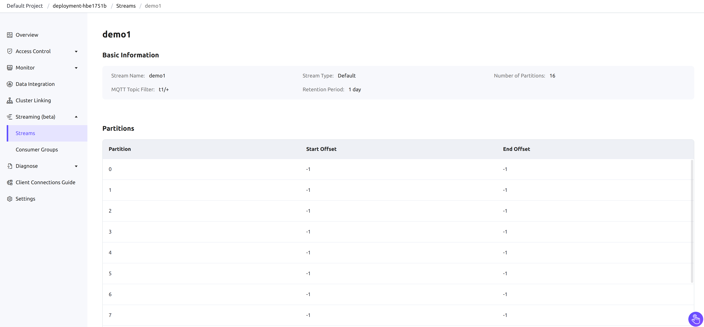
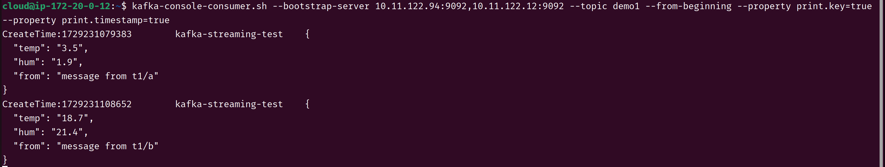
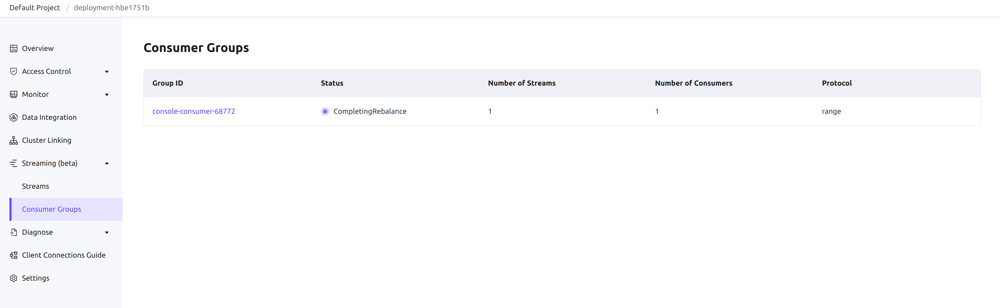
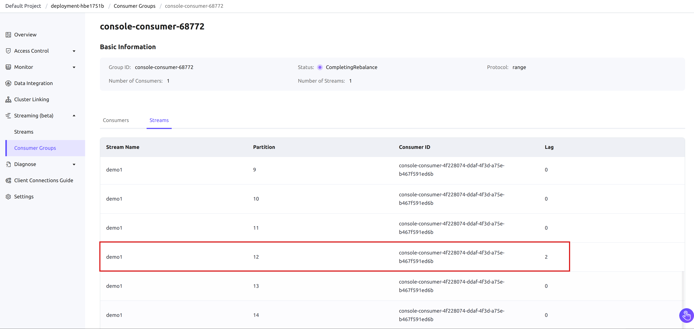

# Use EMQX Streaming in EMQX Premium

This page provides a step-by-step guide on how to use the EMQX Streaming feature in a Premium deployment.

## Prerequisites

Before you begin, ensure you have completed the following steps:

- A Premium deployment has been created. For detailed instructions, refer to [Create a Premium Deployment](../create/premium.md).
- VPC peering connections are enabled for your deployment. For instructions, refer to [VPC Peering Connections](../deployments/vpc_peering.md).
- Any MQTT clients that will publish messages are set up and available.
- Any Kafka clients that will consume messages are ready.

## Enable EMQX Streaming

The EMQX Streaming feature can only be activated by submitting a ticket. 

1. Go to your deployment and navigate to **Streaming (beta)**. 
2. Click **Enable Streaming (beta)** on the page to submit a ticket.

Once the EMQX Streaming is activated, the Kafka endpoint information will be displayed under the **Streaming Connection Information** section on the deployment overview page.


## Create a Stream in EMQX Platform Console

Users can create two types of streams: default and free. A default stream is linked to an MQTT topic filter and created with 16 partitions by default, storing all matching MQTT messages. A free stream operates independently of MQTT topics, with customizable partition numbers, providing greater flexibility for non-MQTT use cases.

 The retention period for both types of streams is fixed at 1 day and cannot be modified.

1. Navigate to **Streaming (beta)** -> **Streams**.
2. Click **New** on the Streams page. On the **New Streams** popup, complete the following settings:
   - **Stream Name**: Provide a name for the stream, for example, `demo1`. The Kafka topic for a Kafka client must match the stream name.
   - **Stream Type**: Select the stream type.
     - **Default**: The default type Stream is associated with an MQTT topic filter, and MQTT messages matching the topic filter are saved to the Stream. 
     - **Free**: The free type Stream is not associated with an MQTT topic filter and is typically used for other data processing purposes.
   - **MQTT Topic Filter**: If you select `Default` as the stream type, enter a topic filter for MQTT messages. MQTT messages matching this topic filter are saved to the corresponding default type Stream. For this example, enter `t1/+`.
   - **Number of Partitions**: If you select `Free` as the stream type, specify the number of partitions to divide the stream for scalability and parallel processing.

3. Click **Confirm**.

Once the stream is created, it will appear in the **Streams** list. By clicking the stream name, you can view details, including the partition offsets and other stream-specific information.



## Publish Messages Using MQTT Client

You can use [MQTTX](https://mqttx.app/) to simulate an MQTT client and publish messages to the topics `t1/a` and `t1/b`.


## Consume Messages Using Kafka CLI

Follow the steps below to download the official Kafka CLI tool:

1. Download and install the official Kafka CLI tool from the [Kafka Downloads page](https://kafka.apache.org/downloads).
2. Configure the Kafka CLI tool to connect to the Kafka endpoint provided in the EMQX Platform overview.

### Retrieve Topic Information

Using the Kafka CLI, you can retrieve topic information with the `describe` command. Ensure that the `bootstrap-server` option is set to the Kafka endpoint shown on the **Deployment Overview** page.

Example command:

```bash
kafka-topics.sh --describe --bootstrap-server <kafka-endpoint>
```


### Consume Messages from the Topic

To consume messages using the Kafka CLI, execute the following command:

```bash
kafka-console-consumer.sh --bootstrap-server <kafka-endpoint> --topic <stream-name> --from-beginning
```

This command will consume messages from the specified stream starting from the beginning. You should see the previously published messages being consumed.



## View Consumed Messages in EMQX Platform Console

To verify the consumed messages, navigate to **Streaming (beta)** -> **Consumer Groups** in the EMQX Platform Console.



Click on the **Group ID** to view details about the consumer group, such as the list of consumers and their consumption progress.



## Remove a Stream

To remove a stream:

1. Go to the **Streaming (beta)** -> **Streams** section.
2. Click the **Delete** icon in the **Action** column next to the stream you want to remove.
3. Confirm the deletion by clicking **Confirm**.