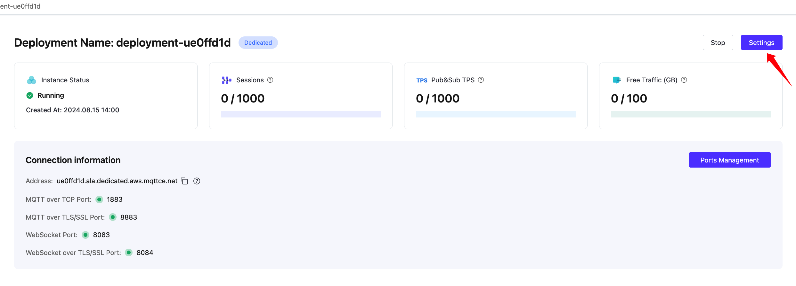

# Delete EMQX Account

This document walks you through deleting your account.

## Prerequisites

To delete your account, you must ensure that you have no:

- Deployments
- Outstanding payments

## Delete All Deployments

To delete a deployment, navigate to the deployments page, enter the deployment detail and click the Delete button in the top right corner. The deployment will be permanently deleted after a double-checked.

If you have several projects, make sure that deployments under each project are deleted.

## Pay the outstanding bills

Navigate to billing overview page, the balance should be $0. If you delete an hourly billing deployment during the month, that deployment's bill for the month will be settled at the end of the month. You can pay the bill next month and proceed the account deletion.

If you have a negative balance, click the Payment button and complete the payment.

## Delete EMQX Cloud account

:::tip
Once you delete your account there's no way to recover it.

You can't reuse the email address that is associated with the deleted account to create a new account.
:::

1. Click the profile icon and navigate to the Profile page.
2. Find the Delete Account section at the end of the page. Click Delete Account button.
3. Confirm that you want to delete your account.
   a. Acknowledge the implications of deleting your account.
   b. Click Confirm Account Deletion
   c. If there are any requirements you have not yet met, you are prompted to complete them before deleting your account.
4. You could tell us the reasons for leaving. Enter the email address before clicking Confirm and Delete button.
